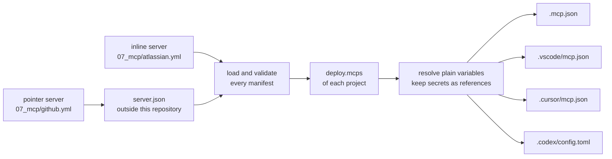

# MCP Servers

An MCP server gives an AI coding assistant extra tools, such as reading Jira issues or GitHub pull requests, over the Model Context Protocol (MCP).
Each YAML file here is an MCP server manifest: it declares one MCP server once, and a deploy writes it into the MCP config file of every supported tool in each project that selects it.
The engine never uses the value of a variable marked secret: each tool gets a reference by name.
A plain variable is written as its value, read from `env_vars` of the config files only.
For a pointer server, which variables are secret comes from its `server.json`, so the engine refuses a `server.json` it cannot render safely; see [What a deploy lets a tool start](#what-a-deploy-lets-a-tool-start).

The schema is `ai-tools-engine/engine/src/main/kotlin/cz/cleanship/aitools/engine/models/McpServerManifest.kt`.
When this page and the model disagree, the model wins.



## Servers in this folder

| File | Server | Form |
| --- | --- | --- |
| `atlassian.yml` | Jira and Confluence through the local `jira-confluence-mcp-server` checkout | inline stdio server |
| `github.yml` | GitHub through the `server.json` of the `github-mcp-server` checkout | pointer to the remote endpoint |

Both carry the tag `ai-tools`, which the `mcps` filter of `09_deployments/ai-tools/project.yml` selects.

Every run needs two checkouts outside this repository, `./deploy.sh --dry-run` included:

- `atlassian.yml` starts `${PROJECTS_FOLDER}/jira-confluence-mcp-server/.venv/bin/jira-mcp-server`. The engine does not check that this file exists; a missing one only shows when a tool starts the server.
- `github.yml` reads the `server.json` of `${PROJECTS_FOLDER}/github-mcp-server`, a checkout of `github/github-mcp-server`. With the default `config.yml` that is `~/Documents/Projects/github-mcp-server`. Every run reads that file, so a machine without the checkout fails every run until you check it out or remove `github.yml`.

`github.yml` selects the remote Streamable HTTP endpoint `https://api.githubcopilot.com/mcp/` rather than the OCI package.
The remote takes one secret: the whole `Authorization` header.
Its `server.json` does not mark the header required, so the secret is optional.
Every tool fills it from its environment, and Claude Code sends an empty header when it is unset.
The package passes its token as `-e GITHUB_PERSONAL_ACCESS_TOKEN={token}`, a runtime argument other than `-e NAME`, so loading refuses it.
Its identifier also holds `${VERSION}`, which the oci grammar refuses, so allowing the argument alone would not make the package usable.
Codex could not fill that argument from the environment either.
Before starting a tool, export the header value, including the scheme:

```bash
export GITHUB_AUTHORIZATION="Bearer <your GitHub token>"
```

## Adding a server

1. Create `07_mcp/<id>.yml`, as an [inline server](#an-inline-server) or a [pointer server](#a-pointer-server).
2. Tag it `ai-tools` to deploy it into this repository, or select it in the `deploy.mcps` block of another project; see [Where the servers land](#where-the-servers-land).
3. Run `./deploy.sh --dry-run` from the repository root. It loads and checks the manifest, names each MCP config file it would write, and warns about every secret the environment does not set.

The full step list is in [QUICKREF.md](../QUICKREF.md#add-an-mcp-server).

## An inline server

An inline server declares how a tool starts or reaches it, and the variables it needs.
This is a shortened `07_mcp/atlassian.yml`:

```yaml
id: atlassian
description: Jira and Confluence through the local jira-confluence-mcp-server.
transport:
  type: stdio
  command: ${PROJECTS_FOLDER}/jira-confluence-mcp-server/.venv/bin/jira-mcp-server
  # args: [--verbose]          # optional
  # env: { LOG_LEVEL: info }   # optional fixed values
variables:                     # optional
  - name: JIRA_PAT
    description: Jira personal access token.
    secret: true               # required: true or false, there is no default
    required: false            # optional, default true
  - name: JIRA_BASE_URL
    description: Base URL of Jira.
    secret: false
    required: false
metadata:
  version: 1.0.0
  tags: [ai-tools]
```

A remote server uses `type: http` with a `url` and optional `headers`:

```yaml
id: example
description: An example remote server.
transport:
  type: http
  url: https://mcp.example.com/mcp
  headers:
    Authorization: Bearer ${EXAMPLE_TOKEN}
variables:
  - name: EXAMPLE_TOKEN
    description: API token.
    secret: true
metadata:
  version: 1.0.0
  tags: [ai-tools]
```

- `transport.type` is `stdio` or `http`. Any other type, SSE included, fails the run.
- A stdio transport has `command` and the optional `args` and `env`. An http transport has `url` and the optional `headers`.
- `description` is required for an inline server and must not be blank.
- Each variable has the required fields `name`, `description`, and `secret`.
- The optional field `required` defaults to `true`.
- A `name` is an environment variable name: letters, digits, and underscores, not starting with a digit.
- `${NAME}` in `args`, `env`, `url`, and `headers` must name a variable the manifest declares under `variables`.
- Any other `${` fails loading, naming the file: an undeclared name, and tool syntax such as `${NAME:-default}`, `${env:NAME}`, `${input:id}` or a nested reference. Every tool would expand such text from its own environment.
- `command` is a path. `${NAME}` in it is a variable of the run, from `env_vars` of `config.yml` or `config.local.yml` or from the environment of the run, such as `${PROJECTS_FOLDER}`. It may not reference a declared variable.
- A `command` that is `~` or starts with `~/` is expanded against the home directory of the user running the engine, whatever `--user-home` the run uses. A relative command without `~` is kept as written, for the tool to look up. `url` is never expanded.
- A name under `env` must be an environment variable name, and a name under `headers` an HTTP header name.
- A stdio server receives every declared variable in its environment under the variable's own name. Do not also set that name under `env`.
- An http server receives only the variables its `url` and `headers` reference. A declared variable that neither references fails the run.
- Every `.yml` and `.yaml` file under a directory of `locations.mcps` (`07_mcp/` by default), at any depth, is loaded as an MCP server manifest. Keep other YAML files out of those directories.

### URL rules

These rules apply to the `url` of every http server, inline or pointer.
No message repeats a url.

| Rule | Example that fails |
| --- | --- |
| The url starts with `http://` or `https://`, in any letter case, followed by a host. | `mcp.example.com/mcp`, `ftp://mcp.example.com/mcp` |
| The host starts right after `//`: no path, query, fragment, port, user or space in its place. | `https://?x`, `https://:443/mcp`, `https://#mcp.example.com` |
| A url that writes its scheme also writes its host, rather than taking it from a variable. | `https://${HOST}/mcp` |
| The url holds no backslash, which some tools read as a slash. | `https://mcp.example.com\mcp` |
| The url carries no user or password. | `https://user:pw@mcp.example.com/mcp` |
| When the server sends a secret header, the url starts with `https://` as written in the manifest, never with plain http or a variable. | `${BASE}/mcp` with a secret header |

When a rule is checked:

- A url that starts with written text is checked when loading, on the text before its first variable. That text must hold the scheme and at least the start of the host, so `https://mcp.${DOMAIN}/mcp` passes and `https://${HOST}/mcp` does not.
- A url whose written start is exactly `http://` or `https://`, followed by a variable, fails loading with its own message: write the host, or start the url with the variable.
- A url that starts with a variable, such as `${BASE}/mcp`, is checked once its plain variables are resolved from `env_vars`.
- Every url is checked again once its variables are resolved.
- A failure when loading names the manifest and stops the whole run before anything is written.
- A failure once the variables are resolved names the server and the variables the url uses, never the value. It fails the MCP config files of every project that selects the server. The rest of the run is still written, and the run exits non-zero.

## A pointer server

```yaml
# 07_mcp/github.yml
id: github
source: ${PROJECTS_FOLDER}/github-mcp-server
select:
  remote: https://api.githubcopilot.com/mcp/
metadata:
  version: 1.0.0
  tags: [ai-tools]
```

A pointer server takes its description, transport, and variables from a `server.json` in the [MCP Registry format](https://static.modelcontextprotocol.io/schemas/2025-12-11/server.schema.json).

- `source` names that file, or the folder holding it. It resolves like the `source` of a pointer skill:
  - `${NAME}` is substituted with a variable of the run.
  - `~` or a leading `~/` is the home directory of the user running the engine, whatever `--user-home` the run uses.
  - Any other relative path resolves against the folder holding the manifest.
- The `$schema` of the file must be `https://static.modelcontextprotocol.io/schemas/2025-12-11/server.schema.json`. A file of another version, or one without `$schema`, fails the run.
- `select` picks one way to run the server: `package: <identifier>` or `remote: <url>`, never both. Leave `select` out only when the file declares exactly one package or remote.
- A pointer server must not declare `description`, `transport`, or `variables`.
- A remote must be `streamable-http`.
- The url of a remote follows the [URL rules](#url-rules).
- No message repeats the url of a remote. A remote is named by its position in the file, such as `remote 1`.
- A package must be a stdio package from `npm` (started with `npx -y`), `pypi` (`uvx`), or `oci` (`docker run -i --rm`, with `-e NAME` for each environment variable).
- A `runtimeHint` other than the runner of the registry type, `npx`, `uvx` or `docker`, fails loading.
- Runtime arguments are accepted only for an `oci` package, and only as `-e NAME`, which forwards one environment variable into the container and declares it as a variable. Any other runtime argument fails loading, naming the file and the argument.
- The identifier and the version of a package must follow the grammar of its registry. Otherwise loading fails naming the file and the field, without repeating the text.
  - npm: the identifier follows the rules `validate-npm-package-name` sets for new packages: lower case, URL-safe characters, at most 214 characters, optionally scoped. The version is a SemVer 2.0.0 version, a single-comparator range such as `^1.2.0` or `1.x`, or a dist-tag. An `npm:` alias and a git or URL spec are refused. A name or version ending in `.tgz`, `.tar` or `.tar.gz` is refused too, because npm reads it as a local file. Only specs npm resolves from its registry are accepted.
  - pypi: the identifier is a PEP 508 project name, and the version a PEP 440 version.
  - oci: the identifier is an image reference as `distribution/reference` defines it, optionally with a tag or a digest, and the version is a tag or a digest. An identifier that carries a tag or a digest is used as written, and the version is then ignored.
- No identifier or version the engine accepts starts with `-` or holds whitespace. So no identifier or version reaches a position where `npx`, `uvx` or `docker` reads its own options. Package arguments come after the identifier. They are checked for `${`, but not against a grammar.
- A `server.json` fails loading when it sets, forwards or derives an environment variable whose name is on the [environment variable denylist](#environment-variable-denylist), compared without regard to case.
- A derived name is one the engine builds from the manifest id and a key of the file, such as `GIT_SSH_COMMAND` from the id `git` and the `valueHint` `ssh_command`; see [how the variables are named](#how-the-variables-of-a-serverjson-are-named).
- A header of a remote fails loading when its name is a hop-by-hop header or overrides the host, the client address, the method, or authentication other than `Authorization`: `Host`, `Connection`, `Keep-Alive`, `Proxy-*`, `TE`, `Trailer`, `Transfer-Encoding`, `Upgrade`, `Content-Length`, `Cookie`, `Forwarded`, `X-Forwarded-*`, `X-Real-IP`, `X-HTTP-Method-Override`, `X-Method-Override`, `X-Original-URL`, `X-Rewrite-URL`.
- The grammar checks and the two denylists apply to what a `server.json` contributes. The [URL rules](#url-rules) apply to every server.
- An inline server is exempt from the denylists. It is written by the owner of this repository, chooses its whole `command` anyway, and is reviewed like code.
- Every run, `--dry-run` included, logs for each pointer server the file it was read from, the name of every variable it passes to the server and every environment variable it sets, never a value. A `server.json` may still ask for any other variable of your environment, such as `AWS_SECRET_ACCESS_KEY`, by name; read that line before you deploy.

### Environment variable denylist

Each of these names configures the runner, the loader or the connection of the process a tool starts:

| Names | What they configure |
| --- | --- |
| `DOCKER_*`, `CONTAINER_*`, `CONTAINERS_*` | docker and podman |
| `NPM_*` (so `npm_config_*` too), `NODE_*` | npm and Node.js |
| `UV_*`, `PIP_*`, `PYTHON*` | uv, pip and Python |
| `LD_*`, `DYLD_*`, `GCONV_PATH` | the dynamic loader and glibc |
| `HOSTALIASES`, `LOCALDOMAIN`, `RES_OPTIONS` | name resolution of glibc |
| `GIT_*` | git |
| `SSL_*`, `REQUESTS_CA_BUNDLE`, `CURL_CA_BUNDLE`, `*_PROXY` | TLS and proxies |
| `PATH`, `HOME`, `TMPDIR`, `TMP`, `TEMP`, `SHELL`, `BASH_ENV`, `ENV`, `XDG_*` | the paths, shell and configuration directories a process runs with |

### How the variables of a `server.json` are named

| In `server.json` | Variable |
| --- | --- |
| an environment variable of a package without a `value`, or whose `value` is one `{placeholder}` defined under its `variables` | the name of the environment variable, such as `EXAMPLE_TOKEN` |
| a `{placeholder}` in a url, header, argument, or environment value, defined under `variables` | the manifest id and the placeholder in upper case, such as `GITHUB_TOKEN` |
| a header without a `value` | the manifest id and the header name in upper case, such as `GITHUB_AUTHORIZATION` |
| a positional argument without a `value` | the manifest id and its `valueHint` in upper case |

- A positional argument with neither `value` nor `valueHint`, and a named argument without a `value`, fail loading, naming the file, and the argument when it has a name. Rendering them would shift the command line.
- A `{placeholder}` that `variables` does not define is kept as written.
- Text the engine writes from the file is data. A url, a header value, a package argument, or an environment value that holds `${`, in any form, fails loading, naming the file and the field, because every tool would expand it as a reference to its own environment.
- An identifier or version holding `${` fails the grammar check instead.
- Fields the engine does not render, such as the top-level `version`, are not read.
- In a generated name, every character other than an ASCII letter, digit or underscore becomes `_`, and a name that would start with a digit gets a leading `_`.
- A variable is secret when its own input or any input around it is marked `isSecret`, so a header marked secret makes the `{token}` inside its value secret too. One variable derived both as secret and as not secret fails loading.
- `isRequired` becomes `required`. `server.json` defaults it to `false`, so an input without it is an optional variable.
- The same secret rules as for an inline server then apply: a secret inside an argument or combined with other text in an environment value or header fails loading.

## Secret and plain variables

A secret variable (`secret: true`) is never written, logged or resolved by the engine. The engine only checks whether the environment of the run sets it, to warn when it does not.
Each tool gets a reference to it and reads the value from its own environment when it starts or connects to the server:

| Tool | MCP config file | A secret variable is written as |
| --- | --- | --- |
| Claude Code | `.mcp.json` | `${NAME}`, or `${NAME:-}` when `required: false` |
| GitHub Copilot (VS Code) | `.vscode/mcp.json` | `${env:NAME}` |
| Cursor | `.cursor/mcp.json` | `${env:NAME}` |
| Codex | `.codex/config.toml` | its name in `env_vars` (stdio), `bearer_token_env_var` (`Authorization: Bearer ${NAME}`), or `env_http_headers` (a header whose whole value is `${NAME}`) |

Because Codex has no `${NAME}` expansion, a secret is accepted only where all four tools can pass it by name:

- in a stdio server, only through its environment, never in `command`, `args`, or `env`;
- in an http server, only as a whole header value, `${NAME}`, or as `Authorization: Bearer ${NAME}`, never in `url`.

### Where a secret value comes from

The value of a secret must be in the environment of the tool process when the tool starts: the shell you start `claude` or `codex` from, or the session that starts VS Code or Cursor.

- Export it, for example in your shell profile or with `export JIRA_PAT=...` before you start the tool.
- `env_vars` of `config.yml` or `config.local.yml` is not enough. The engine reads `env_vars` only while it deploys, and it never uses the value of a secret, so a secret declared there never reaches a tool.
- A deploy does not need the secret. Every run, `--dry-run` included, warns once about each secret variable of a selected server that the environment of the run does not set, naming the variable and never its value, and does not fail on it.
- If a secret is unset when the tool starts, Claude Code passes an optional one as an empty value and leaves a required one as the literal text `${NAME}`. Do not rely on a server's own `.env` file for a declared variable: a server that reads that file only for variables not already set may never use it.

### Plain variables

A plain variable (`secret: false`) is resolved when the deploy runs, from `env_vars` of `config.local.yml` and `config.yml` only, and written into the MCP config file as its value.
The environment of the run is never read for it, so a value your shell happens to export, such as a proxy with credentials or `JIRA_VERIFY_SSL=false` from a debugging session, never lands in a file.

- A required plain variable that `env_vars` does not declare fails the MCP config files of every project that selects the server, naming the server and the variable.
- An optional one that `env_vars` does not declare is left out, and so is an `env` entry or header that references it.
- An optional one used in `args` or `url` cannot be left out, so it fails the MCP config files of every project that selects the server.
- A value in `env_vars` that holds `${` fails the same way, naming the variable, because a tool would expand it. No message ever repeats a value.
- Such a failure does not stop the run: every other artifact is still written, and the run exits non-zero at the end.
- Put machine-specific plain values into `env_vars` of `config.local.yml`, which is gitignored.

## Where the servers land

A project selects servers with a `deploy.mcps` filter of the same shape as `skills`:

```yaml
deploy:
  mcps:
    filter:
      - type: tags
        tags: [ai-tools]
```

- MCP servers are opt-in. A project without an `mcps` block gets none of them, unlike every other kind, because the entries land in files other repositories commit and a tool starts the processes they name.
- An `mcps` block present with an empty filter (`mcps: {}`) selects every MCP server manifest of the run, like the other blocks.
- A project that selects no server, with no block or with a filter that matches nothing, never reads or writes any MCP config file. Removing a project's `mcps` block therefore leaves the entries an earlier deploy wrote; remove them by hand.

| Tool | MCP config file in the project | Server entry |
| --- | --- | --- |
| Claude Code | `.mcp.json` | `mcpServers.<id>`, with `type` |
| GitHub Copilot | `.vscode/mcp.json` | `servers.<id>`, with `type` |
| Cursor | `.cursor/mcp.json` | `mcpServers.<id>`, `type` on stdio servers only |
| Codex | `.codex/config.toml` | `[mcp_servers.<id>]` and its sub-tables |
| Windsurf | none | the run warns that the servers are not deployed for it |
| Antigravity | none | the run warns that the servers are not deployed for it |

The entry name is the manifest id, so Claude Code names a tool of the server `mcp__<id>__<tool>`.

For the http example above, a deploy writes this entry into `.mcp.json`:

```json
{
  "mcpServers": {
    "example": {
      "type": "http",
      "url": "https://mcp.example.com/mcp",
      "headers": {
        "Authorization": "Bearer ${EXAMPLE_TOKEN}"
      }
    }
  }
}
```

and this table into `.codex/config.toml`:

```toml
[mcp_servers.example]
url = "https://mcp.example.com/mcp"
bearer_token_env_var = "EXAMPLE_TOKEN"
```

### What the engine owns in an MCP config file

In a project that selects at least one server, the engine owns the entries named after any MCP server manifest of the run:

- it writes each selected server into the entry of its id;
- it removes the entry of a server the run knows but the project does not select, even one you wrote by hand under that name, so do not name your own entries like a manifest of `07_mcp/`;
- it keeps every other entry, and every other key of the file.

An owned entry is rendered in full on every deploy. A setting you add to it by hand, such as `startup_timeout_sec` or a `[mcp_servers.<id>.tools.<tool>]` table in Codex, is removed; settings of that kind belong in the manifest once the engine supports them.

Every edit is checked before it is written, and the file is left untouched, failing that project and tool, when a check does not hold:

- The existing file must parse: strict JSON for the JSON files, TOML 1.0 for `.codex/config.toml`. A JSON file with comments or trailing commas, as VS Code and Cursor allow, is refused rather than rewritten without them, on every deploy until you remove them. A JSON object with a duplicate key is refused too.
- In `.codex/config.toml`, an owned server must be defined as its own `[mcp_servers.<id>]` table. An owned server written as an inline table, with dotted keys, or as an array of tables is refused rather than defined twice.
- The edited file is parsed again: every entry and key the engine does not own must be unchanged, and the owned entries must be exactly the selected servers.
- The file must read the same just before the write as when it was merged. It does not when a tool writes it during the deploy.

A JSON file is written again as a whole, so its layout is normalized. In `.codex/config.toml`, only the tables of owned servers are cut out and written again; every other line, comment and blank line included, is kept byte for byte, and so are its line endings and a missing final newline. Lines the engine adds use the dominant line ending of the file: CRLF when more lines end in CRLF than in LF, otherwise LF. This holds for any mix of line endings, with or without a final newline.
A rewritten file keeps its permission bits, set on the temporary file before any content is written.
The file is written only inside the project directory, once links are resolved:

- A symbolic link at the path is written through only when its real target lies inside the project.
- The directory holding the file, such as a linked `.codex`, `.vscode` or `.cursor`, must lie inside the project too.
- A link at the file, or at a directory above it, that leads outside the project, nowhere, or in a loop fails that project and tool. The message names the file and where the link leads. A dry run fails the same way as a deploy.
- Anything at the path that is not a regular file, such as a directory or a FIFO, fails that project and tool without being opened.
- Something that is not a directory above the file, such as a regular file at `.codex`, fails that project and tool before anything is read or written, in a dry run as in a deploy.
- A write the file system refuses, for example to a read-only MCP config file or into a read-only `.codex` directory, fails that project and tool too. Only a real deploy finds it, because a dry run never writes. For an MCP config file, this is the one case in which a dry run passes where a deploy fails.

These checks guard the MCP config file only:

- Any other file a tool cannot write in a project, such as one under a broken `.claude` or `.github`, or under a broken `.codex` or `.cursor` of a project that selects no server, is found only by a real deploy.
- There it fails that project and tool with the [`cannot be written ... no further <tool> files`](#troubleshooting) message.
- No further files of that tool are written in that project, and every other tool and project is still deployed.
- A tool writes its other files before its MCP config file. So a broken `.codex` or `.cursor` usually fails a real deploy with that message, while a dry run reports it through the MCP config file; see [PLANNED_FEATURES.md](../PLANNED_FEATURES.md#run-2).

No failure message quotes the content of a file or the value of a variable; it names the file, the line or offset, the server and the variable, or the duplicated key.
`replace: true` never deletes an MCP config file: Codex and Cursor replace only the directories they generate inside `.codex` and `.cursor`.

### Keep the files out of version control

The four MCP config files are gitignored in this repository.
They hold plain values resolved on one machine, such as base URLs and the absolute path of the Jira server, which differ between machines.
The engine does not edit the `.gitignore` of another project: in every project that selects servers, add `.mcp.json`, `.vscode/mcp.json`, `.cursor/mcp.json`, and `.codex/config.toml` to its `.gitignore` yourself, or review each file before you commit it.

### What a deploy lets a tool start

An MCP entry makes a tool start a process or send requests to a server, often without asking:

- Claude Code asks once per server in an interactive session and remembers the answer; `claude mcp reset-project-choices` resets it ([Claude Code MCP documentation](https://code.claude.com/docs/en/mcp)). `claude -p` and the Agent SDK start the servers of `.mcp.json` without asking.
- VS Code starts the servers of `.vscode/mcp.json` without a prompt in a trusted workspace. It also reads `.mcp.json`, so a Copilot user gets the Claude Code entries too.
- Cursor documents no prompt before it starts the servers of `.cursor/mcp.json`; a tool call asks for approval.
- Codex reads the `.codex/config.toml` of a project only when the project is trusted in Codex, and then starts its servers without a further prompt. In a project you have not trusted, Codex ignores the file.

A pointer server trusts its `server.json` within the rules above:

- `select` pins the package name or the remote url.
- The grammar checks keep the version from naming another package or a local file.
- The version itself, the package arguments, the headers, and the names of the variables it forwards follow the checkout under `${PROJECTS_FOLDER}`. After a `git pull` there, the next deploy writes what the new file says.
- The runner installs from the registry configured for your runner, not from one the file can choose.

Review changes to that checkout, and the forwarded names the run logs, before you deploy.

## Not supported yet

These are planned and listed in [PLANNED_FEATURES.md](../PLANNED_FEATURES.md#mcps):

- MCP servers in the user scope: a `user.yml` has no `mcps` block, so nothing is written to `~/.claude.json` or `~/.codex/config.toml`.
- Attaching a server to a single agent.
- Windsurf. Antigravity stays unsupported too.
- Allow and deny lists of the tools of a server.
- A secrets manager as the source of secret values. Today the only source is the environment of the tool.
- Pinning a pointer server, so that a changed `server.json` fails the run until you accept it.

## Troubleshooting

**`MCP server '<id>' needs the variable '<NAME>' ...`**: a required plain variable is not declared under `env_vars:`. Declare it in `config.local.yml`, mark it `required: false`, or mark it `secret: true` to pass it from the environment of the tool. Exporting it in the shell of the deploy does not help: plain variables are never read from there. The MCP config files of the projects selecting that server are not written, everything else is, and the run exits non-zero.

**`MCP server '<id>' uses the optional variable '<NAME>' in ..., which 'env_vars:' of config.yml and config.local.yml do not declare, and ... cannot be left out. Declare it under 'env_vars:'.`**: an optional plain variable is used in `args` or `url`, where leaving it out would change the command line or the address. Declare it under `env_vars:` in `config.local.yml`. Marking it `required: true` does not help: the run then fails with the `needs the variable` message above. The MCP config files of the projects selecting that server are not written, everything else is, and the run exits non-zero.

**`MCP server '<id>' reads the variable '<NAME>' for ..., and its value in 'env_vars:' holds '${', which a tool would expand from its own environment. Declare a value without it.`**: the value of a plain variable in `config.yml` or `config.local.yml` holds `${`. Change the value there. The MCP config files of the projects selecting that server are not written, and the run exits non-zero.

**`MCP server '<id>' has a 'url' that does not start with 'http://' or 'https://' followed by a host.`** / **`MCP server '<id>' has a 'url' that holds a backslash, which some tools read as a slash.`** / **`MCP server '<id>' has a 'url' that carries credentials, which every tool would write into its config file and send. Pass them as a secret header instead.`** / **`MCP server '<id>' sends a secret header, so its 'url' must start with 'https://' as written, never plain http or a variable.`**: the url as written breaks a [URL rule](#url-rules). An empty host, such as `https://?x` or `https://:443/mcp`, gets the first message. Fix the manifest. The message starts with `Failed to load <file>:`, and the whole run stops before anything is written.

**`MCP server '<id>' has a 'url' that writes its scheme but takes its host from a variable. Write the host after 'http://' or 'https://', or start the url with the variable, which is then checked once resolved.`**: the url is written like `https://${HOST}/mcp`. Write the host, as in `https://mcp.example.com/${PATH_PART}`, or let the variable hold the scheme too, as in `${BASE}/mcp`. The message starts with `Failed to load <file>:`, and the whole run stops before anything is written.

**`MCP server '<id>' resolves its 'url' from '<NAME>' to one that ... Give '<NAME>' a value in 'env_vars:' that makes the url start with 'http://' or 'https://' followed by a host, without a backslash or credentials.`**: the url breaks a [URL rule](#url-rules) once its plain variables are resolved from `env_vars`. The `...` is one of `holds a backslash, which some tools read as a slash`, `does not start with 'http://' or 'https://' followed by a host`, or `carries credentials, which every tool would write into its config file and send`. When the url uses several variables, the message names them all, as in `from 'A', 'B'`, and ends `Give 'A', 'B' values in 'env_vars:' that make the url ...`. Fix the value in `config.yml` or `config.local.yml`. The message never repeats the url or a value. The MCP config files of the projects selecting that server are not written, and the run exits non-zero.

**`MCP server '<id>' sends a secret header, but its 'url' resolves from '<NAME>' to one that is not https. Give '<NAME>' a value in 'env_vars:' that makes the url start with 'https://'.`**: the same, for a server that sends a secret header. With several variables the remedy reads `Give 'A', 'B' values in 'env_vars:' that make the url start with 'https://'.` Loading already requires `https://` as written for such a server, so this is a safeguard you should not meet.

**`MCP server '<id>' references the secret variable '<NAME>' in ...`**: a secret is used where a tool would need its value in the file. Pass it through the environment of a stdio server, or use it as a whole header value or a bearer token. The message has two origins:

- From loading, when the message starts with `Failed to load <file>:`. The manifest breaks the rules above, and the whole run stops before anything is written.
- Resolving refuses the same thing again as a safeguard, with a message ending in `where it would have to be written as a value.`. Loading rejects every such manifest first, so you only meet that second message after an engine fault; report it.

**`... declares the schema '...', but this engine reads only '...'`** / **`'...server.json' declares no '$schema'. This engine reads only server.json files of the schema '...'.`**: the `server.json` is of another registry schema version, or declares none. Point `source` at a file of the 2025-12-11 schema. The message starts with `Failed to load <file>:`, and the whole run stops before anything is written.

**`The 'source' '...' resolves to '...', which does not exist.`** / **`The 'source' '...' holds no server.json: '...' does not exist.`**: the checkout a pointer server names is missing, or holds no `server.json`, as on a machine without `${PROJECTS_FOLDER}/github-mcp-server`. Check it out there, fix `source`, or remove the manifest. The message starts with `Failed to load <file>:`, and the whole run stops before anything is written.

**`'...server.json' declares <n> ways to run the server: .... Pick one with 'select:' and 'package: <identifier>' or 'remote: <url>'.`** / **`'...server.json' declares no package and no remote, so there is no server to start or reach.`**: add `select` naming one package or remote of the file, or point `source` at a file that declares one. The message starts with `Failed to load <file>:`, and the whole run stops before anything is written.

**`'...server.json' provides no 'description', and a pointer server takes its description from there. Point 'source' at a server.json that describes the server.`**: the `server.json` of a pointer server has no `description`, or a blank one. Point `source` at a file that has one. The message starts with `Failed to load <file>:`, and the whole run stops before anything is written.

**`'select' names the package '...', which '...' does not declare`**: the identifier or url in `select` does not match the file. The message lists what the file declares.

**`... is not valid JSON at offset <n>, so the engine leaves it untouched`** / **`... is not valid TOML at line <n>, column <m>`**: an existing MCP config file cannot be parsed, or holds comments or trailing commas. Fix or remove it, and deploy again. The other artifacts of the run are still written, and the run exits non-zero.

**`MCP server '<id>' references its declared variable '<NAME>' in 'command'. The command is a path, resolved like the 'source' of a pointer: it may reference only variables of the run, from 'env_vars:' or the environment of the run.`**: `command` names a variable of `variables`. Use a variable of the run, such as `${PROJECTS_FOLDER}`, or write the path. The message starts with `Failed to load <file>:`, and the whole run stops before anything is written.

**`MCP server '<id>' references the variable '<NAME>' in 'command', which neither 'env_vars:' of config.yml or config.local.yml nor the environment of the run declares.`**: declare the variable under `env_vars:` of `config.local.yml`, export it in the environment of the run, or write the path. The same message with `'source'` is about the `source` of a pointer server. The message starts with `Failed to load <file>:`, and the whole run stops before anything is written.

**`MCP server '<id>' sets '<NAME>' under 'env' and declares it as a variable. A stdio server already receives every declared variable under its own name; remove one of them.`** / **`MCP server '<id>' declares the variable '<NAME>', which neither 'url' nor 'headers' references. An http server receives only the variables it references; reference it or remove it.`**: remove the duplicate `env` entry or the unused variable. The message starts with `Failed to load <file>:`, and the whole run stops before anything is written.

**`MCP server '<id>' references '<NAME>' in ..., which it does not declare`** / **`... holds a '${' ... that is not a reference in the form '${NAME}'`**: declare the variable under `variables`, or remove the tool syntax. The message names the field, never its text.

**`'...server.json': ... holds '${' in ...`**, **`... declares the runtime argument ...`**, **`... names the runtime ...`**, **`... derives the variable ... twice`**: the `server.json` of a pointer server asks for something the engine does not render. Select another package or remote, or leave the server out.

**`'...server.json': The remote <n> sends the header '<name>', which controls the connection or overrides authentication; the engine sends only 'Authorization' and headers of the server itself.`**: the remote sends a header on the [header denylist](#a-pointer-server). Select another remote or a package, or leave the server out. The message starts with `Failed to load <file>:`, and the whole run stops before anything is written.

**`'...server.json': The identifier of the <registry> package is not a ..., or starts with '-', so the engine refuses to put it on the command line of '<runner>'.`** / **`'...server.json': The version of the <registry> package '<identifier>' does not follow the ..., so the engine refuses to put it on the command line of '<runner>'.`**: the identifier or version breaks the grammar of its registry, or holds `${`. Select another package or a remote, or leave the server out. The message starts with `Failed to load <file>:`, and the whole run stops before anything is written.

**`'...server.json': It sets, forwards or derives the environment variable '<NAME>', which configures the runner, the loader or the connection of the process a tool starts, so the engine refuses it.`**: the name is on the [denylist](#environment-variable-denylist). When `<NAME>` starts with the manifest id in upper case, the engine derived it from the id and a key of the file. If the id is what puts the name on the list, as the id `git` does for `GIT_SSH_COMMAND`, give the manifest another id. Otherwise select another package or remote, or leave the server out.

**`'<file>' is reached through the symbolic link '<link>', which leads to '<target>' and cannot be followed (<exception>), so the engine leaves it untouched.`**: the MCP config file, or a directory above it such as `.codex`, `.vscode` or `.cursor`, is a link that leads nowhere or in a loop. When the link itself cannot be read, the message says `is reached through a symbolic link that cannot be followed` instead. Repair or remove the link, and deploy again. That project fails for that tool, and the rest of the run is still written. In a real deploy, a tool that writes other files into that directory first, such as Codex agents or the Cursor rules, fails there instead, with the `cannot be written ... no further <tool> files` message below.

**`'<file>' lies in '<directory>' once links are resolved, outside the project directory '<project>'. ...`** / **`'<file>' is a symbolic link to '<target>', which lies outside the project directory '<project>'. ...`**: the MCP config file, or the directory holding it, leads outside the project. The engine writes only inside the project. Replace the link with a file or directory inside the project, or remove it.

**`'<file>' lies below '<path>', which is not a directory, so the engine leaves it untouched. Remove what is at that path, and deploy again.`**: something other than a directory, such as a regular file named `.codex`, sits where the directory of the MCP config file belongs. Remove or rename it. That project fails for that tool, and the rest of the run is still written. In a real deploy, a tool that writes other files into that directory first fails there instead, with the message below.

**`'<file>' cannot be written (<exception>), so the engine leaves it untouched.`**: a real deploy could not write the MCP config file, for example because the file or the `.codex` directory is read-only. A dry run never writes, so it does not report this. Make the path writable, and deploy again.

**`[<project> | <TOOL> | <manifest>] '<path>' cannot be written (<class>[: <reason>]), so the engine writes no further <tool> files of project '<project>' in this run. Repair or remove what is at that path, and deploy again.`**: a real deploy could not write a file of that tool in that project.

- Cause: `.claude`, `.codex`, `.cursor` or `.github` is a link that leads nowhere or in a loop, is a regular file, or is a read-only directory. Repair or remove what is at that path, and deploy again.
- Message variants: `<reason>` is the reason the operating system gave, such as `No such file or directory`, `Not a directory` or `Permission denied`, when it is known. A failure that did not come from writing a file reads `'<path>' cannot be accessed (<class>[: <reason>])`, or `A file cannot be accessed (<class>[: <reason>])` when no path is known.
- What is still written: the files of that tool written before the failure stay in place. Every other tool and project is still deployed. The line is listed under `Export failed for N manifest(s)`, `<manifest>` is the export that hit it, such as `agent 'basic'`, and the run exits non-zero.
- Dry run and user deployment: a dry run writes nothing, so it reports this only through the MCP config file in `.codex`, `.vscode` or `.cursor`, and only when the project selects servers. In a user deployment, a file that cannot be written stops the run instead, and the CLI prints `'<path>' cannot be written (<class>[: <reason>])` as one line.

**`'<file>' would not be valid TOML after the edit at line <n>, column <m>, so the engine leaves it untouched. Fix the file or remove it, and deploy again.`**: the edited `.codex/config.toml` did not parse, so it was not written. This is a safeguard: a valid file of any line-ending mix is edited without it. Report the file layout.

**`'<file>' is not a regular file, so the engine leaves it untouched. Remove what is at that path, and deploy again.`** / **`'<file>' cannot be read (<exception>), so the engine leaves it untouched.`**: a directory, a FIFO or another entry that is not a file sits at the path of the MCP config file, or the file cannot be read. Remove what is there, or make the file readable. That project fails for that tool, in a dry run as in a deploy, and the rest of the run is still written.

**`... defines the MCP server '<id>', which a manifest of this run owns, other than as a table`**: rewrite that definition in `.codex/config.toml` as a `[mcp_servers.<id>]` table, or remove it.

**`... declares the key '<key>' twice in one object`** / **`... changed while the engine merged it`** / **`... would lose or change content the engine does not own`**: the file is left untouched. Remove the duplicate key, deploy again once the tool writing the file is idle, or report the file layout.

**`<tool> has no MCP support in this engine`**: a project selects servers and the run configures Windsurf or Antigravity. The servers are deployed for every other tool.

**A server does not start in Codex**: check that the project is trusted in Codex, and that every secret variable is exported in the shell that starts Codex.

**A project got no MCP config file**: MCP servers are opt-in; add an `mcps` block to its `project.yml`.
