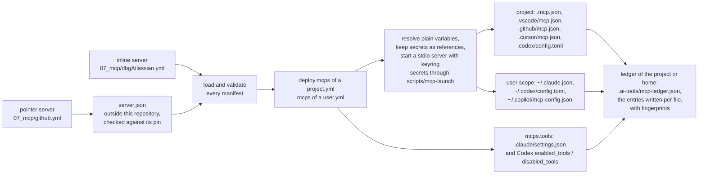
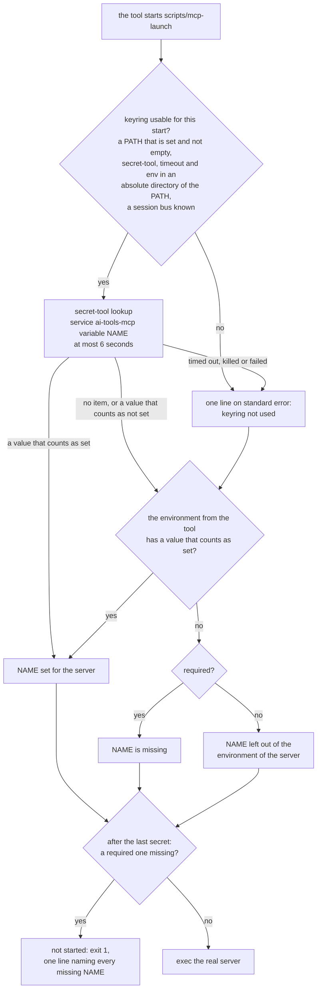

# MCP Servers

An MCP server gives an AI coding assistant extra tools, such as reading Jira issues or GitHub pull requests, over the Model Context Protocol (MCP).
Each YAML file here is an MCP server manifest: it declares one MCP server once, and a deploy writes it into the MCP config file of every supported tool in each project that selects it.
A user deployment can select servers too, for the MCP config files of Claude Code, Codex and Copilot CLI in the home directory; see [The user scope](#the-user-scope).
An agent can name the servers it uses, and a deployment can allow and deny single tools of a server; see [Attaching servers to an agent](#attaching-servers-to-an-agent) and [Allowing and denying tools](#allowing-and-denying-tools).
The engine never reads the value of a variable marked secret, and no MCP config file holds one.
A stdio server reads each secret from the libsecret keyring at the moment a tool starts it.
The launcher `scripts/mcp-launch` of this repository does the reading, with the environment of the tool as the fallback.
To store a secret, follow [First steps: keep a token in the keyring](#first-steps-keep-a-token-in-the-keyring).
A remote server reads each secret from the environment of the tool.
A plain variable is written as its value, read from `env_vars` of the config files only.
For a pointer server, which variables are secret comes from its `server.json`, so the engine refuses a `server.json` it cannot render safely; see [What a deploy lets a tool start](#what-a-deploy-lets-a-tool-start).

The schema is `ai-tools-engine/engine/src/main/kotlin/cz/cleanship/aitools/engine/models/McpServerManifest.kt`.
When this page and the model disagree, the model wins.



The ledger is read at the start of the next deploy, which removes the entries it records that the deployment no longer selects; see [The ledger](#the-ledger).

## Servers in this folder

| File | Server | Form |
| --- | --- | --- |
| `dbgAtlassian.yml` | Jira and Confluence through the local `jira-confluence-mcp-server` checkout | inline stdio server |
| `github.yml` | GitHub through the `server.json` of the `github-mcp-server` checkout | pointer to the remote endpoint, [pinned](#pinning-a-pointer-server) |

Both carry the tag `ai-tools`, which the `mcps` filter of `09_deployments/ai-tools/project.yml` selects.

Every run needs two checkouts outside this repository, `./deploy.sh --dry-run` included:

- `dbgAtlassian.yml` starts `${PROJECTS_FOLDER}/jira-confluence-mcp-server/.venv/bin/jira-mcp-server`. The engine does not check that this file exists; a missing one only shows when a tool starts the server.
- `github.yml` reads the `server.json` of `${PROJECTS_FOLDER}/github-mcp-server`, a checkout of `github/github-mcp-server`. With the default `config.yml` that is `~/Documents/Projects/github-mcp-server`. Every run reads that file, so a machine without the checkout fails every run until you check it out or remove `github.yml`.
- `github.yml` pins the hash of that `server.json`. A checkout whose `server.json` holds other bytes fails every run until you review the change and update the pin; see [Pinning a pointer server](#pinning-a-pointer-server).

`github.yml` selects the remote Streamable HTTP endpoint `https://api.githubcopilot.com/mcp/` rather than the OCI package.
The remote takes one secret: the whole `Authorization` header.
Its `server.json` does not mark the header required, so the secret is optional.
Every tool fills it from its environment, and Claude Code sends an empty header when it is unset.
The package passes its token as `-e GITHUB_PERSONAL_ACCESS_TOKEN={token}`, a runtime argument other than `-e NAME`, so loading refuses it.
Its identifier also holds `${VERSION}`, which the oci grammar refuses, so allowing the argument alone would not make the package usable.
Codex could not fill that argument from the environment either.
A remote server does not use the keyring, so the header value, including the scheme, must be in the environment of the tool when it starts.
Either export it:

```bash
export GITHUB_AUTHORIZATION="Bearer <your GitHub token>"
```

or store it in the keyring and start the tool with it for that one command; see [Remote servers](#remote-servers).

## Adding a server

1. Create `07_mcp/<id>.yml`, as an [inline server](#an-inline-server) or a [pointer server](#a-pointer-server).
2. Tag it `ai-tools` to deploy it into this repository, or select it in the `deploy.mcps` block of another project or the `mcps` block of a `user.yml`; see [Where the servers land](#where-the-servers-land).
3. For a pointer server, review its `server.json` and add the `pin` that the first dry run prints; see [Pinning a pointer server](#pinning-a-pointer-server).
4. Store each secret of a stdio server in the keyring; see [First steps: keep a token in the keyring](#first-steps-keep-a-token-in-the-keyring).
5. Run `./deploy.sh --dry-run` from the repository root. It loads and checks the manifest, names each MCP config file it would write, and reports where a tool will find each secret; see [What the check of secrets reports](#what-the-check-of-secrets-reports). To see only the lines about secrets, as plain text, run `LOG_FORMAT=TEXT ./deploy.sh --dry-run 2>&1 | grep secret`, as in step 2 of [First steps](#first-steps-keep-a-token-in-the-keyring).

The full step list is in [QUICKREF.md](../QUICKREF.md#add-an-mcp-server).

## An inline server

An inline server declares how a tool starts or reaches it, and the variables it needs.
This is a shortened `07_mcp/dbgAtlassian.yml`:

```yaml
id: dbgAtlassian
description: Jira and Confluence through the local jira-confluence-mcp-server.
transport:
  type: stdio
  command: ${PROJECTS_FOLDER}/jira-confluence-mcp-server/.venv/bin/jira-mcp-server
  # args: [--verbose]          # optional
  # env: { LOG_LEVEL: info }   # optional fixed values
variables:                     # optional
  - name: JIRA_PAT
    description: Jira personal access token.
    secret: true               # required: true or false, there is no default
    required: false            # optional, default true
    # from: environment        # optional, on a secret only: manager (default) or environment
  - name: JIRA_BASE_URL
    description: Base URL of Jira.
    secret: false
    required: false
metadata:
  version: 1.0.0
  tags: [ai-tools]
```

A remote server uses `type: http` with a `url` and optional `headers`:

```yaml
id: example
description: An example remote server.
transport:
  type: http
  url: https://mcp.example.com/mcp
  headers:
    Authorization: Bearer ${EXAMPLE_TOKEN}
variables:
  - name: EXAMPLE_TOKEN
    description: API token.
    secret: true
metadata:
  version: 1.0.0
  tags: [ai-tools]
```

- `transport.type` is `stdio` or `http`. Any other type, SSE included, fails the run.
- A stdio transport has `command` and the optional `args` and `env`. An http transport has `url` and the optional `headers`.
- `description` is required for an inline server and must not be blank.
- Each variable has the required fields `name`, `description`, and `secret`.
- The optional field `required` defaults to `true`.
- The optional field `from` is allowed on a secret variable only. It says where a stdio server reads the secret: `manager` (the default) or `environment`; see [The `from` key](#the-from-key).
- A `name` is an environment variable name: letters, digits, and underscores, not starting with a digit.
- `${NAME}` in `args`, `env`, `url`, and `headers` must name a variable the manifest declares under `variables`.
- Any other `${` fails loading, naming the file: an undeclared name, and tool syntax such as `${NAME:-default}`, `${env:NAME}`, `${input:id}` or a nested reference. Every tool would expand such text from its own environment.
- Any other `$` fails loading too, such as `$NAME`, `$$` or a `$` in a password. Copilot CLI expands a bare `$NAME` from its own environment. A header name that holds `$` fails too. A `command` that holds a `$` once the variables of the run and a leading `~` are resolved fails the same way.
- `command` is a path. `${NAME}` in it is a variable of the run, from `env_vars` of `config.yml` or `config.local.yml` or from the environment of the run, such as `${PROJECTS_FOLDER}`. It may not reference a declared variable.
- A `command` that is `~` or starts with `~/` is expanded against the home directory of the user running the engine, whatever `--user-home` the run uses. A relative command without `~` is kept as written, for the tool to look up. `url` is never expanded.
- A name under `env` must be an environment variable name, and a name under `headers` an HTTP header name.
- A stdio server receives every declared variable in its environment under the variable's own name. Do not also set that name under `env`.
- An http server receives only the variables its `url` and `headers` reference. A declared variable that neither references fails the run.
- Every `.yml` and `.yaml` file under a directory of `locations.mcps` (`07_mcp/` by default), at any depth, is loaded as an MCP server manifest. Keep other YAML files out of those directories.

### URL rules

These rules apply to the `url` of every http server, inline or pointer.
No message repeats a url.

| Rule | Example that fails |
| --- | --- |
| The url starts with `http://` or `https://`, in any letter case, followed by a host. | `mcp.example.com/mcp`, `ftp://mcp.example.com/mcp` |
| The host starts right after `//`: no path, query, fragment, port, user or space in its place. | `https://?x`, `https://:443/mcp`, `https://#mcp.example.com` |
| A url that writes its scheme also writes its host, rather than taking it from a variable. | `https://${HOST}/mcp` |
| The url holds no backslash, which some tools read as a slash. | `https://mcp.example.com\mcp` |
| The url carries no user or password. | `https://user:pw@mcp.example.com/mcp` |
| When the server sends a secret header, the url starts with `https://` as written in the manifest, never with plain http or a variable. | `${BASE}/mcp` with a secret header |

When a rule is checked:

- A url that starts with written text is checked when loading, on the text before its first variable. That text must hold the scheme and at least the start of the host, so `https://mcp.${DOMAIN}/mcp` passes and `https://${HOST}/mcp` does not.
- A url whose written start is exactly `http://` or `https://`, followed by a variable, fails loading with its own message: write the host, or start the url with the variable.
- A url that starts with a variable, such as `${BASE}/mcp`, is checked once its plain variables are resolved from `env_vars`.
- Every url is checked again once its variables are resolved.
- A failure when loading names the manifest and stops the whole run before anything is written.
- A failure once the variables are resolved names the server and the variables the url uses, never the value. It fails the MCP config files of every deployment that selects the server. The rest of the run is still written, and the run exits non-zero.

## A pointer server

```yaml
# 07_mcp/github.yml
id: github
source: ${PROJECTS_FOLDER}/github-mcp-server
select:
  remote: https://api.githubcopilot.com/mcp/
pin: sha256:38d2395945342d544b57055e46d5faaae01f51cb4304bbd5182ec60489c33372
metadata:
  version: 1.1.0
  tags: [ai-tools]
```

A pointer server takes its description, transport, and variables from a `server.json` in the [MCP Registry format](https://static.modelcontextprotocol.io/schemas/2025-12-11/server.schema.json).

- `source` names that file, or the folder holding it. It resolves like the `source` of a pointer skill:
  - `${NAME}` is substituted with a variable of the run.
  - `~` or a leading `~/` is the home directory of the user running the engine, whatever `--user-home` the run uses.
  - Any other relative path resolves against the folder holding the manifest.
- The `$schema` of the file must be `https://static.modelcontextprotocol.io/schemas/2025-12-11/server.schema.json`. A file of another version, or one without `$schema`, fails the run.
- `select` picks one way to run the server: `package: <identifier>` or `remote: <url>`, never both. Leave `select` out only when the file declares exactly one package or remote.
- `pin` is optional. It is the hash of the bytes of the `server.json`; see [Pinning a pointer server](#pinning-a-pointer-server).
- A pointer server must not declare `description`, `transport`, or `variables`.
- A remote must be `streamable-http`.
- The url of a remote follows the [URL rules](#url-rules).
- No message repeats the url of a remote. A remote is named by its position in the file, such as `remote 1`.
- A package must be a stdio package from `npm` (started with `npx -y`), `pypi` (`uvx`), or `oci` (`docker run -i --rm`, with `-e NAME` for each environment variable).
- A `runtimeHint` other than the runner of the registry type, `npx`, `uvx` or `docker`, fails loading.
- Runtime arguments are accepted only for an `oci` package, and only as `-e NAME`, which forwards one environment variable into the container and declares it as a variable. Any other runtime argument fails loading, naming the file and the argument.
- The identifier and the version of a package must follow the grammar of its registry. Otherwise loading fails naming the file and the field, without repeating the text.
  - npm: the identifier follows the rules `validate-npm-package-name` sets for new packages: lower case, URL-safe characters, at most 214 characters, optionally scoped. The version is a SemVer 2.0.0 version, a single-comparator range such as `^1.2.0` or `1.x`, or a dist-tag. An `npm:` alias and a git or URL spec are refused. A name or version ending in `.tgz`, `.tar` or `.tar.gz` is refused too, because npm reads it as a local file. Only specs npm resolves from its registry are accepted.
  - pypi: the identifier is a PEP 508 project name, and the version a PEP 440 version.
  - oci: the identifier is an image reference as `distribution/reference` defines it, optionally with a tag or a digest, and the version is a tag or a digest. An identifier that carries a tag or a digest is used as written, and the version is then ignored.
- No identifier or version the engine accepts starts with `-` or holds whitespace. So no identifier or version reaches a position where `npx`, `uvx` or `docker` reads its own options. Package arguments come after the identifier. They are checked for `$`, but not against a grammar.
- A `server.json` fails loading when it sets, forwards or derives an environment variable whose name is on the [environment variable denylist](#environment-variable-denylist), compared without regard to case. This holds for a stdio and an http server alike.
- A derived name is one the engine builds from the manifest id and a key of the file, such as `GIT_SSH_COMMAND` from the id `git` and the `valueHint` `ssh_command`; see [how the variables are named](#how-the-variables-of-a-serverjson-are-named).
- A header of a remote fails loading when its name is a hop-by-hop header or overrides the host, the client address, the method, or authentication other than `Authorization`: `Host`, `Connection`, `Keep-Alive`, `Proxy-*`, `TE`, `Trailer`, `Transfer-Encoding`, `Upgrade`, `Content-Length`, `Cookie`, `Forwarded`, `X-Forwarded-*`, `X-Real-IP`, `X-HTTP-Method-Override`, `X-Method-Override`, `X-Original-URL`, `X-Rewrite-URL`.
- The grammar checks and the two denylists apply to what a `server.json` contributes. The [URL rules](#url-rules) apply to every server.
- An inline server is exempt from the header denylist and the grammar checks. It is written by the owner of this repository, chooses its whole `command` anyway, and is reviewed like code.
- An inline server is checked against the list of refused names only when it is started through the launcher, and then by the class of each name; see [Names the launcher refuses](#names-the-launcher-refuses).
- Every run, `--dry-run` included, logs for each pointer server the file it was read from, the name of every variable it passes to the server and every environment variable it sets, never a value. A `server.json` may still ask for any other variable of your environment, such as `AWS_SECRET_ACCESS_KEY`, by name; read that line before you deploy.

### Environment variable denylist

The environment variable denylist of a `server.json` is the whole list of [names the launcher refuses](#names-the-launcher-refuses), class A and class B alike.
It covers every name that configures a shell, the launcher and the programs it starts, the runner (`npx`, `uvx`, `docker`), the dynamic loader, an interpreter, the locale, or the connection of the process a tool starts, such as `PATH`, `LD_*`, `NODE_*`, `PYTHON*`, `DOCKER_*`, `GIT_*`, `LANG` and `*_PROXY`.
It applies to every name the file contributes, secret or not, for a stdio and an http server alike.
The reason is that the owner of this repository does not write the `server.json`.
A class B name, such as `NODE_OPTIONS` or `HTTPS_PROXY`, does not change the launcher, but it still lets the file change what the runtime of the server loads or where it connects.

### How the variables of a `server.json` are named

| In `server.json` | Variable |
| --- | --- |
| an environment variable of a package without a `value`, or whose `value` is one `{placeholder}` defined under its `variables` | the name of the environment variable, such as `EXAMPLE_TOKEN` |
| a `{placeholder}` in a url, header, argument, or environment value, defined under `variables` | the manifest id and the placeholder in upper case, such as `GITHUB_TOKEN` |
| a header without a `value` | the manifest id and the header name in upper case, such as `GITHUB_AUTHORIZATION` |
| a positional argument without a `value` | the manifest id and its `valueHint` in upper case |

- A positional argument with neither `value` nor `valueHint`, and a named argument without a `value`, fail loading, naming the file, and the argument when it has a name. Rendering them would shift the command line.
- A `{placeholder}` that `variables` does not define is kept as written.
- Text the engine writes from the file is data. A url, a header value, a package argument, or an environment value that holds `$`, in any form, fails loading, naming the file and the field but not the value: every tool would expand `${` as a reference to its own environment, and Copilot CLI expands a bare `$NAME` as well. A header name or a package environment variable name that holds `$` fails the same way, without repeating the name; whether Copilot CLI expands a header name is not verified.
- An identifier or version holding `${` fails the grammar check instead.
- Fields the engine does not render, such as the top-level `version`, are not read.
- In a generated name, every character other than an ASCII letter, digit or underscore becomes `_`, and a name that would start with a digit gets a leading `_`.
- A variable is secret when its own input or any input around it is marked `isSecret`, so a header marked secret makes the `{token}` inside its value secret too. One variable derived both as secret and as not secret fails loading.
- `isRequired` becomes `required`. `server.json` defaults it to `false`, so an input without it is an optional variable.
- The same secret rules as for an inline server then apply: a secret inside an argument or combined with other text in an environment value or header fails loading.

### Pinning a pointer server

A pin makes a changed `server.json` fail the run until you have reviewed the change.
Without a pin, a `git pull` in the checkout changes what every tool starts on the next deploy.

- The key is `pin`, on a pointer server only.
- Its value is `sha256:` followed by the 64 lowercase hexadecimal digits of the SHA-256 hash of the bytes of the `server.json`.
- The hash covers that one file, not the rest of the checkout.
- Every run, `--dry-run` included, reads the file once and compares the hash of exactly the bytes it then decodes.

To add a pin:

1. Review the `server.json` the manifest points at.
2. Run `./deploy.sh --dry-run`. For every pointer server without a pin, it logs one warning that names the file and prints the value to add:

   ```
   MCP server 'github' reads '/home/<you>/Documents/Projects/github-mcp-server/server.json' without a pin, so any change to that file changes what every tool starts. Review the file, then add 'pin: sha256:38d2395945342d544b57055e46d5faaae01f51cb4304bbd5182ec60489c33372' to the manifest to refuse any other content.
   ```

3. Copy `pin: sha256:<hash>` from the warning into the manifest. `sha256sum server.json` prints the same 64 digits, without the `sha256:` prefix.

When the file no longer matches, loading fails and the whole run stops before anything is written, `--dry-run` included.
The message names the manifest, the `server.json`, the actual hash, and the pinned one.
A mismatch means the checkout now holds a different `server.json` than the one you reviewed, for example after a `git pull`.
Review what changed, for example with `git -C <checkout> diff <old commit> -- server.json`, then set `pin` to the new hash from the message.
A hash is not a secret, so the messages print it.

A `pin` on an inline server, or a value of another form, fails loading naming the manifest; see [Troubleshooting](#troubleshooting).

## Secret and plain variables

A variable is secret when its manifest marks it `secret: true`, such as a token, a password or the path of a key file.
The engine never reads, writes or logs the value of a secret.
An MCP config file holds only the name of a secret and a reference to it.

Where a server finds the value of a secret when a tool starts it:

- A stdio server is a program a tool starts on your machine. By default it reads each secret from the keyring, the password store of your desktop session, and from the environment of the tool when the keyring does not hold it.
- A remote server is one a tool reaches over HTTP. It reads each secret from the environment of the tool; see [Remote servers](#remote-servers).

The manifests and the config files call the place a secret is kept a secrets manager.
A secret variable may declare `from: manager`, which means that it is read from the secrets manager, or `from: environment`; see [The `from` key](#the-from-key).
The key `secrets_manager` of the config files names the secrets manager of the machine; see [The `secrets_manager` setting](#the-secrets_manager-setting).
The only secrets manager this engine supports is the libsecret keyring, which this page calls the keyring.

### First steps: keep a token in the keyring

The keyring is the password store of your Linux desktop session.
A token kept there is in no file of any project and not in your shell profile.
You store each token once.
A tool, here, is an AI coding assistant that starts MCP servers, such as Claude Code, Codex, GitHub Copilot or Cursor.
The launcher `scripts/mcp-launch`, a script of this repository, reads the token from the keyring each time a tool starts the server.

Before you start:

- Install `secret-tool`, the command-line program of the keyring. On Ubuntu and Debian it is the package `libsecret-tools`.
- Open a terminal of your desktop session, where the keyring runs. [Storing a secret in the keyring](#storing-a-secret-in-the-keyring) lists exactly what that terminal needs.
- Look up the name of the secret: it is the `name` of a variable marked `secret: true` in the manifest of the server, such as `JIRA_PAT` in `07_mcp/dbgAtlassian.yml`.
- Make sure that `./deploy.sh --dry-run` can run. It needs what [Requirements](../README.md#requirements) of `README.md` lists, among them a JDK and two checkouts of other repositories.

**Step 1: store the secret.**
Run this command, with the name of your secret in place of `JIRA_PAT` in both places:

```bash
secret-tool store --label='ai-tools MCP JIRA_PAT' service ai-tools-mcp variable JIRA_PAT
```

It prints this prompt and waits:

```
Password:
```

Paste or type the value, and press Enter.
The prompt shows nothing of what you type.
Paste only once the prompt is shown.
Text that arrives earlier is thrown away.
An empty value is then stored instead.
When the command prints an error, the value is not stored; see [When `secret-tool` fails](#when-secret-tool-fails).

**Step 2: check that it is stored.**
From the root of this repository, run:

```bash
LOG_FORMAT=TEXT ./deploy.sh --dry-run 2>&1 | grep secret
```

- `./deploy.sh --dry-run` checks everything a deploy would do, and writes nothing. It prints several thousand lines.
- `LOG_FORMAT=TEXT` makes it print them as plain text. Without it, each line is a JSON object.
- `2>&1 | grep secret` keeps only the lines that contain the word `secret`.

For each MCP server that a deploy would write, the dry run prints one line for each secret that the launcher reads from the keyring.
Every other secret gets a line only when the environment of the run does not set it.
Each line starts with the time of day.
When the secret is stored, its line reads:

```
09:28:19.688 INFO  c.c.a.e.tools.mcp.McpServerResolver - MCP server 'dbgAtlassian' reads the optional secret variable 'JIRA_PAT' from the keyring, which holds it.
```

When it is not stored, but the variable is set in the environment of the run, for example by your shell profile, the line is an INFO line that ends with `the keyring does not hold it, and the environment of this run sets it.`.
When it is found in neither, the line is a warning that ends with the command of step 1:

```
09:28:19.688 WARN  c.c.a.e.tools.mcp.McpServerResolver - MCP server 'dbgAtlassian' reads the optional secret variable 'JIRA_PAT' from the keyring or the environment of the tool that starts it, but the keyring does not hold it and the environment of this run does not set it. Store it with: secret-tool store --label='ai-tools MCP JIRA_PAT' service ai-tools-mcp variable JIRA_PAT
```

`optional` in a line means that the server can start without that secret.
A `required` secret is one the server cannot start without.

The other secrets of the same server that the keyring supplies keep their own lines until you store them too.
In this repository, those of `dbgAtlassian` are `CONFLUENCE_PAT`, `JIRA_CLIENT_CERT` and `JIRA_CLIENT_KEY`.
You need not store a secret you do not use: a warning about an optional secret you do not use needs no action.
Two more lines end with `Export it before starting the tool.`.
They are about `GITHUB_AUTHORIZATION` of `github` and `GITHUB_DBG_TOKEN` of `github-dbg`, which are remote servers; see [Remote servers](#remote-servers).
The keyring never supplies these two secrets, so storing them does not remove their lines.
Export such a secret instead, and only when you use it.

Other lines this command can show:

- A warning with `the engine cannot tell whether the keyring holds it` means that the check could not ask the keyring. [What the check of secrets reports](#what-the-check-of-secrets-reports) lists each reason and what to do.
- An error that contains `MCP server '<id>' reads its secrets through the launcher` means that the engine does not trust the file `scripts/mcp-launch` or one of its directories. The usual cause is that their group may write them. When the cause is such a permission, the message names the command that fixes it after `Remove that permission with:`, such as `chmod go-w '<path>'`. Run that command, then run step 2 again; see [The launcher file](#the-launcher-file).
- Every variant of that error but the one about a path that holds `$` ends with `or set 'secrets_manager: environment' in config.local.yml to read every secret from the environment of the tool.`. That setting turns the keyring off for every server; see [The `secrets_manager` setting](#the-secrets_manager-setting).
- When the command prints nothing, the dry run stopped before it checked the secrets. Run `LOG_FORMAT=TEXT ./deploy.sh --dry-run` without the filter, and read its last lines.

**Step 3: deploy, then restart the tool.**
Run `./deploy.sh` from the root of this repository.
It writes the MCP config files, whose entries then start the server through the launcher.
It also writes into every other project the config lists, and into your home; see [README.md](../README.md#common-workflow).
You need this deploy the first time.
You need it again after you change [`from`](#the-from-key) or [`secrets_manager`](#the-secrets_manager-setting).
Then quit the tool, such as Claude Code or Codex, and start it again, so that it starts the server anew.

The launcher reads the keyring each time a tool starts the server.
So a value you store, replace or remove later takes effect the next time the tool starts the server, without a deploy.
A server that is already running keeps the value it started with.

**Step 4: when the server does not start or gets no value.**
When the launcher cannot use the keyring, or does not find a required secret, it writes a line starting with `mcp-launch:` to the standard error of the server.
In Claude Code, `/mcp` shows a server that failed to start as failed.
Where a tool shows the line of the launcher depends on the tool; [Seeing the messages of the launcher](#seeing-the-messages-of-the-launcher) lists what the documentation of each tool says.
For a server that failed to start, the check in a terminal described there is the way that always works.
[Secrets and the launcher](#secrets-and-the-launcher) lists each such line with its cause and what to do.
An optional secret found nowhere gives no such line; run the dry run of step 2 to see it.

**To replace a secret**, run the command of step 1 again.
The keyring then updates the item stored under the same two attributes, `service` and `variable`, rather than add a second one.

**To remove a secret**, run:

```bash
secret-tool clear service ai-tools-mcp variable JIRA_PAT
```

`secret-tool` 0.20.4 crashes when nothing matches.
It then exits with code 139, and the shell may print `Segmentation fault`.
So its exit code does not tell whether an item was removed; check with the dry run of step 2.

After you replace or remove a secret, restart the tool, as at the end of step 3; no deploy is needed.

### What the keyring protects and what it does not

The keyring keeps a secret:

- out of every file that this repository, the engine or a tool writes, the MCP config files of every project and home included;
- out of your shell profile and your shell history, when you store it through the prompt;
- out of the environment of the tool, which receives only the name of a secret the launcher reads.

The keyring daemon stores the items of a keyring in one file of its own under your home directory, such as `~/.local/share/keyrings/Default_keyring.keyring` of `gnome-keyring-daemon`.
That file is encrypted with the password of the keyring.
When that password is empty, which is usual with automatic login, the items are stored without encryption.
A secret in a keyring with an empty password is then protected by the permissions of that file, as a file readable only by you would be, and the gain is that it is in none of the files the engine writes, not in your shell profile and not in the environment of the tool.

The keyring does not keep one server's secret from another program of yours:

- While the keyring is unlocked, every program that runs as your user can ask it for any item, every `ai-tools-mcp` item included. Every MCP server runs as your user.
- A stored item is not bound to a server. Every server that declares a variable of that name receives the value stored under that name, in every project and home deployed from this repository.
- A running server holds its values in its environment. Your own processes and root can read that environment through `/proc/<pid>/environ`.

A remote server does not use the keyring at all; see [Remote servers](#remote-servers).

### How a stdio server gets its secrets

The terms of this part:

- A keyring daemon, such as `gnome-keyring-daemon`, is the program that keeps the stored items and answers requests for them. It encrypts them with the password of the keyring, and stores them without encryption when that password is empty; see [What the keyring protects and what it does not](#what-the-keyring-protects-and-what-it-does-not).
- The D-Bus session bus is the message channel of your login session, over which programs reach the keyring daemon.
- libsecret is the library programs use to reach the keyring, and `secret-tool` is its command-line program.
- The launcher `scripts/mcp-launch` is a shell script kept in this repository that a tool starts in place of the server.
- [`from`](#the-from-key) is an optional key of a secret variable that names where a stdio server reads it: `manager`, the default, or `environment`.
- [`secrets_manager`](#the-secrets_manager-setting) is an optional key of `config.yml` or `config.local.yml` that names the secrets manager of the machine: `libsecret`, the default, or `environment`.

Where a server finds a secret:

| Server | Where the server finds a secret |
| --- | --- |
| stdio, and the secret declares no `from`, or `from: manager` | the keyring first, then the environment of the tool; the launcher reads both |
| stdio, and the secret declares `from: environment` | the environment of the tool only |
| http (remote) | the environment of the tool only, whatever `from` says; see [Remote servers](#remote-servers) |
| any server, on a machine whose config sets `secrets_manager: environment` | the environment of the tool only |

The engine writes an entry that starts the launcher instead of the server when all of these hold:

- the server is a stdio server;
- at least one of its secrets declares no `from`, or `from: manager`;
- the `secrets_manager` of the machine is `libsecret`, the default.

Every other server is written without the launcher: every secret is a reference the tool resolves from its own environment.

A tool then starts the server in three steps:

1. The tool starts the launcher with the server id, the name of each keyring secret after `--required` or `--optional`, then `--`, then the real command and its arguments unchanged.
2. The launcher looks each name up in the keyring, and falls back to the environment it received from the tool; see [The order in which a secret is looked for](#the-order-in-which-a-secret-is-looked-for).
3. The launcher puts every value it found into its own environment and replaces itself with the real server (`exec`).

After step 3, the server has the process id of the launcher. It also keeps its standard input and output and its signals. So the tool talks to the server as it would without the launcher.

What each party sees:

- The MCP config file holds the absolute path of the launcher, the names of the secrets, the real command, and the references of the tool. It never holds a value.
- The argument list of the launcher holds names only. `ps` shows that list, and Cursor writes it into its log.
- No program the launcher starts receives the value of a secret as an argument. The helper `env` receives the values of `DBUS_SESSION_BUS_ADDRESS`, `XDG_RUNTIME_DIR` and `HOME` as arguments, none of them a secret; see [The programs the launcher starts](#the-programs-the-launcher-starts).
- The launcher writes its own messages to standard error, one line each. None of them holds a value.
- The launcher never writes to standard output, which carries the protocol of the server.
- The shell that runs the launcher, and the dynamic loader that starts that shell, write a message of their own in a few cases, such as a command that is not found. No such message holds the value of a variable the manifest declares; see [Limits](#limits).
- The environment of the running server holds the values, as it did when the tool passed them.

The server receives every variable the launcher received from the tool, plus the secrets the launcher found, with these differences:

- An optional secret found nowhere is removed.
- A variable named like one of the launcher's own variables, which all start with `mcp_launch_`, is removed.
- Under dash, an entry whose name is not a valid shell name is dropped by the shell.
- A variable the shell sets itself reaches the server with the value of the shell, or not at all. dash sets `PWD` and `PPID`. bash as `/bin/sh` also sets or drops, among others, `OLDPWD`, `_`, `SHLVL`, `LINENO`, `OPTERR`, `POSIXLY_CORRECT`, `SHELLOPTS` and `BASHOPTS`; see [Limits](#limits) for the last two. Each of these names is of class A, so no manifest that loads declares one for a server started through the launcher.

`env_vars` of `config.yml` or `config.local.yml` never reaches a secret.
The engine reads `env_vars` only while it deploys, and it never uses the value of a secret.
Do not rely on a server's own `.env` file for a declared variable either: a server that reads that file only for variables not already set may never use it.

### Storing a secret in the keyring

To store a secret, you need:

- `secret-tool`. On Ubuntu and Debian it is the package `libsecret-tools`.
- A keyring daemon on the session bus, such as `gnome-keyring-daemon`.
- A shell in which `DBUS_SESSION_BUS_ADDRESS` is set, or in which `$XDG_RUNTIME_DIR/bus` is a socket. A terminal of your desktop session has one of them. Without either, and with `DISPLAY` set, `secret-tool` may start a second session bus and a second keyring daemon of its own.

What the launcher needs when a tool starts the server is listed under [The programs the launcher starts](#the-programs-the-launcher-starts).

Every secret is stored under two fixed attributes: `service` with the value `ai-tools-mcp`, and `variable` with the name of the variable.
So one stored item serves every server of every project that declares that name.
`--label` is the name that keyring programs such as Seahorse show. The launcher finds the item by its two attributes only.
The dry run prints the store command for every keyring secret it finds nowhere; see [What the check of secrets reports](#what-the-check-of-secrets-reports).

The prompt of `secret-tool store`:

- Text that arrives before `Password:` is shown is thrown away.
- An empty value is stored without a complaint. The launcher counts it as not set.
- The prompt stores the value without the line break of the Enter key.

Do not pass the value through a pipe, as in `echo <value> | secret-tool store ...`:

- A value written on the command line lands in the history of your shell and on the screen.
- A piped value keeps every byte, including the line break that `echo` adds.
- The launcher removes exactly one trailing line break from a keyring value. So a value stored with one line break still works. A value stored with two reaches the server with one.

#### When `secret-tool` fails

When `secret-tool store` prints an error, the value is not stored.
The usual cause is that the terminal cannot reach the keyring daemon.
`secret-tool lookup` 0.20.4 was seen to print these errors in that case:

- `secret-tool: Cannot autolaunch D-Bus without X11 $DISPLAY`: the shell knows no session bus, and `DISPLAY` is not set.
- `secret-tool: Could not connect: No such file or directory`: `DBUS_SESSION_BUS_ADDRESS` names a bus that does not exist.

Check the terminal, then run the command again:

1. `echo "$DBUS_SESSION_BUS_ADDRESS"` prints an address, such as `unix:path=/run/user/1000/bus`. Or `ls -l "$XDG_RUNTIME_DIR/bus"` prints a line that starts with `s`, which marks a socket.
2. A keyring daemon runs. For GNOME Keyring, `pgrep -a gnome-keyring` prints a line with `gnome-keyring-daemon`.

When a check fails, open a terminal of your desktop session, and check again.
A terminal without a session bus but with `DISPLAY` set may even start a second session bus and keyring daemon of its own; see the list above.

### The programs the launcher starts

The launcher needs:

- a `/bin/sh` that accepts the option `-p` of its first line (`#!/bin/sh -p`), such as dash or bash; BusyBox does not accept it, see [Limits](#limits);
- to use the keyring, three programs in an absolute directory of the `PATH` it receives from the tool: `secret-tool`, `env`, and a `timeout` that takes the options `-v` and `-k`, such as the one of GNU coreutils.

The `PATH` it receives is the `PATH` in the environment the tool starts the server with. That is usually the `PATH` of the shell or desktop session the tool was started from.

How the launcher finds and starts these programs:

- When the tool passes no `PATH`, or an empty one, the launcher starts none of the three and does not use the keyring. It writes the line `... keyring not used, reading secrets from the environment: the PATH is not set or is empty`. dash and bash have a default search path of their own for that case, but the launcher never takes a helper from it.
- Otherwise it searches only the absolute directories of that `PATH`. An empty entry, `.`, every other relative entry, and a directory whose name holds `=` are skipped. So a program of the same name in the project directory is never started.
- A program counts as found when it is an executable regular file.
- When one of the three is not found, the launcher does not use the keyring for this start, and writes one line saying which program is missing.
- `env` starts with every exported variable of the tool removed, except `BASH_XTRACEFD`. Under bash, it also receives `SHELLOPTS` and `BASHOPTS` with the values of bash when the tool passed them, the `SHLVL` that bash exports itself, and the entries of the environment whose names are not valid shell names, which no shell can remove.
- The arguments of `env` are `-i`, then `DBUS_SESSION_BUS_ADDRESS=<value>`, `XDG_RUNTIME_DIR=<value>` and `HOME=<value>`, each only when it is set and not empty, then the path of `timeout`, `-v -k 1 5`, the path of `secret-tool`, and `lookup service ai-tools-mcp variable <NAME>`. Until `env` replaces itself with `timeout`, `ps` shows these three values to every user of the machine. None of them is a secret.
- `env` then starts `timeout`, and `timeout` starts `secret-tool`. Both receive only `DBUS_SESSION_BUS_ADDRESS`, `XDG_RUNTIME_DIR` and `HOME`, each only when it is set and not empty.
- So no secret, no other variable of the tool, no `DISPLAY` and no `PATH` reaches `timeout` or `secret-tool`.
- `HOME` is passed because a session bus reached over TCP authenticates with a cookie file in the home directory.
- Their standard input is `/dev/null`.
- The launcher reads the environment inside its shell, without starting a program.

The time limit of one lookup:

- `timeout` sends the lookup the stop signal SIGTERM after 5 seconds.
- A lookup still running 1 second later is killed.
- So one lookup takes at most 6 seconds.
- After a lookup that did not end in time, or that failed, the launcher does not ask the keyring again during that start. So a keyring that does not answer delays a start by at most 6 seconds.
- Codex gives a server 10 seconds to start by default.

### The order in which a secret is looked for

For each secret, in the order of its arguments, the launcher:

1. Looks the name up in the keyring with `secret-tool lookup service ai-tools-mcp variable <NAME>`, waiting at most 6 seconds.
2. Reads the environment variable of the same name, as the tool passed it. It does this when the keyring holds no item for the name, when the stored value counts as not set, or when the keyring is not used for this start.
3. Marks the secret as found nowhere when neither source has a value that counts as set; see [Required and optional secrets](#required-and-optional-secrets).

A value in the keyring wins over a value in the environment.



The keyring is not used for the rest of a start, and the launcher writes one line to standard error, when:

- the tool passed no `PATH`, or an empty one;
- `secret-tool` is in no absolute directory of the `PATH`;
- `timeout` is in no absolute directory of the `PATH`, because a lookup without a time limit could wait for an unlock prompt forever;
- `env` is in no absolute directory of the `PATH`, because without it the rest of the environment of the tool would reach `secret-tool`;
- no session bus is known: `DBUS_SESSION_BUS_ADDRESS` is unset or empty, and `$XDG_RUNTIME_DIR/bus` is not a socket;
- a lookup did not end within 5 seconds and ended on the stop signal;
- a lookup did not end within 5 seconds and was killed 1 second later;
- a lookup failed in any other way than "no such item".

A value counts as not set, from either source, when it is:

- empty;
- exactly `${NAME}`, `${NAME:-}` or `${env:NAME}` for the same name, which is the text a tool leaves in place when it does not expand its reference.

Any other value is used, even one that only looks similar, such as `${OTHER}` or a single space.
A keyring value loses exactly one trailing line break, the one a piped `echo` stores. Every other byte is kept.
An environment value is passed on unchanged.

### Required and optional secrets

- A required secret (`required: true`, the default) that is found nowhere stops the start. The launcher exits with code 1 and writes one line to standard error naming the server and every missing secret. The server is not started, so the tool cannot connect to it.
- An optional secret (`required: false`) that is found nowhere is left out of the environment of the server: the variable is unset, not empty.
- The launcher enforces `required` itself. So the Claude Code entry references a keyring secret as `${NAME:-}`, even a required one.
- `${NAME}` would make Claude Code report a missing variable for each keyring secret you did not also export.

### The `from` key

A secret variable may declare where a stdio server reads it:

```yaml
variables:
  - name: DEMO_TOKEN
    description: API token of the demo service.
    secret: true               # no 'from': the keyring first, then the environment of the tool
  - name: DEMO_CI_TOKEN
    description: A token that is only ever exported, never stored in the keyring.
    secret: true
    required: false
    from: environment          # the environment of the tool only, without the launcher
```

- `from: manager` is the default. The secret is read from the secrets manager the machine names in [`secrets_manager`](#the-secrets_manager-setting). That is the keyring by default. The environment of the tool is the fallback.
- `from: environment` reads the secret from the environment of the tool only. The entry references it exactly as without the keyring.
- Use `from: environment` for a secret you always export, for example on a build machine.
- Use it also for a secret whose name is of class B, such as `HTTPS_PROXY`. A secret whose name is of class A must be renamed, unless every secret of the server declares `from: environment`; see [Names the launcher refuses](#names-the-launcher-refuses).
- `from` on a variable that is not secret fails loading, naming the manifest and the variable.
- Any value other than `manager` or `environment` fails loading, naming the file; see [Troubleshooting](#secrets-and-the-launcher).
- Every secret a pointer server takes from its `server.json` gets the default. A pointer manifest cannot declare `from`.
- On an http server, `from` is accepted and has no effect: an http server always reads its secrets from the environment of the tool.

### Names the launcher refuses

Some environment variables have a meaning of their own for the shell that runs the launcher, for the programs it starts, or for the runtime of the server.
A value under such a name could change how the launcher runs or what the server runs, or appear in a message on standard error.
The block `mcp_launch_refused_names` of `scripts/mcp-launch` lists these names as patterns, and puts each pattern in one of two classes:

- **Class A**: names that change how the launcher's shell or the programs it starts run, or that a shell sets or prints itself. Examples: `PATH`, `HOME`, `LANG`, `LC_*`, `LD_*`, `BASH*`, `OPTIND`, `SHLVL`.
- **Class B**: every other refused name. Such a name changes only what the server, or a program the server starts, does: an interpreter, a package runner, name resolution, a proxy, temporary files. Examples: `NODE_*`, `PYTHON*`, `GIT_*`, `*_PROXY`, `TMPDIR`.

A server is **started through the launcher** when it is a stdio server with at least one keyring secret, that is, a secret that declares no `from`, or `from: manager`.
Loading treats such a server so on every machine, also on one whose config sets `secrets_manager: environment`, where the engine writes no launcher.
So the rule does not depend on `secrets_manager`, and a manifest that loads on one machine loads on every other.

Where a name is refused, by the class of the pattern it matches:

| Server | Role of the name | Class A | Class B |
| --- | --- | --- | --- |
| inline, started through the launcher | keyring secret: a secret without `from`, or with `from: manager` | refused | refused |
| inline, started through the launcher | environment-only secret: a secret with `from: environment` | refused | allowed |
| inline, started through the launcher | plain variable (`secret: false`) | refused | allowed |
| inline, started through the launcher | key under `env` | refused | allowed |
| pointer, stdio or http | every name its `server.json` sets, forwards or derives, secret or not | refused | refused |
| any other: an inline http server, or an inline stdio server without a keyring secret | every role | allowed | allowed |

A refused name fails loading, naming the manifest, the name and the pattern it matches; see [While loading](#while-loading).

Why the rule differs by class:

- A tool puts the whole `env` of an entry into the environment of the launcher's shell: the reference of every secret, `from: environment` or not, and every plain value and `env` key.
- The shell and the dynamic loader read some class A names before the first line of the launcher runs, and print the value of a few of them; see [Limits](#limits). So a class A name is refused in every role.
- Neither the launcher's shell nor its helpers `env`, `timeout` and `secret-tool` read a class B name. bash reads `TMPDIR` only to write a here-document, which the launcher never uses.
- The server reads a class B name. The tool gives that variable to the server with or without the launcher. So an inline manifest may use a class B name in every role but that of a keyring secret.
- The launcher itself refuses a name of either class after `--required` or `--optional`, because it cannot tell an inline server from a pointer server. It does so with `mcp-launch: usage error: secret name <NAME> is refused: ...`.
- A pointer's `server.json` is refused for both classes, because the owner of this repository does not write it; see [Environment variable denylist](#environment-variable-denylist).

Examples:

- Allowed: `07_mcp/dbgAtlassian.yml` declares the plain variable `DBG_ATLASSIAN_HTTPS_PROXY` (`secret: false`) and passes it to the server as `HTTPS_PROXY` under `env`, beside four keyring secrets. Both names match `*_PROXY`, which is of class B.
- Allowed: an inline stdio server with a keyring secret sets `NODE_OPTIONS` under `env`. `NODE_OPTIONS` matches `NODE_*`, which is of class B.
- Refused: the same server declares a secret `LC_ALL` with `from: environment`. `LC_ALL` matches `LC_*`, which is of class A, and bash as `/bin/sh` prints an invalid value of `LC_ALL` before the launcher runs.

How names are matched:

- Matching ignores case, so `https_proxy` and `Https_Proxy` are refused like `HTTPS_PROXY`.
- A `*` in the list stands for any text, the empty text included. So `LD_*` refuses `LD_PRELOAD`, and `*_PROXY` refuses `HTTPS_PROXY`.
- A name is refused only when it matches a pattern as a whole. So `GITHUB_TOKEN` and `MY_LD_PRELOAD` are accepted.
- `NPM_TOKEN` and `GIT_TOKEN` match `NPM_*` and `GIT_*`, which are of class B. So neither can be a keyring secret, and an inline manifest may declare either `from: environment`.
- A name that matches patterns of both classes is of class A. For example, `G_PROXY` matches `G_*` of class A and `*_PROXY` of class B.

What to do with a refused name:

- A class B name as a keyring secret: declare it `from: environment`, and export it before starting the tool. Or rename it, if the server accepts another name.
- A class A name: rename or remove it. When it is a keyring secret and the only one of the server, declaring it `from: environment` is enough. Otherwise declare every secret of the server `from: environment`, so that the server is no longer started through the launcher, and export those secrets before starting the tool.

The list, as the block of `scripts/mcp-launch` holds it; the engine's build fails when its own copy differs from the block, class included:

| What gives the names a meaning | Class | Names |
| --- | --- | --- |
| the launcher, its programs and the session bus | A | `MCP_LAUNCH_*`, `PATH`, `IFS`, `HOME`, `DISPLAY`, `DBUS_*`, `XDG_*`, `G_*`, `GIO_*` |
| the locale | A | `LANG`, `LANGUAGE`, `LC_*`, `NLSPATH`, `LOCPATH` |
| the shell, dash or bash | A | `POSIXLY_CORRECT`, `_`, `BASH*`, `ENV`, `SHELL`, `SHELLOPTS`, `SHLVL`, `CDPATH`, `PPID`, `PWD`, `OLDPWD`, `OPTIND`, `OPTARG`, `OPTERR`, `PS0`, `PS1`, `PS2`, `PS3`, `PS4`, `LINENO`, `RANDOM`, `SRANDOM`, `SECONDS`, `UID`, `EUID`, `GROUPS`, `HOSTNAME`, `HOSTTYPE`, `MACHTYPE`, `OSTYPE`, `MAIL`, `MAILCHECK`, `MAILPATH`, `HISTCHARS`, `HISTCMD`, `HISTCONTROL`, `HISTFILE`, `HISTFILESIZE`, `HISTIGNORE`, `HISTSIZE`, `HISTTIMEFORMAT`, `FUNCNAME`, `FUNCNEST`, `GLOBIGNORE`, `GLOBSORT`, `EXECIGNORE`, `FIGNORE`, `TIMEFORMAT`, `TMOUT`, `PROMPT_COMMAND`, `PROMPT_DIRTRIM`, `PIPESTATUS`, `DIRSTACK`, `COMP_*`, `COMPREPLY`, `COPROC`, `COLUMNS`, `LINES`, `EMACS`, `INSIDE_EMACS`, `EPOCHREALTIME`, `EPOCHSECONDS`, `FCEDIT`, `HOSTFILE`, `IGNOREEOF`, `INPUTRC`, `MAPFILE`, `READLINE_*`, `REPLY`, `CHILD_MAX` |
| the dynamic loader and the C library | A | `LD_*`, `DYLD_*`, `GLIBC_TUNABLES`, `GCONV_PATH`, `MALLOC_*` |
| name resolution of the C library | B | `HOSTALIASES`, `LOCALDOMAIN`, `RES_OPTIONS` |
| interpreters and package runners | B | `NODE_*`, `NPM_*` (so `npm_config_*` too), `PYTHON*`, `UV_*`, `PIP_*`, `PERL5LIB`, `PERL5OPT`, `PERL5DB`, `PERLLIB`, `RUBYOPT`, `RUBYLIB`, `JAVA_TOOL_OPTIONS`, `JDK_JAVA_OPTIONS`, `_JAVA_OPTIONS` |
| docker and podman | B | `DOCKER_*`, `CONTAINER_*`, `CONTAINERS_*` |
| git | B | `GIT_*` |
| TLS and proxies | B | `SSL_*`, `*_PROXY`, `REQUESTS_CA_BUNDLE`, `CURL_CA_BUNDLE` |
| temporary files | B | `TMPDIR`, `TMP`, `TEMP` |

bash reads `TMPDIR` only to write a here-document, which the launcher never uses, so `TMPDIR` is of class B.

The launcher also receives the id of the server as its first argument.
So the id of a server started through the launcher, inline or pointer, must start with a letter or digit, and hold only letters, digits, `.`, `_` and `-`.
Loading checks this whatever `secrets_manager` the machine uses.

### The `secrets_manager` setting

The top-level key `secrets_manager` of `config.yml` or `config.local.yml` names the secrets manager of the machine:

```yaml
# config.local.yml of a machine without libsecret
secrets_manager: environment
```

| Value | Effect |
| --- | --- |
| `libsecret` | the default when neither file names one. Stdio servers read their secrets through the launcher from the keyring, with the environment of the tool as the fallback. |
| `environment` | no server is started through the launcher. Every secret is written as a reference the tool resolves from its own environment, and the check reads no keyring. |

- `config.local.yml` wins over `config.yml`.
- Only the value of the file that decides is checked: `config.local.yml` when it names one, otherwise `config.yml`. A value in `config.yml` is not checked while `config.local.yml` names one.
- A value other than `libsecret` or `environment` in the file that decides fails the run, naming the file and the accepted values, without repeating the value. The comparison is exact, so `Libsecret` fails too.
- A key the engine does not know, such as the misspelled `secret_manager`, is ignored with a warning naming the file and the key. The default `libsecret` then applies.
- The next deploy after a change rewrites the entries of the affected servers.
- Use `environment` on a machine without a keyring, on a machine whose `/bin/sh` is BusyBox, and for tools on the Windows side; see [Limits](#limits).

### The launcher file

Every tool of every project and home deployed from this checkout starts the file `scripts/mcp-launch`.
So the engine gives it to a tool only when the file is safe to start.
The file must:

- exist, and be a regular file once links are resolved;
- be executable by the user who runs the engine;
- lie inside this checkout once links are resolved;
- have a real path without `$`, which a tool would expand as `${` or, in Copilot CLI, as `$NAME`;
- be owned by the user who runs the engine;
- be writable by that user only, not by its group or others;
- lie in directories that are each owned by that user and writable by no one else, from its own directory `scripts/` up to the root of this checkout, once links are resolved.

A person who may write one of these directories could put another file in place of the launcher without changing the launcher's own mode.
The directories above the checkout are not checked: a person who may write there could replace the whole checkout.

Otherwise the MCP config file of every deployment and tool that selects a server needing the launcher is not written, in a dry run as in a deploy.
Everything else of the run is still exported, and the run exits non-zero.
A run that selects no such server never looks at the file.
Each message and its remedy is listed under [Secrets and the launcher](#secrets-and-the-launcher).

The engine checks the file and its directories at every deploy and every dry run, and never in between.
A change of the checkout after a deploy, such as a `git pull` or a changed mode, is checked only at the next run.

Git checks the file out, and creates its directories, with the mode your umask allows.
With the umask `002`, which some Linux systems set for their users, the file and its directories are writable by their group, and the engine refuses them.
Remove that permission once, from the root of this checkout, with `chmod go-w scripts/mcp-launch scripts .`.

### What each tool's entry looks like

Take this made-up server:

```yaml
id: demo
description: An example stdio server whose secrets come from the keyring.
transport:
  type: stdio
  command: /opt/demo/bin/demo-mcp
  args: [--read-only]
variables:
  - name: DEMO_TOKEN
    description: API token of the demo service.
    secret: true               # no 'from': the keyring first, then the environment of the tool
  - name: DEMO_PROXY_TOKEN
    description: Token of an optional proxy.
    secret: true
    required: false
  - name: DEMO_CI_TOKEN
    description: A token that is only ever exported, never stored in the keyring.
    secret: true
    required: false
    from: environment          # the environment of the tool only, without the launcher
  - name: DEMO_BASE_URL
    description: Base URL of the demo service.
    secret: false
metadata:
  version: 1.0.0
  tags: [demo]
```

With `DEMO_BASE_URL: "https://demo.example.invalid"` under `env_vars`, a deploy writes this entry into `.mcp.json` (Claude Code).
`/home/<you>/Documents/Projects/ai-tools` stands for the absolute path of your checkout:

```json
{
  "mcpServers": {
    "demo": {
      "type": "stdio",
      "command": "/home/<you>/Documents/Projects/ai-tools/scripts/mcp-launch",
      "args": [
        "demo",
        "--required",
        "DEMO_TOKEN",
        "--optional",
        "DEMO_PROXY_TOKEN",
        "--",
        "/opt/demo/bin/demo-mcp",
        "--read-only"
      ],
      "env": {
        "DEMO_TOKEN": "${DEMO_TOKEN:-}",
        "DEMO_PROXY_TOKEN": "${DEMO_PROXY_TOKEN:-}",
        "DEMO_CI_TOKEN": "${DEMO_CI_TOKEN:-}",
        "DEMO_BASE_URL": "https://demo.example.invalid"
      }
    }
  }
}
```

This one into `.vscode/mcp.json` (GitHub Copilot).
`.cursor/mcp.json` (Cursor) gets the same entry under `mcpServers` instead of `servers`:

```json
{
  "servers": {
    "demo": {
      "type": "stdio",
      "command": "/home/<you>/Documents/Projects/ai-tools/scripts/mcp-launch",
      "args": [
        "demo",
        "--required",
        "DEMO_TOKEN",
        "--optional",
        "DEMO_PROXY_TOKEN",
        "--",
        "/opt/demo/bin/demo-mcp",
        "--read-only"
      ],
      "env": {
        "DEMO_TOKEN": "${env:DEMO_TOKEN}",
        "DEMO_PROXY_TOKEN": "${env:DEMO_PROXY_TOKEN}",
        "DEMO_CI_TOKEN": "${env:DEMO_CI_TOKEN}",
        "DEMO_BASE_URL": "https://demo.example.invalid"
      }
    }
  }
}
```

This one into `.github/mcp.json` and `~/.copilot/mcp-config.json` (GitHub Copilot, read by Copilot CLI).
It is the entry of `.mcp.json` with `"tools": ["*"]` as its first key:

```json
{
  "mcpServers": {
    "demo": {
      "tools": [
        "*"
      ],
      "type": "stdio",
      "command": "/home/<you>/Documents/Projects/ai-tools/scripts/mcp-launch",
      "args": [
        "demo",
        "--required",
        "DEMO_TOKEN",
        "--optional",
        "DEMO_PROXY_TOKEN",
        "--",
        "/opt/demo/bin/demo-mcp",
        "--read-only"
      ],
      "env": {
        "DEMO_TOKEN": "${DEMO_TOKEN:-}",
        "DEMO_PROXY_TOKEN": "${DEMO_PROXY_TOKEN:-}",
        "DEMO_CI_TOKEN": "${DEMO_CI_TOKEN:-}",
        "DEMO_BASE_URL": "https://demo.example.invalid"
      }
    }
  }
}
```

And this table into `.codex/config.toml` (Codex):

```toml
[mcp_servers.demo]
command = "/home/<you>/Documents/Projects/ai-tools/scripts/mcp-launch"
args = ["demo", "--required", "DEMO_TOKEN", "--optional", "DEMO_PROXY_TOKEN", "--", "/opt/demo/bin/demo-mcp", "--read-only"]
env_vars = ["DEMO_TOKEN", "DEMO_PROXY_TOKEN", "DEMO_CI_TOKEN", "DBUS_SESSION_BUS_ADDRESS", "XDG_RUNTIME_DIR"]

[mcp_servers.demo.env]
DEMO_BASE_URL = "https://demo.example.invalid"
```

- The launcher gets `--required` or `--optional` and the name of each keyring secret. `DEMO_CI_TOKEN` declares `from: environment`, so the launcher is not told about it, and the server receives it from the tool.
- Every reference stays in the entry, so the launcher can fall back to a value the tool passes.
- Codex clears the environment of a server. It passes only a short default list, plus each name of `env_vars` that its own environment sets.
- So the Codex table of a server started through the launcher also names `DBUS_SESSION_BUS_ADDRESS` and `XDG_RUNTIME_DIR`. The launcher needs them to reach the keyring.
- Only the names are written, never a value.
- The Copilot CLI entry names neither variable. Copilot CLI 1.0.89 passes a stdio server its whole environment, the two bus variables included; see [Limits](#limits).
- The user scope gets the same entries: `~/.claude.json` like `.mcp.json`, `~/.codex/config.toml` like `.codex/config.toml`, and `~/.copilot/mcp-config.json` like `.github/mcp.json`.

Each tool writes a reference in its own form:

| Tool | MCP config file | A secret variable is written as |
| --- | --- | --- |
| Claude Code | `.mcp.json` | `${NAME}`; `${NAME:-}` when `required: false`, or when the launcher reads the secret |
| GitHub Copilot (VS Code) | `.vscode/mcp.json` | `${env:NAME}` |
| GitHub Copilot (Copilot CLI) | `.github/mcp.json`, `~/.copilot/mcp-config.json` | as for Claude Code: `${NAME}`; `${NAME:-}` when `required: false`, or when the launcher reads the secret |
| Cursor | `.cursor/mcp.json` | `${env:NAME}` |
| Codex | `.codex/config.toml` | its name in `env_vars` (stdio), `bearer_token_env_var` (`Authorization: Bearer ${NAME}`), or `env_http_headers` (a header whose whole value is `${NAME}`) |

When a secret the tool reads from its environment is unset, Claude Code passes an optional one as an empty value and a required one as the literal text `${NAME}`.
Copilot CLI 1.0.89 does the same. It also expands a bare `$NAME`, which is why loading refuses a `$` anywhere else in the text it writes.
It never expands `${env:NAME}`, which is why its files get the form of Claude Code.

### Where a secret may appear

Because Codex has no `${NAME}` expansion, a secret is accepted only where all four tools can pass it by name:

- in a stdio server, only through its environment, never in `command`, `args`, or `env`;
- in an http server, only as a whole header value, `${NAME}`, or as `Authorization: Bearer ${NAME}`, never in `url`.

### What the check of secrets reports

Every run, `--dry-run` included, checks where a tool will find each secret variable of each selected server.
It logs a line naming the server and the variable, never a value.
The log is JSON unless `LOG_FORMAT=TEXT` is set; step 2 of [First steps](#first-steps-keep-a-token-in-the-keyring) shows how to read only these lines, as plain text.
A deploy logs the same lines as a dry run, and none of them fails the run.
`<kind>` in the messages below is `required` or `optional`.

Which secrets get a line:

- A secret the launcher reads always gets one of four lines. That is a secret of a stdio server without `from: environment`, on a machine whose `secrets_manager` is `libsecret`.
- Every other secret gets a line only when the environment of the run does not set it. That is a secret of a remote server, a secret declared `from: environment`, and every secret on a machine whose `secrets_manager` is `environment`.

For a secret the launcher reads, the engine asks the keyring daemon whether an item with the two attributes exists, and never receives a value:

- It asks through `busctl --user ... SearchItems`, a call of the freedesktop secret service that answers with item paths only. It never runs `secret-tool`.
- It starts `busctl` only from an absolute directory of the `PATH` of the run.
- It starts nothing while no session bus is known, and it never starts a keyring daemon that is not running.
- It waits at most 5 seconds. Once it cannot tell for one secret, every later secret of the run gets the same answer without a second attempt.
- It counts a locked item as stored.
- It counts a value in the environment of the run as not set exactly when the launcher does: an empty value, or the unexpanded reference of the variable itself, such as `${NAME}`.

The four lines:

**Stored in the keyring.** Nothing to do.

```
MCP server '<id>' reads the <kind> secret variable '<NAME>' from the keyring, which holds it.
```

**Not in the keyring, but set in the environment of the run.** The server will get the value only if the tool, too, is started from an environment that sets it. Store it in the keyring to stop depending on that.

```
MCP server '<id>' reads the <kind> secret variable '<NAME>' from the environment of the tool that starts it: the keyring does not hold it, and the environment of this run sets it.
```

**Found nowhere.** A warning. Run the command the message ends with; see [First steps](#first-steps-keep-a-token-in-the-keyring). An optional secret you do not use can stay unset.

```
MCP server '<id>' reads the <kind> secret variable '<NAME>' from the keyring or the environment of the tool that starts it, but the keyring does not hold it and the environment of this run does not set it. Store it with: secret-tool store --label='ai-tools MCP <NAME>' service ai-tools-mcp variable <NAME>
```

When the environment of the run sets the variable to a value that counts as not set, the same warning reads `... and the environment of this run sets it empty or to its own unexpanded reference, which counts as not set. Store it with: ...`.

**Cannot tell.** A warning. The launcher may still find the secret when the tool starts the server.

```
MCP server '<id>' reads the <kind> secret variable '<NAME>' from the keyring, and the engine cannot tell whether the keyring holds it: <reason>.
```

| `<reason>` | What to do |
| --- | --- |
| `no D-Bus session bus is known (DBUS_SESSION_BUS_ADDRESS is not set and XDG_RUNTIME_DIR/bus is not a socket)` | Run the deploy from a shell of your desktop session, where one of the two is set. |
| `busctl is not on the PATH` | Install `busctl`, which is part of systemd, in an absolute directory of the `PATH`, or ignore the warning. |
| `busctl could not be started (<exception class>)` | Check that the `busctl` found first on the `PATH` is executable. |
| `busctl did not answer within 5 seconds` | The keyring daemon does not answer. Check that it runs, and run again. |
| `busctl failed with exit code <N>` | The keyring daemon is usually not running. A daemon that starts only on demand is not started by the check, although the launcher starts it; see [Limits](#limits). |
| `busctl answered in a form the engine does not read` | Report the `busctl` version. |

A secret the launcher does not read gets this warning when the environment of the run does not set it. For such a secret, any value counts as set, the empty one included:

```
MCP server '<id>' reads the <kind> secret variable '<NAME>' from the environment of the tool that starts it, and the environment of this run does not set it. Export it before starting the tool.
```

Once per run, when a server needs the keyring and `secret-tool` is in no absolute directory of the `PATH` of the run:

```
The secrets manager of this machine is libsecret, but secret-tool is not on the PATH of this run. The launcher reads every secret from the environment of the tool unless the PATH of the tool holds secret-tool. Install secret-tool (package libsecret-tools), or set 'secrets_manager: environment' in config.local.yml.
```

The check looks at the `PATH` and the session bus of the run.
A tool started from another environment, such as a desktop launcher, may have a different one.

### Seeing the messages of the launcher

The launcher writes each of its messages as one line to the standard error of the server, starting with `mcp-launch:`.
Where a tool shows the standard error of a server:

| Tool | Where |
| --- | --- |
| Claude Code | Its documentation says to start it with `claude --debug=mcp` and read the standard error of a server in the debug log `~/.claude/debug/<session-id>.txt`, for a server that started and lists no tools. It does not say so for a server that failed to start. `/mcp` shows such a server as failed. |
| GitHub Copilot (VS Code) | Run **MCP: List Servers** from the Command Palette, select the server, and choose **Show Output**. Its documentation says that this shows the logs of the server. It does not say whether those logs hold the standard error. |
| GitHub Copilot (Copilot CLI) | Not checked for this page. |
| Cursor | Open the Output panel, and select **MCP Logs**. Its documentation says that these logs show the error messages of servers. It does not say whether they hold the standard error. |
| Codex | Its documentation does not say where the standard error of a server is shown. |

The check that works for every tool is to start the launcher by hand in a terminal:

1. Open the MCP config file the tool reads, such as `.mcp.json` in the root of the project, and find the entry of the server, such as `"dbgAtlassian"`. For Codex, it is the table `[mcp_servers.dbgAtlassian]` of `.codex/config.toml`.
2. Copy the value of `command`, which is the path of the launcher, and the items of `args` up to and including `--`. They hold names only, never the value of a secret.
3. In a terminal of your desktop session, run them with `/bin/true` in place of the real command, each item in single quotes. For the `demo` entry of [What each tool's entry looks like](#what-each-tools-entry-looks-like), that is:

```bash
'/home/<you>/Documents/Projects/ai-tools/scripts/mcp-launch' 'demo' '--required' 'DEMO_TOKEN' '--optional' 'DEMO_PROXY_TOKEN' '--' /bin/true; echo "exit code $?"
```

`/bin/true` stands in for the server: the launcher reads the secrets as it would for the server, then starts `/bin/true`, which ends at once.
What you then see:

- Only `exit code 0`: the launcher used the keyring, found every required secret in the keyring or in the environment of the terminal, and would start the server. An optional secret found nowhere gives no line; the dry run of step 2 of [First steps](#first-steps-keep-a-token-in-the-keyring) shows it.
- One or more lines that start with `mcp-launch:`, such as `mcp-launch: demo: not started: required secret not found in the keyring or the environment: DEMO_TOKEN`, followed by `exit code 1`. [Secrets and the launcher](#secrets-and-the-launcher) lists each line with its cause and what to do.
- A line `mcp-launch: demo: keyring not used, reading secrets from the environment: <reason>`, followed by `exit code 0`: the launcher could not use the keyring, and found every required secret in the environment of the terminal. A tool that does not pass that secret to the server would not start it. Fix the cause the line names; [Secrets and the launcher](#secrets-and-the-launcher) lists each `<reason>`.
- A line `mcp-launch: usage error: <problem>`, followed by `exit code 2`: the launcher started nothing, because the copied items are not complete or not exact. Copy them again from the entry.

The launcher sees the environment of that terminal, not the `env` of the entry and not the environment the tool gives the server.
A secret you exported in the terminal therefore counts as found, even when the tool would not pass it.
Codex, for example, passes a server only a short list of variables; see [What each tool's entry looks like](#what-each-tools-entry-looks-like).

### Remote servers

A tool connects to a remote (http) server itself and sends the secret with each request, so no launcher can sit in between.
Its entry keeps the reference, and the value must be in the environment of the tool when the tool starts.

To keep the value out of your shell profile, store it in the keyring and start the tool with it for a single command.
For `github.yml`, store the whole header value, `Bearer ` followed by the token, under its variable name:

```bash
secret-tool store --label='ai-tools MCP GITHUB_AUTHORIZATION' service ai-tools-mcp variable GITHUB_AUTHORIZATION
```

Then start the tool like this:

```bash
GITHUB_AUTHORIZATION="$(secret-tool lookup service ai-tools-mcp variable GITHUB_AUTHORIZATION)" claude
```

- `secret-tool lookup service ai-tools-mcp variable GITHUB_AUTHORIZATION` prints the stored value.
- `$(...)` puts that output in place. The shell drops every trailing line break of the output.
- The double quotes keep the value in one piece if you later change the command into a form where the shell splits words, such as `env GITHUB_AUTHORIZATION=$(...) claude`.
- `GITHUB_AUTHORIZATION=... claude` sets the variable for that one command only. Your shell does not keep it, and neither the history nor a file holds the value.
- Put `codex`, or the command of another tool, in place of `claude`.

Keep in mind:

- When nothing is stored, `secret-tool lookup` prints nothing. The variable is then set but empty, and the tool still starts.
- When the keyring cannot be reached, `secret-tool` prints its error to the terminal, with the same result.
- Claude Code sends an empty header when the variable is empty.
- So a start without a message in the terminal, followed by requests the server refuses, points to nothing stored under that name. To check without showing the value, run `secret-tool lookup service ai-tools-mcp variable GITHUB_AUTHORIZATION >/dev/null && echo stored`.
- The value is in the environment of the tool and of everything the tool starts, other servers and shell commands included, as it would be after an `export`.
- The engine does not ask the keyring about a secret of a remote server. The dry run keeps reporting `Export it before starting the tool.` for it unless the environment of the run sets it.
- Run the command from a shell with a session bus; see [Storing a secret in the keyring](#storing-a-secret-in-the-keyring).

The engine writes no such start command for you.

### Limits

- **The checkout must stay in place.** Every entry that starts the launcher names it by the absolute path of this checkout, in every project and home deployed from it. Moving or renaming the checkout breaks those servers until you deploy again from the new place. A checkout whose path holds `${` fails those MCP config files, because a tool would expand it.
- **The launcher must be started through its first line.** A tool starts it that way. Started as `sh scripts/mcp-launch ...`, it loses the option `-p` and with it the protection against an inherited `SHELLOPTS`, `BASHOPTS` or function under bash.
- **No BusyBox as `/bin/sh`.** BusyBox refuses the option `-p` of the first line, so the launcher starts nothing and the shell exits with code 2. This is the case on Alpine Linux. On such a machine, set `secrets_manager: environment` in `config.local.yml`.
- **Messages printed before the launcher runs, which no script can prevent.** Before the first line of the launcher runs, the dynamic loader that starts the shell, and the shell itself, read some variables of the environment. When the value is not one they accept, they print a message holding the value, or a number derived from it, on standard error, which a tool may keep in a log. With dash 0.5.10.2, bash 5.0.17 and glibc 2.31, these are:
  - with dash as `/bin/sh`: `LD_AUDIT`, `LD_DEBUG`, `LD_PRELOAD`, `OPTIND`;
  - with bash as `/bin/sh`: `BASH_COMPAT`, `BASH_XTRACEFD`, `LC_ALL`, `LD_AUDIT`, `LD_DEBUG`, `LD_PRELOAD`, `SHLVL`.

  The three `LD_*` names are printed by the loader, the others by the shell. Other versions may print more. Each of these names is of class A, so no manifest that loads puts a value under such a name into the entry of a server started through the launcher. A variable that the tool sets from its own environment still can. With `LD_TRACE_LOADED_OBJECTS` or `LD_SHOW_AUXV` set, the loader writes the libraries or the auxiliary vector of the shell to standard output, without a value; with the first, the launcher does not run at all. The messages are listed under [Messages of the shell](#messages-of-the-shell).
- **`SHELLOPTS` and `BASHOPTS` under bash.** bash holds both read-only, so no POSIX script can remove them or restore the values the launcher received. When the tool passes them, the server receives the values of bash instead, such as `SHELLOPTS=braceexpand:hashall:interactive-comments:noglob:nounset:posix:privileged`, and a server that is itself a bash script starts with those options. When the tool passes neither, the server receives neither. Under dash, the server receives the values the tool passed. Do not export `SHELLOPTS` or `BASHOPTS` in the environment of a tool.
- **Tested versions.** The behaviour of the launcher was verified with dash 0.5.10.2, bash 5.0.17 and glibc 2.31. Other shells, such as mksh, zsh or macOS bash 3.2, newer bash versions, and musl are not tested. The tests of the launcher read the environment of each program from `/proc/<pid>/environ`, so they are skipped where `/proc` is missing, such as on macOS.
- **Tools on the Windows side.** A tool that runs on Windows, rather than in WSL, cannot start a shell script by its Linux path. This is not tested. For such a tool, set `secrets_manager: environment` in `config.local.yml`.
- **Claude Code with `CLAUDE_CODE_MCP_ALLOWLIST_ENV`.** With that variable set, Claude Code passes a server only a short list of variables, without `DBUS_SESSION_BUS_ADDRESS` and `XDG_RUNTIME_DIR`. The code of Claude Code 2.1.283 does the same when `CLAUDE_CODE_ENTRYPOINT` is `local-agent`; this was read in its code, not tried. The launcher then writes `keyring not used` once and reads the environment. The `${NAME:-}` references of the entry still deliver the values you exported. Only the Codex entry forwards the two bus variables.
- **Copilot CLI passes its whole environment, as observed on 1.0.89.** A stdio server started by Copilot CLI 1.0.89 received the whole environment of the CLI, `DBUS_SESSION_BUS_ADDRESS` and `XDG_RUNTIME_DIR` included, which is how the launcher reaches the keyring. The GitHub documentation says that only `PATH` is inherited ([Adding MCP servers for Copilot CLI](https://docs.github.com/en/copilot/how-tos/copilot-cli/customize-copilot/add-mcp-servers), read 2026-09-30). A later version that follows its documentation would cut the launcher off from the keyring; the launcher would then write `keyring not used` and read the environment. This was observed without the sandbox of Copilot CLI; with `sandbox.enabled` it is not verified.
- **A locked keyring is not tested.** A dismissed unlock prompt is expected to look like "no such item", so the launcher would read the environment without a message. The check counts a locked item as stored.
- **Two items under the same attributes.** `secret-tool lookup` then returns the first unlocked match in the order the keyring daemon lists them, which you cannot choose. The store command above replaces rather than adds, so this happens only when another program stored an item with these attributes, possibly with more attributes besides. `clear` removes every unlocked match.
- **A keyring daemon that starts on demand.** The check never starts a keyring daemon, so on such a machine it reports "cannot tell" with `busctl failed with exit code <N>`. The launcher lets the session bus start the daemon, and works.
- **The check and the tool may see different environments**; see the end of [What the check of secrets reports](#what-the-check-of-secrets-reports).
- **The first deploy with the keyring rewrites entries.** Every entry of a stdio server with a keyring secret changes, and so does its fingerprint in the [ledger](#the-ledger). The entries are owned by name, so nothing is lost.
- **The launcher is checked at deploy and dry run only.** The engine checks the file and its directories, up to the root of the checkout, each time it runs. A tool starts the file at every start of a server, possibly long after. A later change of the checkout, such as a `git pull`, a `git checkout` of a branch without `scripts/mcp-launch`, or a changed mode, is not checked until the next run. The directories above the checkout are never checked.

### Plain variables

A plain variable (`secret: false`) is resolved when the deploy runs, from `env_vars` of `config.local.yml` and `config.yml` only, and written into the MCP config file as its value.
The environment of the run is never read for it, so a value your shell happens to export, such as a proxy with credentials or `JIRA_VERIFY_SSL=false` from a debugging session, never lands in a file.

- A required plain variable that `env_vars` does not declare fails the MCP config files of every deployment that selects the server, naming the server and the variable.
- An optional one that `env_vars` does not declare is left out, and so is an `env` entry or header that references it.
- An optional one used in `args` or `url` cannot be left out, so it fails the MCP config files of every deployment that selects the server.
- A value in `env_vars` that holds `$` fails the same way, naming the variable, because a tool would expand `${`, and Copilot CLI a bare `$NAME` as well. No message ever repeats a value.
- Such a failure does not stop the run: every other artifact is still written, and the run exits non-zero at the end.
- Put machine-specific plain values into `env_vars` of `config.local.yml`, which is gitignored.

## Where the servers land

A project selects servers with a `deploy.mcps` filter of the same shape as `skills`:

```yaml
deploy:
  mcps:
    filter:
      - type: tags
        tags: [ai-tools]
```

- MCP servers are opt-in. A project without an `mcps` block gets none of them, unlike every other kind, because the entries land in files other repositories commit and a tool starts the processes they name.
- An `mcps` block present with an empty filter (`mcps: {}`) selects every MCP server manifest of the run, like the other blocks.
- The block may also hold `tools`, which allows and denies single tools of a selected server; see [Allowing and denying tools](#allowing-and-denying-tools).
- A project that selects no server, with no block or with a filter that matches nothing, writes no server entry. It still reads its [ledger](#the-ledger), and removes the entries the ledger records from the files it names. Without a ledger, such a project reads and writes no MCP config file.
- A user deployment selects servers with an `mcps` block of the same shape at the top level of its `user.yml`; see [The user scope](#the-user-scope).

| Tool | MCP config file in the project | Server entry |
| --- | --- | --- |
| Claude Code | `.mcp.json` | `mcpServers.<id>`, with `type` |
| GitHub Copilot | `.vscode/mcp.json`, read by Copilot in VS Code | `servers.<id>`, with `type` |
| GitHub Copilot | `.github/mcp.json`, read by Copilot CLI | `mcpServers.<id>`, with `tools: ["*"]`, `type`, and `args` on every stdio entry |
| Cursor | `.cursor/mcp.json` | `mcpServers.<id>`, `type` on stdio servers only |
| Codex | `.codex/config.toml` | `[mcp_servers.<id>]` and its sub-tables |
| Windsurf | none | the run warns that the servers are not deployed for it |
| Antigravity | none | the run warns that the servers are not deployed for it |

The entry name is the manifest id, so Claude Code names a tool of the server `mcp__<id>__<tool>`.

For the http example above, a deploy writes this entry into `.mcp.json`:

```json
{
  "mcpServers": {
    "example": {
      "type": "http",
      "url": "https://mcp.example.com/mcp",
      "headers": {
        "Authorization": "Bearer ${EXAMPLE_TOKEN}"
      }
    }
  }
}
```

and this table into `.codex/config.toml`:

```toml
[mcp_servers.example]
url = "https://mcp.example.com/mcp"
bearer_token_env_var = "EXAMPLE_TOKEN"
```

### GitHub Copilot: Copilot in VS Code and Copilot CLI

The tool `github_copilot` serves two programs: Copilot in VS Code, and Copilot CLI, the `copilot` terminal command.
Each reads its own files, so a deploy writes the selected servers into two files of a project:

| Program | Reads in a project | Reads in the home | The engine writes |
| --- | --- | --- | --- |
| Copilot in VS Code | `.vscode/mcp.json`, and `.mcp.json` too | the `mcp.json` of each user profile and of each remote | `.vscode/mcp.json` |
| Copilot CLI | `.mcp.json` or `.github/mcp.json`, never both; never `.vscode/mcp.json` | `~/.copilot/mcp-config.json` | `.github/mcp.json`, and `~/.copilot/mcp-config.json` for a `user.yml`; see [The user scope](#the-user-scope) |

Before you rely on `.github/mcp.json`:

- Copilot CLI reads `.github/mcp.json` from version 1.0.61 on.
- In one directory, Copilot CLI reads exactly one project file: `.mcp.json` when it exists, whatever it holds, otherwise `.github/mcp.json`.
- So in a project that also deploys `claude`, Copilot CLI uses the servers of the `.mcp.json` of Claude Code, which work for it, and ignores `.github/mcp.json`. The engine writes `.github/mcp.json` anyway, so it holds the same servers.
- Any other `.mcp.json` in the project directory hides `.github/mcp.json` too, even an empty one. Then the run warns, in a dry run as in a deploy:

  ```
  <id>: '<project>/.github/mcp.json' gets the MCP servers [<ids>] for github_copilot, but '<project>/.mcp.json' exists and this deployment does not write it: Copilot CLI reads only .mcp.json in that directory and ignores .github/mcp.json there. Let this deployment write .mcp.json too, or remove that file.
  ```

  Add `claude` to the tools of the deployment, or remove that `.mcp.json`. There is no warning when the same deployment writes `.mcp.json` through `claude`.
- A project server wins over a user server of the same name. `copilot mcp list` shows only the winner.
- Copilot CLI loads project servers only in a folder you trusted in Copilot CLI; see [What a deploy lets a tool start](#what-a-deploy-lets-a-tool-start).

The entries of `.github/mcp.json` and `~/.copilot/mcp-config.json` have the form Copilot CLI writes itself: `"tools": ["*"]` first, then `type`, then `command`, `args` and `env` of a stdio server, or `url` and `headers` of a remote server.
`args` is written even when it is empty.
So `copilot mcp add` and `copilot mcp remove`, which rewrite the whole file of the home, leave the entries of the engine unchanged, and the [ledger](#the-ledger) still recognizes them; this was verified with Copilot CLI 1.0.89.
`"tools": ["*"]` lets Copilot CLI use every tool of the server.

### What the engine owns in an MCP config file

In a deployment that selects at least one server, the engine owns the entries named after any MCP server manifest of the run, and the entries the [ledger](#the-ledger) records for the file while they still hold what the engine wrote:

- it writes each selected server into the entry of its id;
- it removes the entry of a server the run knows but the deployment does not select, even one you wrote by hand under that name, so do not name your own entries like a manifest of `07_mcp/`;
- it removes an entry the ledger records whose manifest was deleted from `07_mcp/`, but only while the entry holds the content the ledger records for it;
- it keeps every other entry, and every other key of the file.

So while a deployment selects servers, an entry named after a manifest belongs to the engine whatever it holds: an entry you edited by hand is replaced or removed without a warning.

In a deployment that selects no server, the engine owns only the entries the ledger records for the file, each only while it holds the recorded content, and removes them.
The same fingerprint rule applies to an entry whose manifest no longer exists.
In those two cases, an entry whose content changed since, for example because you edited it by hand, is left in place with a warning, and the ledger no longer records it.

An owned entry is rendered in full on every deploy. A setting you add to it by hand, such as `startup_timeout_sec` or a `[mcp_servers.<id>.tools.<tool>]` table in Codex, is removed; settings of that kind belong in the manifest once the engine supports them.

Every edit is checked before it is written, and the file is left untouched, failing that deployment and tool, when a check does not hold:

- The existing file must be valid UTF-8, so no byte the engine does not own is replaced.
- The existing file must parse: strict JSON for the JSON files, TOML 1.0 for `.codex/config.toml`. A JSON file with comments or trailing commas, as VS Code and Cursor allow, is refused rather than rewritten without them, on every deploy until you remove them. A JSON object with a duplicate key is refused too, and so is a value no JSON reader accepts, such as an unquoted word or the number `01`.
- A JSON string must not hold a raw control character, such as a line break or a tab; JSON allows them only escaped.
- A JSON file must not nest its values deeper than 512 levels. The top object counts as level 1.
- A key the engine edits, such as `mcpServers` or `permissions.deny`, must hold an object or an array as the tool expects.
- In `.codex/config.toml`, an owned server must be defined as its own `[mcp_servers.<id>]` table. An owned server written as an inline table, with dotted keys, or as an array of tables is refused rather than defined twice.
- The edited file is parsed again: every entry and key the engine does not own must be unchanged, and the owned entries must be exactly the selected servers.
- The file must read the same just before the write as when it was merged. It does not when a tool writes it during the deploy.

The project files `.mcp.json`, `.vscode/mcp.json`, `.github/mcp.json`, and `.cursor/mcp.json`, and `~/.copilot/mcp-config.json` of the home, are written again as a whole, so their layout is normalized.
`~/.claude.json` and every `settings.json` are edited in place instead: only the owned entries change, and every other byte is kept, an empty `{}` or `[]` included; see [The user scope](#the-user-scope).
A `mcpServers` object the engine added to a file that had none stays as `"mcpServers": {}` once its last entry is removed.
In `.codex/config.toml`, only the tables of owned servers are cut out and written again; every other line, comment and blank line included, is kept byte for byte, and so are its line endings and a missing final newline. Lines the engine adds use the dominant line ending of the file: CRLF when more lines end in CRLF than in LF, otherwise LF. This holds for any mix of line endings, with or without a final newline.
A rewritten file keeps its permission bits, set on the temporary file before any content is written.
A file the engine creates under the home, such as `~/.claude.json`, `~/.codex/config.toml`, `~/.copilot/mcp-config.json`, `~/.claude/settings.json` or the ledger of the home, gets the mode `0600` (`rw-------`) on a POSIX file system, so only you can read it. A file created in a project gets the mode of every other generated file.
The engine moves each new file into place atomically where the file system supports it.

In a project, the file is written only inside the project directory, once links are resolved:

- A symbolic link at the path is written through only when its real target lies inside the project.
- The directory holding the file, such as a linked `.codex`, `.vscode`, `.github` or `.cursor`, must lie inside the project too.
- A link at the file, or at a directory above it, that leads outside the project, nowhere, or in a loop fails that project and tool. The message names the file and where the link leads. A dry run fails the same way as a deploy.

In the user scope, a link at the file or above it may lead anywhere, as the links of a dotfile repository do, but it must lead to something.
In both scopes:

- Anything at the path that is not a regular file, such as a directory or a FIFO, fails that deployment and tool without being opened.
- Something that is not a directory above the file, such as a regular file at `.codex`, fails that deployment and tool before anything is read or written, in a dry run as in a deploy.
- A write the file system refuses, for example to a read-only MCP config file or into a read-only `.codex` directory, fails that deployment and tool too. Only a real deploy finds it, because a dry run never writes.

The same rules hold for every `settings.json` the engine edits and for the [ledger](#the-ledger).
The directory each tool writes into is checked as well, before any file of the tool is written; see [Tool directories](#tool-directories).

No failure message quotes the content of a file or the value of a variable; it names the file, the line or offset, the server and the variable, or the duplicated key.
A name the engine read from a file or a manifest, such as a key, a ledger entry or a server id, is named with every control character, line or paragraph separator, Unicode format character (such as U+202E) and lone surrogate written as `\uXXXX`, and cut to 160 characters ending in `…`, so it cannot start a line of its own or hide text in a log.
`replace: true` never deletes an MCP config file: Codex and Cursor replace only the directories they generate inside `.codex` and `.cursor`, and GitHub Copilot only `.github/prompts`, `.github/instructions` and `.github/agents`, never `.github/mcp.json`.
It does delete `.claude/settings.json`, because Claude Code replaces `.claude` as a whole; see [Allowing and denying tools](#allowing-and-denying-tools).

### Keep the files out of version control

The five MCP config files of a project are gitignored in this repository, and so is `.ai-tools/`, the directory of the [ledger](#the-ledger).
The config files hold plain values resolved on one machine, such as base URLs, the absolute path of the Jira server, and the absolute path of the launcher, which differ between machines.
The ledger records what the engine wrote on one machine.
The engine does not edit the `.gitignore` of another project. In every project that selects servers, add `.mcp.json`, `.vscode/mcp.json`, `.github/mcp.json`, `.cursor/mcp.json`, `.codex/config.toml`, and `.ai-tools/` to its `.gitignore` yourself, or review each file before you commit it.
`.claude/settings.json` is often committed. A deployment with `deny` restrictions changes only the permission entries it wrote there, so the diff shows exactly those entries.

### What a deploy lets a tool start

An MCP entry makes a tool start a process or send requests to a server, often without asking:

- Claude Code asks once per server in an interactive session and remembers the answer; `claude mcp reset-project-choices` resets it ([Claude Code MCP documentation](https://code.claude.com/docs/en/mcp)). `claude -p` and the Agent SDK start the servers of `.mcp.json` without asking.
- VS Code starts the servers of `.vscode/mcp.json` without a prompt in a trusted workspace. It also reads `.mcp.json`, so a Copilot user gets the Claude Code entries too.
- Copilot CLI loads the servers of `.github/mcp.json`, or of `.mcp.json` when that file exists, only in a folder you trusted in Copilot CLI; a subfolder of a trusted folder counts. In a folder you have not trusted, it skips them, without a message in `copilot -p`. The servers of `~/.copilot/mcp-config.json` always load. See [GitHub Copilot: Copilot in VS Code and Copilot CLI](#github-copilot-copilot-in-vs-code-and-copilot-cli).
- Cursor documents no prompt before it starts the servers of `.cursor/mcp.json`; a tool call asks for approval.
- Codex reads the `.codex/config.toml` of a project only when the project is trusted in Codex, and then starts its servers without a further prompt. In a project you have not trusted, Codex ignores the file.

A pointer server trusts its `server.json` within the rules above:

- `select` pins the package name or the remote url.
- The grammar checks keep the version from naming another package or a local file.
- The version itself, the package arguments, the headers, and the names of the variables it forwards follow the checkout under `${PROJECTS_FOLDER}`. Without a pin, the next deploy after a `git pull` there writes what the new file says. With a [pin](#pinning-a-pointer-server), a changed file fails every run until you update the pin.
- The runner installs from the registry configured for your runner, not from one the file can choose.

Review changes to that checkout, and the forwarded names the run logs, before you deploy.

## The user scope

A `user.yml` selects MCP servers with a top-level `mcps` block of the same shape as `deploy.mcps` of a project:

```yaml
# in 09_deployments/<name>/user.yml, beside rulesets, agents and the other blocks
mcps:
  filter:
    - type: whitelist
      ids: [github]
  tools:                          # optional; see "Allowing and denying tools"
    github:
      deny: [delete_repository]
```

- Selection is opt-in, as in a project: a `user.yml` without an `mcps` block selects no server.
- `09_deployments/globals/user.yml` of this repository has no `mcps` block, so a deploy writes no server into your home.
- A `user.yml` without the block still reads the [ledger](#the-ledger) of the home and removes the entries it records, unless another deployment of the run covers the file with its `mcps` block.

Paths are relative to `--user-home`, which defaults to your home directory:

| Tool | MCP config file | Server entry | Tool restrictions |
| --- | --- | --- | --- |
| Claude Code | `~/.claude.json` | top-level `mcpServers.<id>`, with `type` | `~/.claude/settings.json` |
| Codex | `~/.codex/config.toml` | `[mcp_servers.<id>]` and its sub-tables | in the server table |
| GitHub Copilot, read by Copilot CLI | `~/.copilot/mcp-config.json` | top-level `mcpServers.<id>`, with `tools: ["*"]`, `type`, and `args` on every stdio entry | none; a restriction is not applied, and the run warns about it |
| Cursor, Windsurf, Antigravity | none | the run warns that the tool gets none of the servers, with the reason | none |

- The ledger of the user scope is `~/.ai-tools/mcp-ledger.json`.
- Secrets are handled exactly as in a project: a stdio server with a keyring secret starts the launcher, and every secret is written as a reference, `${NAME}` or `${NAME:-}` for Claude Code and Copilot CLI and by name for Codex; see [Secret and plain variables](#secret-and-plain-variables). Claude Code expands `${NAME}` in the server entries of `~/.claude.json` ([Claude Code MCP documentation](https://code.claude.com/docs/en/mcp)).
- For `github_copilot`, a `user.yml` deploys only MCP servers, into `~/.copilot/mcp-config.json`, for Copilot CLI. No instructions, agent, prompt or skill file of GitHub Copilot is written into the home. A `user.yml` that selects servers and names `github_copilot` under `tools` logs this once:

  ```
  <id>: only the MCP servers are deployed for github_copilot in the user scope; its instructions, agents, prompts and skills are not.
  ```

  A `user.yml` that names `github_copilot` but selects no server still removes the entries its ledger records in `~/.copilot/mcp-config.json`. When the ledger records none there, it logs the warning `<id>: github_copilot gets only MCP servers in the user scope, and the manifest selects none, so nothing is deployed for it.`
- `~/.copilot/mcp-config.json` may hold servers and credentials you wrote by hand. The engine keeps every entry it does not own, and an existing file keeps its permission bits. A file the engine creates is readable and writable by you only.
- The engine writes `~/.copilot/mcp-config.json` under `--user-home` and does not read `COPILOT_HOME`, the variable with which Copilot CLI moves `~/.copilot`.
- A server of `.github/mcp.json` or `.mcp.json` of a project wins over a server of the same name in `~/.copilot/mcp-config.json`; see [GitHub Copilot: Copilot in VS Code and Copilot CLI](#github-copilot-copilot-in-vs-code-and-copilot-cli).
- Ownership, verification and the other rules of [What the engine owns in an MCP config file](#what-the-engine-owns-in-an-mcp-config-file) apply unchanged. So a server you added by hand under the id of a manifest, for example with `claude mcp add --scope user github ...`, is changed by the first deploy of a `user.yml` that selects servers. When the `user.yml` selects that id, the entry is replaced; otherwise it is removed, which the dry run names under `removing [...]`. Either way, when the ledger of the home does not record the entry with what it holds, the run first warns, in a dry run as in a deploy, naming the file and the entry but never its content; see the message `... which the MCP ledger does not record ...` under [Troubleshooting](#troubleshooting).
- A file the engine creates under the home gets the mode `0600`.
- A link at `~/.claude`, `~/.codex`, `~/.copilot`, or one of the files may lead anywhere, as the links of a dotfile repository do, but it must lead to something; see [Tool directories](#tool-directories).
- Copilot in VS Code and Cursor keep their user servers in files this engine does not write: VS Code in the `mcp.json` of each user profile and of each remote, Cursor in `~/.cursor/mcp.json`. Windsurf and Antigravity are not supported in either scope; see [Not supported yet](#not-supported-yet).

### Deploy while no Claude Code session runs

`~/.claude.json` is the file Claude Code "writes for itself": it holds the sign-in session, the MCP servers, the trust state of each project, and global settings ([Claude Code settings](https://code.claude.com/docs/en/settings)).
Claude Code writes it back while it runs, for example when you approve a trust prompt ([the `.claude` directory](https://code.claude.com/docs/en/claude-directory)).
The engine therefore edits it in place:

- Only the owned entries under `mcpServers` change. Every other byte is kept: layout, escapes, large numbers, and line endings.
- A first deploy only inserts the new entries. A deploy that no longer selects them restores the bytes the file held before, except that a `mcpServers` key the engine added stays as `"mcpServers": {}`.
- Every edit is parsed again and compared with what the engine intended before it is written.
- The engine reads the file, merges, reads it again, and compares it once more right before it moves the new content into place. When the file changed in between, the engine leaves it untouched and fails that deployment and tool with `'<file>' changed while the engine merged it, so the engine leaves it untouched. Deploy again once the tool writing it is idle.`
- A write by Claude Code in the instant between that last check and the move is not detected, and one of the two writes is lost.

So deploy the user scope while no Claude Code session runs.
Claude Code keeps the five newest earlier versions of `~/.claude.json` in `~/.claude/backups/` ([the `.claude` directory](https://code.claude.com/docs/en/claude-directory)).

### Codex merges user and project entries

Codex reads `~/.codex/config.toml` and the `.codex/config.toml` of a trusted project, and merges them field by field: for an entry of the same id in both files, the project file wins each field it sets, and a field only the user file sets still applies.
This is read from the Codex source (`codex-rs/config/src/merge.rs`); the documentation only says that the closest file wins for the same key ([Codex configuration](https://developers.openai.com/codex/config-advanced)).
The engine writes complete entries in both files, so every field it renders is set in the project entry too.
A field the engine renders only in the user entry, such as `enabled_tools` from a restriction of the user deployment, still applies inside a project whose entry of that id does not set it.

### Trying it out

Point a dry run at a scratch home to see what the user scope would write:

```bash
./deploy.sh --dry-run --user-home /tmp/try
```

With an `mcps` block selecting `github`, the log holds lines such as:

```
Would write the MCP ledger {.claude.json=[github]} to /tmp/try/.ai-tools/mcp-ledger.json
Would write MCP servers [github] to /tmp/try/.claude.json
Would write the MCP ledger {.claude.json=[github], .codex/config.toml=[github]} to /tmp/try/.ai-tools/mcp-ledger.json
Would write MCP servers [github] to /tmp/try/.codex/config.toml
```

A run without `--dry-run` writes those files into `/tmp/try`, and also deploys every project for real; only the user scope goes to the scratch home.

## Attaching servers to an agent

An agent manifest names the MCP servers it uses under `mcps`:

```yaml
# 05_agents/reviewer-pull-request.yml
id: reviewer-pull-request
description: Reviews a GitHub pull request.
persona: You are a senior engineer who reviews pull requests.
prompt: Review the pull request the user names.
mcps:
  - github
metadata:
  version: 1.0.0
  tags: [development]
```

- `mcps` is optional and empty by default.
- Each entry is the id of an MCP server manifest. An id no manifest of the run declares fails loading, naming the agent manifest, and the whole run stops before anything is written.
- Every deployment that deploys the agent must select each of its servers. A deployment that does not is not exported at all: nothing of it is written, every other deployment is still exported, and the run exits non-zero naming the deployment, the agent and the server.
- The servers themselves come from the MCP config file of the deployment. The agent file only names them.

| Tool | What the agent file gets |
| --- | --- |
| Claude Code | `mcpServers: [github]` in the frontmatter of `.claude/agents/<id>.md`, or `~/.claude/agents/<id>.md` in the user scope |
| GitHub Copilot | nothing: a Copilot agent without `tools` already gets every configured server, and a `tools` list would remove its built-in tools |
| Codex | nothing: Codex agents are rendered as skills, which name no MCP server, and every server of the deployment is available to every agent |
| Cursor | nothing: Cursor agents are rendered as rules, and Cursor gives every subagent all servers it is configured with |
| Windsurf, Antigravity | nothing: their agents are rendered as rules, and the engine writes no MCP config file for them |

For GitHub Copilot, Codex, Cursor, Windsurf and Antigravity, the run logs one warning per deployment and tool, naming the agents and the reason, such as:

```
app: github_copilot attaches no MCP server to the agent(s) 'reviewer-pull-request': a Copilot agent without 'tools' already gets every configured server, and a 'tools' list would remove its built-in tools.
```

- **Claude Code.** A server named by string "shares the parent session's connection" to the server the MCP config file configures ([Claude Code subagents](https://code.claude.com/docs/en/sub-agents)). The engine writes names only. It never defines a server inside an agent file, because the documentation does not say whether Claude Code expands `${NAME}` there.
- **GitHub Copilot.** The agent file never carries `tools`. VS Code documents `tools` as "A list of tool or tool set names that are available for this custom agent" ([VS Code custom agents](https://code.visualstudio.com/docs/copilot/customization/custom-agents), read 2026-09-25), so listing only the servers of an agent would take away its built-in tools, such as editing files. Without `tools`, the agent keeps every tool, the servers of `.vscode/mcp.json` included.

## Allowing and denying tools

A deployment may allow and deny single tools of a server it selects, under `tools` of its `mcps` block. Only Codex applies `allow`; Claude Code applies only `deny`:

```yaml
deploy:
  mcps:
    filter:
      - type: whitelist
        ids: [github]
    tools:
      github:
        allow: [get_me]
        deny: [delete_repository]
```

- `tools` maps the id of a selected server to its `allow` and `deny` lists. The map, and each list, is optional and empty by default.
- A tool is named as the server exposes it, such as `get_me`: 1 to 128 of the characters `A-Z a-z 0-9 _ - .`, the characters MCP tool names are made of. There are no wildcards.
- A restriction for a server the deployment does not select, a tool name outside those characters, or a server id or tool name that holds `__`, leaves the whole deployment unexported, reported with the other failures of the run. `__` separates the server from the tool in a Claude Code permission entry `mcp__<server>__<tool>`.
- A `user.yml` uses the same `tools` key in its top-level `mcps` block.

The tools apply the lists differently:

| Tool | Where the lists land | What they do |
| --- | --- | --- |
| Codex | `enabled_tools` and `disabled_tools` in the owned `[mcp_servers.<id>]` table, before its sub-tables | Codex offers only the tools of `enabled_tools`, and hides those of `disabled_tools`, which it applies after `enabled_tools` ([Codex MCP documentation](https://developers.openai.com/codex/mcp)). |
| Claude Code | `deny` only: `permissions.deny` entries `mcp__<id>__<tool>` in `.claude/settings.json` of the project, or `~/.claude/settings.json` in the user scope | A denied tool is blocked ([Claude Code permissions](https://code.claude.com/docs/en/permissions)). Every other tool of the server stays available and asks before it runs. The `allow` list is not applied, and the run warns about it. |
| GitHub Copilot | nothing | The run warns that the tool does not restrict the tools of the server. The engine knows no setting of `.vscode/mcp.json` that does. Copilot CLI reads an allow list from the entry field `tools`, but the engine writes every entry of `.github/mcp.json` and `~/.copilot/mcp-config.json` with `"tools": ["*"]`, which allows every tool. |
| Cursor | nothing | The run warns that the tool does not restrict the tools of the server: the engine knows no setting of its MCP config file that does. |
| Windsurf, Antigravity | nothing | They get no MCP config file at all. |

Claude Code has no setting that limits which tools a server offers. A `permissions.allow` entry would approve a call without a prompt, which grants where the restriction means to limit, so the engine never writes or changes `permissions.allow`.
For a restriction with `allow`, every deploy through Claude Code logs:

```
app: claude does not apply the 'allow' list of the MCP server(s) [github]: Claude Code has no list of the tools a server may offer; only 'deny' is rendered.
```

### What the engine owns in a `settings.json`

For the example above, a project `.claude/settings.json` that holds permissions of its own is edited like this:

```json
{
  "permissions": {
    "allow": [
      "Bash(git status)"
    ],
    "deny": [
      "mcp__playwright__browser_close",
      "mcp__github__delete_repository"
    ]
  },
  "model": "opus"
}
```

- The engine owns exactly the `permissions.deny` entries it wrote: those the [ledger](#the-ledger) records with their exact text, and only while they still hold that text. It never owns an entry by its name.
- A deny entry you wrote yourself is never taken over or removed, even when the deployment denies the same tool; the engine then does not add it a second time.
- `permissions.allow`, and every other key and byte of the file, is kept as it is.
- New entries go where the first owned entry stood, otherwise after the last entry of the list.
- A missing file is created, holding only `permissions`.
- A deployment that restricts nothing, and whose ledger records nothing for the file, never reads or writes it.
- Once a deployment drops a restriction, the next deploy removes the entries it wrote, names each one by its full text, such as `removing [mcp__github__delete_repository]`, and leaves the file otherwise as it was.
- A file left holding nothing but `permissions` with empty lists is deleted, which gives a project back the state it had before its first restriction. When a symbolic link sits at the file, as in a dotfile setup, the emptied content is written through the link instead, and the link stays.
- A replacing deploy (`replace: true`) of a project deletes `.claude` as a whole, `settings.json` included, with every entry written by hand. The engine then writes `settings.json` again holding only its own permissions. In such a project, keep no settings of your own in `.claude/settings.json`. A dry run of such a project treats `.claude/settings.json` as missing, as the deploy will find it.

## The ledger

The engine records which MCP entries it wrote, and what it wrote into each, so that a later deploy can remove the ones its deployment no longer selects; see below for when the content has to match.

| Deploy target | Ledger |
| --- | --- |
| a project | `.ai-tools/mcp-ledger.json` in the project directory |
| the user scope | `.ai-tools/mcp-ledger.json` under `--user-home`, so `~/.ai-tools/mcp-ledger.json` by default |

A ledger lists, for every MCP config file and `settings.json` of its target that the engine wrote entries into, each entry with a fingerprint of its content:

```json
{
  "version": 2,
  "files": {
    ".claude/settings.json": {
      "deny:mcp__github__delete_repository": "sha256:<64 hexadecimal digits>"
    },
    ".mcp.json": {
      "dbgAtlassian": "sha256:<64 hexadecimal digits>",
      "github": ["sha256:<64 hexadecimal digits>", "sha256:<64 hexadecimal digits>"]
    }
  }
}
```

- Each path is relative to the project directory or home, written with `/`.
- An entry of an MCP config file is named by its server id. An entry of `settings.json` is named `deny:` followed by its exact text.
- A fingerprint is `sha256:` followed by the 64 lowercase hexadecimal digits of the SHA-256 hash of the entry once parsed and written canonically. Layout, key order, escapes and comments do not change it; any change of content does. A number counts as written, so `1000`, `1e3` and `1000.0` give three fingerprints.
- The ledger holds names and fingerprints only, never a value or a command, and the log never shows a fingerprint.
- An entry usually records one fingerprint. It records a sorted list of several only while an edit of its file is pending, or when the ledger could not be written after the edit.

How a deploy uses it:

- The whole run is planned before anything is exported. Each ledger is read once, and every deployment and tool writing into that project or home uses it. Two directories that lead to the same place once links are resolved share one ledger.
- Before the engine writes a file, it records what the file will hold beside what it recorded before. After the write, it narrows the record to what the file now holds. So whichever step fails, every entry the engine changed is still recorded as its own.
- An entry the ledger records, but the deployment no longer selects, is removed from its file. In a deployment that still selects servers, an entry named after a manifest is removed whatever it holds. Otherwise the entry is removed only while it holds one of the recorded fingerprints, and an entry whose content changed since is left in place with a warning, and the ledger records it no more.
- The fingerprint rule applies to a deployment without an `mcps` block: removing the block of a project removes, on its next deploy, the entries the ledger records that still hold the recorded content, and then the ledger itself.
- The same rule applies to an entry the ledger records whose manifest was deleted from `07_mcp/`.
- The records of a tool the run does not deploy, for example after narrowing `tools`, are kept until that tool deploys again.
- Without a ledger file, a deployment that selects nothing reads and writes no MCP config file.
- The first deploy that writes an entry creates the ledger. A ledger left with no file is deleted, together with `.ai-tools/` when that directory is then empty. When `.ai-tools/` cannot be removed, the run warns and goes on.

A ledger that records a content no entry holds removes nothing, so a ledger the engine did not write cannot make the engine remove what you wrote, beyond the entries named after a manifest that a deployment selecting servers removes anyway.
The limit of that guarantee: a fingerprint is not a secret. Anyone who can read an entry can compute its fingerprint, so a ledger planted by someone who can write into the project or the home can make the engine remove an entry whose exact content they know.
Every removal is logged by name in the dry run and the deploy, as `removing [...]`.
To check a project you did not write, run `./deploy.sh --dry-run` and compare each `removing [...]` list with the entries you expect the deployment to drop; an entry you did not expect there is one a planted ledger claims.
A ledger nobody but the user running the engine can plant is planned; see [PLANNED_FEATURES.md](../PLANNED_FEATURES.md#mcps).

### One `mcps` block per file

Within one run, each MCP config file and `settings.json` belongs to at most one deployment: the one whose `mcps` block covers it.
Files are compared by their real path, so a project reached through a link to another project directory covers the same files.

- When two deployments of the run declare an `mcps` block and write the same file, for example two projects with the same `deploy.directory`, or a project deployed into the home beside a user deployment, both fail for that file and write none of their MCP files. Their other artifacts are still written.
- A deployment without an `mcps` block never touches a file another deployment of the run covers, so it cannot remove what that deployment wrote.

### What the dry run shows

A dry run writes neither the files nor the ledger, and logs every change instead:

```
Would write MCP servers [], removing [github] to /home/<you>/Documents/Projects/app/.mcp.json
Would write the MCP ledger {.claude/settings.json=[deny:mcp__github__delete_repository]} to /home/<you>/Documents/Projects/app/.ai-tools/mcp-ledger.json
Would delete the MCP tool permissions file emptied by removing [mcp__github__delete_repository] at /home/<you>/Documents/Projects/app/.claude/settings.json
Would delete the MCP ledger at /home/<you>/Documents/Projects/app/.ai-tools/mcp-ledger.json
```

A `settings.json` that keeps other content is written instead of deleted, as `Would write MCP tool permissions [], removing [mcp__github__delete_repository] to <file>`.

The ledger line names every file and entry, never a fingerprint; an entry of `settings.json` appears as `deny:mcp__<id>__<tool>`.
Because the ledger is widened before each file and narrowed after it, its line comes before the line of a file the edit adds an entry to, and after the line of a file the edit only removes entries from.
A real deploy logs the same lines starting with `Wrote` and `Deleted`.

### A ledger the engine cannot read or write

The ledger is checked when it is read. It must hold only `version` and `files`, and `version` must be the number 2. Every path must be relative to its target without leaving it, every entry must be named like a manifest id or a permission entry, and every entry must carry a fingerprint or a non-empty list of fingerprints. A path or an entry name holding a control or format character is refused.
A ledger of version 1 records no fingerprint and is refused naming its version.
A ledger that fails a check, or cannot be read, fails every MCP export of its target and tool, reported as `MCP ledger`, and the engine leaves every MCP file of that target untouched.
Remove the ledger and deploy again. Without it, the engine no longer knows what it wrote, so remove by hand the entries of servers the deployment no longer selects.

A ledger that cannot be written leaves the file it was about to record untouched, or, when the write failed after the file was written, records both what the file held and what it holds now.
The failure is reported once for that tool, as `MCP ledger`, and the other MCP files of that tool are then left as they are. Every later tool writing into the same project or home fails as `MCP ledger` too.
Gitignore `.ai-tools/`; see [Keep the files out of version control](#keep-the-files-out-of-version-control).

## Tool directories

Before the engine writes any file of a tool for a deployment, it checks each directory that tool writes into, and the fixed subdirectories it writes its files in:

| Tool | In a project | In the user scope |
| --- | --- | --- |
| Claude Code | `.claude`, `.claude/agents`, `.claude/commands`, `.claude/skills`, `.claude/workflows` | `~/.claude`, `~/.claude/agents`, `~/.claude/commands`, `~/.claude/skills` |
| Codex | `.codex`, `.codex/skills`, `.codex/features` | `~/.codex`, `~/.codex/skills` |
| GitHub Copilot | `.github`, `.github/agents`, `.github/prompts`, `.github/instructions`, and `.vscode` when it writes `.vscode/mcp.json` | `~/.copilot`, when it writes `~/.copilot/mcp-config.json` |
| Cursor | `.cursor`, `.cursor/rules`, `.cursor/commands`, `.cursor/features` | no user scope |
| Windsurf | `.windsurf`, `.windsurf/rules`, `.windsurf/workflows` | no user scope |
| Antigravity | `.agent`, `.agent/rules`, `.agent/workflows` | no user scope |

A directory fails the check when:

- it is a symbolic link that leads nowhere or in a loop;
- it is not a directory, such as a regular file named `.codex` or `.claude/agents`;
- in a project, it is a link that leads outside the project once resolved. In the user scope, a link may lead anywhere, but it must lead to something.

A directory that does not exist yet passes, because the deploy creates it.
A directory that `replace: true` deletes, such as `.claude` of a replacing project, is not checked, and neither is any directory below it, because the replace removes whatever stands there before anything is written.

When a directory fails, nothing of that tool is written for that deployment: no agent, no prompt, no MCP config file.
The failure is named `tool directory '<directory>'`, such as `tool directory '.claude/agents'`, every other tool and deployment is still exported, and the run exits non-zero.
A dry run checks the same directories and fails the same way.

A dry run still passes where a deploy fails in one case, because it never writes: a write the file system refuses, such as into a read-only directory, to a read-only file, or where a directory stands at the path of a file, such as a directory at `.claude/agents/<id>.md`.
A real deploy reports it:

- For an MCP config file, a `settings.json` or the ledger, the message is [`'<file>' cannot be written (<exception>), so the engine leaves it untouched.`](#troubleshooting), and only that file fails.
- For any other file, the message is [`cannot be written ... no further <tool> files`](#troubleshooting). It ends the files of that tool for that deployment, in a project and in the user scope alike.
- Every other tool and deployment is still exported, and the run exits non-zero.

## Not supported yet

These are not supported. [PLANNED_FEATURES.md](../PLANNED_FEATURES.md#mcps) says for each item it lists whether it is open or not scheduled:

- Windsurf, in either scope. The installed Windsurf reads user servers only from `~/.codeium/windsurf/mcp_config.json`, while the documentation of Devin Desktop, as Windsurf is now named, names other paths. The engine writes none of them.
- Antigravity, in either scope, because it expands no environment variable in its MCP config file, so a secret could reach a server only by being written into the file.
- The user scope of Copilot in VS Code and of Cursor.
- Instructions, agents, prompts and skills of GitHub Copilot in the user scope; a `user.yml` deploys only MCP servers for Copilot CLI.
- Attaching a server to an agent in GitHub Copilot, Codex, Cursor, Windsurf and Antigravity.
- Allow and deny lists in GitHub Copilot and Cursor, and an `allow` list in Claude Code, which has no setting for it. For Copilot CLI, an `allow` list could be written into the entry field `tools`; that is open.
- A ledger that nobody but the user running the engine can plant; see [The ledger](#the-ledger).
- Secrets managers other than libsecret, such as `pass` or 1Password.
- Forwarding `DBUS_SESSION_BUS_ADDRESS` and `XDG_RUNTIME_DIR` for Claude Code when `CLAUDE_CODE_MCP_ALLOWLIST_ENV` is set; open. See [Limits](#limits) for this case and a related one.
- A launcher that runs where `/bin/sh` is BusyBox; not scheduled. See [Limits](#limits).

## Troubleshooting

**`MCP server '<id>' needs the variable '<NAME>' ...`**: a required plain variable is not declared under `env_vars:`. Declare it in `config.local.yml`, mark it `required: false`, or mark it `secret: true`, so that it is read when the server starts; see [Secret and plain variables](#secret-and-plain-variables). The message ends with where a secret would come from. For a stdio server on a machine with the keyring, it ends `... or mark it 'secret: true' to have the tool start the server with it from the keyring, or from the environment of the tool when the keyring does not hold it.`. For a remote server, and on a machine with `secrets_manager: environment`, it ends `... or mark it 'secret: true' to pass it from the environment of the tool.`. Exporting it in the shell of the deploy does not help: plain variables are never read from there. The MCP config files of the deployments selecting that server are not written, everything else is, and the run exits non-zero.

**`MCP server '<id>' needs the variable '<NAME>' for <place>, which 'env_vars:' of config.yml and config.local.yml do not declare. Plain variables are read from there only, never from the environment of the run. Declare it under 'env_vars:' of config.yml or config.local.yml, select another package or remote of its server.json with 'select:', if it declares one, or point 'source' at another server.json.`**: the same for a pointer server, whose `server.json` declares a required plain variable. A pointer manifest declares no variables, so it can neither mark the variable optional nor secret. Declare the variable under `env_vars:` of `config.local.yml`, or pick another package, remote or `server.json`. The consequences are those of the entry above.

**`MCP server '<id>' uses the optional variable '<NAME>' in ..., which 'env_vars:' of config.yml and config.local.yml do not declare, and ... cannot be left out. Declare it under 'env_vars:'.`**: an optional plain variable is used in `args` or `url`, where leaving it out would change the command line or the address. Declare it under `env_vars:` in `config.local.yml`. Marking it `required: true` does not help: the run then fails with the `needs the variable` message above. The MCP config files of the deployments selecting that server are not written, everything else is, and the run exits non-zero.

**`MCP server '<id>' reads the variable '<NAME>' for ..., and its value in 'env_vars:' holds '${', which a tool would expand from its own environment. Declare a value without it.`**: the value of a plain variable in `config.yml` or `config.local.yml` holds `${`; the message names `'$'` instead when it holds any other `$`, which Copilot CLI would expand as `$NAME`. Change the value there. The MCP config files of the deployments selecting that server are not written, and the run exits non-zero.

**`MCP server '<id>' has a 'url' that does not start with 'http://' or 'https://' followed by a host.`** / **`MCP server '<id>' has a 'url' that holds a backslash, which some tools read as a slash.`** / **`MCP server '<id>' has a 'url' that carries credentials, which every tool would write into its config file and send. Pass them as a secret header instead.`** / **`MCP server '<id>' sends a secret header, so its 'url' must start with 'https://' as written, never plain http or a variable.`**: the url as written breaks a [URL rule](#url-rules). An empty host, such as `https://?x` or `https://:443/mcp`, gets the first message. Fix the manifest. The message starts with `Failed to load <file>:`, and the whole run stops before anything is written.

**`MCP server '<id>' has a 'url' that writes its scheme but takes its host from a variable. Write the host after 'http://' or 'https://', or start the url with the variable, which is then checked once resolved.`**: the url is written like `https://${HOST}/mcp`. Write the host, as in `https://mcp.example.com/${PATH_PART}`, or let the variable hold the scheme too, as in `${BASE}/mcp`. The message starts with `Failed to load <file>:`, and the whole run stops before anything is written.

**`MCP server '<id>' resolves its 'url' from '<NAME>' to one that ... Give '<NAME>' a value in 'env_vars:' that makes the url start with 'http://' or 'https://' followed by a host, without a backslash or credentials.`**: the url breaks a [URL rule](#url-rules) once its plain variables are resolved from `env_vars`. The `...` is one of `holds a backslash, which some tools read as a slash`, `does not start with 'http://' or 'https://' followed by a host`, or `carries credentials, which every tool would write into its config file and send`. When the url uses several variables, the message names them all, as in `from 'A', 'B'`, and ends `Give 'A', 'B' values in 'env_vars:' that make the url ...`. Fix the value in `config.yml` or `config.local.yml`. The message never repeats the url or a value. The MCP config files of the deployments selecting that server are not written, and the run exits non-zero.

When the url uses no variable, the message reads `MCP server '<id>' resolves its 'url' to one that ... Write a 'url' that starts with 'http://' or 'https://' followed by a host, without a backslash or credentials.`, and for a pointer server it ends `... to one that .... Select another package or remote of its server.json with 'select:', if it declares one, or point 'source' at another server.json.`. Loading checks such a url already, so this is a safeguard you should not meet.

**`MCP server '<id>' sends a secret header, but its 'url' resolves from '<NAME>' to one that is not https. Give '<NAME>' a value in 'env_vars:' that makes the url start with 'https://'.`**: the same, for a server that sends a secret header. With several variables the remedy reads `Give 'A', 'B' values in 'env_vars:' that make the url start with 'https://'.` Loading already requires `https://` as written for such a server, so this is a safeguard you should not meet.

**`MCP server '<id>' references the secret variable '<NAME>' in ...`**: a secret is used where a tool would need its value in the file. Pass it through the environment of a stdio server, or use it as a whole header value or a bearer token. The message has two origins:

- From loading, when the message starts with `Failed to load <file>:`. The manifest breaks the rules above, and the whole run stops before anything is written.
- Resolving refuses the same thing again as a safeguard, with a message ending in `where it would have to be written as a value.`. Loading rejects every such manifest first, so you only meet that second message after an engine fault; report it.

**`... declares the schema '...', but this engine reads only '...'`** / **`'...server.json' declares no '$schema'. This engine reads only server.json files of the schema '...'.`**: the `server.json` is of another registry schema version, or declares none. Point `source` at a file of the 2025-12-11 schema. The message starts with `Failed to load <file>:`, and the whole run stops before anything is written.

**`The 'source' '...' resolves to '...', which does not exist.`** / **`The 'source' '...' holds no server.json: '...' does not exist.`**: the checkout a pointer server names is missing, or holds no `server.json`, as on a machine without `${PROJECTS_FOLDER}/github-mcp-server`. Check it out there, fix `source`, or remove the manifest. The message starts with `Failed to load <file>:`, and the whole run stops before anything is written.

**`'...server.json' declares <n> ways to run the server: .... Pick one with 'select:' and 'package: <identifier>' or 'remote: <url>'.`** / **`'...server.json' declares no package and no remote, so there is no server to start or reach.`**: add `select` naming one package or remote of the file, or point `source` at a file that declares one. The message starts with `Failed to load <file>:`, and the whole run stops before anything is written.

**`'...server.json' provides no 'description', and a pointer server takes its description from there. Point 'source' at a server.json that describes the server.`**: the `server.json` of a pointer server has no `description`, or a blank one. Point `source` at a file that has one. The message starts with `Failed to load <file>:`, and the whole run stops before anything is written.

**`'select' names the package '...', which '...' does not declare`**: the identifier or url in `select` does not match the file. The message lists what the file declares.

**`... is not valid JSON at offset <n>, so the engine leaves it untouched`** / **`... is not valid TOML at line <n>, column <m>`**: an existing MCP config file cannot be parsed, or holds comments or trailing commas. Fix or remove it, and deploy again. The other artifacts of the run are still written, and the run exits non-zero.

**`MCP server '<id>' references its declared variable '<NAME>' in 'command'. The command is a path, resolved like the 'source' of a pointer: it may reference only variables of the run, from 'env_vars:' or the environment of the run.`**: `command` names a variable of `variables`. Use a variable of the run, such as `${PROJECTS_FOLDER}`, or write the path. The message starts with `Failed to load <file>:`, and the whole run stops before anything is written.

**`MCP server '<id>' references the variable '<NAME>' in 'command', which neither 'env_vars:' of config.yml or config.local.yml nor the environment of the run declares.`**: declare the variable under `env_vars:` of `config.local.yml`, export it in the environment of the run, or write the path. The same message with `'source'` is about the `source` of a pointer server. The message starts with `Failed to load <file>:`, and the whole run stops before anything is written.

**`MCP server '<id>' sets '<NAME>' under 'env' and declares it as a variable. A stdio server already receives every declared variable under its own name; remove one of them.`** / **`MCP server '<id>' declares the variable '<NAME>', which neither 'url' nor 'headers' references. An http server receives only the variables it references; reference it or remove it.`**: remove the duplicate `env` entry or the unused variable. The message starts with `Failed to load <file>:`, and the whole run stops before anything is written.

**`MCP server '<id>' ... Select another package or remote of its server.json with 'select:', if it declares one, or point 'source' at another server.json.`**: a pointer server breaks a rule that the messages above, and others, state for an inline server, such as a secret in its `url`. A pointer manifest declares no transport and no variables, so each such message states the problem and then offers only another package, remote or `server.json`, never an edit of the transport or the variables. It has this ending in place of the inline remedy after:

- `declares the variable '<NAME>', which is not an environment variable name`
- `sets '<NAME>' under 'env' and declares it as a variable. A stdio server already receives every declared variable under its own name`
- `references the secret variable '<NAME>' in <place>. A stdio server receives a secret only in its environment under its own name, the one way every tool - Codex included - passes it without writing its value`
- `references the secret variable '<NAME>' in 'url'. A secret may only be a header value`
- `has a 'url' that writes its scheme but takes its host from a variable`
- `has a 'url' that <problem>`, where `<problem>` is one of the three url problems above
- `declares the variable '<NAME>', which neither 'url' nor 'headers' references. An http server receives only the variables it references`

Select another package or remote with `select`, point `source` at another `server.json`, or leave the server out. The message starts with `Failed to load <file>:`, and the whole run stops before anything is written.

**`MCP server '<id>' references '<NAME>' in ..., which it does not declare`** / **`... holds a '${' ... that is not a reference in the form '${NAME}'`** / **`... holds a '$' ... that does not open a reference in the form '${NAME}'`** / **`... holds a '$' in 'command' ...`**: declare the variable under `variables`, or remove the tool syntax or the `$`. The message names the field, never its text.

**`'...server.json': ... holds '${' in ...`** or **`... holds '$' in ...`**, **`... declares the runtime argument ...`**, **`... names the runtime ...`**, **`... derives the variable ... twice`**: the `server.json` of a pointer server asks for something the engine does not render. Select another package or remote, or leave the server out.

**`'...server.json': The remote <n> sends the header '<name>', which controls the connection or overrides authentication; the engine sends only 'Authorization' and headers of the server itself.`**: the remote sends a header on the [header denylist](#a-pointer-server). Select another remote or a package, or leave the server out. The message starts with `Failed to load <file>:`, and the whole run stops before anything is written.

**`'...server.json': The identifier of the <registry> package is not a ..., or starts with '-', so the engine refuses to put it on the command line of '<runner>'.`** / **`'...server.json': The version of the <registry> package '<identifier>' does not follow the ..., so the engine refuses to put it on the command line of '<runner>'.`**: the identifier or version breaks the grammar of its registry, or holds `${`. Select another package or a remote, or leave the server out. The message starts with `Failed to load <file>:`, and the whole run stops before anything is written.

**`'...server.json': It sets, forwards or derives the environment variable '<NAME>', which matches '<PATTERN>' of the names the engine refuses in a server.json without regard to case: a shell, the launcher, a program it starts, a loader or an interpreter gives that variable a meaning of its own. Select another package or remote of that file with 'select:', if it declares one, or point 'source' at another server.json.`**: a name the `server.json` contributes is on the [denylist](#environment-variable-denylist). `<PATTERN>` is the pattern of the list the name matched, of either class, such as `*_PROXY`. When the engine derived the name from the manifest id and a key of the file, the message ends `... point 'source' at another server.json, or rename the manifest id, which the name is derived from.`. If the id is what puts the name on the list, as the id `git` does for `GIT_SSH_COMMAND`, give the manifest another id. Otherwise select another package or remote, or leave the server out. The message starts with `Failed to load <file>:`, and the whole run stops before anything is written.

**`'<dir>' is a symbolic link to '<target>' that cannot be followed (<exception>), so the engine writes no <tool> files of project '<id>' in this run. Repair or remove the link, and deploy again.`**: a [tool directory](#tool-directories), such as `.claude` or `.codex`, is a link that leads nowhere or in a loop. In the user scope, the message ends `... no <tool> files of user deployment '<id>' in this run. ...`. When the link cannot be read, `to '<target>'` is missing. The failure is listed as `[<id> | <TOOL> | tool directory '<dir>']`. Nothing of that tool is written for that deployment, every other tool and deployment is, and the run exits non-zero. A dry run fails the same way.

**`'<dir>' is not a directory, so the engine writes no <tool> files of project '<id>' in this run. Remove what is at that path, and deploy again.`**: a regular file or another entry that is not a directory sits where a [tool directory](#tool-directories) belongs, such as a file named `.github`. Remove or rename it. The consequences are those of the entry above.

**`'<dir>' leads to '<real>' once links are resolved, outside the project directory '<root>', so the engine writes no <tool> files of project '<id>' in this run. The engine writes only inside the project: replace the link with a directory, and deploy again.`**: a [tool directory](#tool-directories) of a project, such as a `.codex` linked into a dotfile repository, leads outside the project. Replace the link with a directory. In the user scope, such a link is followed. The consequences are those of the entries above.

**`'<file>' is reached through the symbolic link '<link>', which leads to '<target>' and cannot be followed (<exception>), so the engine leaves it untouched.`**: an MCP config file, a `settings.json` or the ledger, or a directory between it and its tool directory, such as `.ai-tools`, is a link that leads nowhere or in a loop. A broken tool directory, such as `.codex`, is reported by the tool directory check above instead. When the link itself cannot be read, the message says `is reached through a symbolic link that cannot be followed` instead. Repair or remove the link, and deploy again. That deployment fails for that tool, in a dry run as in a deploy, and the rest of the run is still written.

**`'<file>' lies in '<directory>' once links are resolved, outside the project directory '<project>'. ...`** / **`'<file>' is a symbolic link to '<target>', which lies outside the project directory '<project>'. ...`**: in a project, the file, or the directory holding it, such as `.ai-tools`, leads outside the project. The engine writes only inside the project. Replace the link with a file or directory inside the project, or remove it.

**`'<file>' lies below '<path>', which is not a directory, so the engine leaves it untouched. Remove what is at that path, and deploy again.`**: something other than a directory, such as a regular file named `.ai-tools`, sits where the directory of an MCP config file, a `settings.json` or the ledger belongs. Remove or rename it. That deployment fails for that tool, and the rest of the run is still written.

**`'<file>' cannot be written (<exception>), so the engine leaves it untouched.`**: a real deploy could not write an MCP config file, a `settings.json` or the ledger, for example because the file or its directory is read-only. A dry run never writes, so it does not report this. Make the path writable, and deploy again.

**`[<id> | <TOOL> | <manifest>] '<path>' cannot be written (<class>[: <reason>]), so the engine writes no further <tool> files of project '<id>' in this run. Repair or remove what is at that path, and deploy again.`**: a real deploy could not write a file of that tool for that deployment. For a user deployment, the message reads `... no further <tool> files of user deployment '<id>' in this run. ...`.

- Cause: a write the file system refuses, such as into a read-only `.claude/agents`, or a directory standing at the path of a file, such as `.claude/agents/<id>.md`. A broken tool directory, or a broken subdirectory such as a regular file at `.claude/agents`, is reported by the [tool directory](#tool-directories) check before anything is written.
- Message variants: `<reason>` is the reason the operating system gave, such as `No such file or directory`, `Not a directory` or `Permission denied`, when it is known. A failure that did not come from writing a file reads `'<path>' cannot be accessed (<class>[: <reason>])`, or `A file cannot be accessed (<class>[: <reason>])` when no path is known.
- What is still written: the files of that tool written before the failure stay in place. Every other tool and deployment is still deployed, in a project and in the user scope alike. The line is listed under `Export failed for N manifest(s)`, `<manifest>` is the export that hit it, such as `agent 'basic'`, and the run exits non-zero.
- Dry run: a dry run writes nothing, so it does not report this.

**`'<file>' would not be valid TOML after the edit at line <n>, column <m>, so the engine leaves it untouched. Fix the file or remove it, and deploy again.`**: the edited `.codex/config.toml` did not parse, so it was not written. This is a safeguard: a valid file of any line-ending mix is edited without it. Report the file layout.

**`'<file>' is not a regular file, so the engine leaves it untouched. Remove what is at that path, and deploy again.`** / **`'<file>' cannot be read (<exception>), so the engine leaves it untouched.`**: a directory, a FIFO or another entry that is not a file sits at the path of an MCP config file, a `settings.json` or the ledger, or the file cannot be read. Remove what is there, or make the file readable. That deployment fails for that tool, in a dry run as in a deploy, and the rest of the run is still written.

**`'<file>' is not valid UTF-8, so the engine leaves it untouched rather than rewrite it with bytes of its own.`**: an MCP config file, a `settings.json` or the ledger holds bytes that are not UTF-8. Fix or remove the file, and deploy again. That deployment fails for that tool, in a dry run as in a deploy.

**`'<file>' is not valid JSON: it holds a value that is neither quoted nor a number, true, false or null, so the engine leaves it untouched rather than rewrite it. Fix the file or remove it, and deploy again.`**: a JSON file holds a value no JSON reader accepts, such as an unquoted word or the number `01`. Fix the value, and deploy again.

**`'<file>' is not valid JSON at offset <n>: a string holds a control character that JSON allows only escaped, so the engine leaves it untouched rather than rewrite it. Fix the file or remove it, and deploy again.`**: a string of a JSON file, a key included, holds a raw line break, tab or other character below U+0020. Write it escaped, such as `\n`, and deploy again. That deployment fails for that tool, in a dry run as in a deploy.

**`'<file>' nests its values deeper than 512 levels at offset <n>, so the engine leaves it untouched rather than read it. Fix the file or remove it, and deploy again.`**: a JSON file, such as `~/.claude.json` or the ledger, nests objects or arrays more than 512 levels deep. Fix or remove the file. That deployment fails for that tool, and the rest of the run is still written.

**`'<file>' holds a '<key>' that is not a JSON object, so the engine leaves it untouched. Fix the file or remove it, and deploy again.`** / **`... that is not a JSON array, ...`** / **`'<file>' is not a JSON object, so the engine leaves it untouched. ...`**: a key the engine edits has another shape than the tool expects, such as `permissions` that is a list, `permissions.deny` that is a string, or a file that is not a JSON object at the top. Fix the file, and deploy again.

**`... defines the MCP server '<id>', which a manifest of this run owns, other than as a table`**: rewrite that definition in `.codex/config.toml` as a `[mcp_servers.<id>]` table, or remove it.

**`'<file>' changed while the engine merged it, so the engine leaves it untouched. Deploy again once the tool writing it is idle.`**: a program wrote the file between the moment the engine read it and the moment it would have replaced it. For `~/.claude.json`, that program is usually a running Claude Code. Close every Claude Code session, and deploy the user scope again; see [Deploy while no Claude Code session runs](#deploy-while-no-claude-code-session-runs). The file is left untouched, that deployment fails for that tool, and the rest of the run is still written.

**`... declares the key '<key>' twice in one object`** / **`... would lose or change content the engine does not own`**: the file is left untouched. Remove the duplicate key, or report the file layout. A key read from the file is named escaped and cut to 160 characters.

**`'<ledger>' is not an MCP ledger the engine can read: <problem>. The engine leaves every MCP file of its target untouched rather than guess what it wrote; remove the ledger, and deploy again.`**: the [ledger](#the-ledger) was edited by hand, damaged, or written by an earlier version of the engine. `<problem>` is one of:

- `it is of version 1, which records no fingerprint of what the engine wrote, and this engine reads only version 2`
- `its version is not 2`
- `it holds '<key>' besides 'version' and 'files'`
- `its 'files' are not an object`
- `it names a path that is not relative to its target, or leaves it`
- `it records the entries of a file without a fingerprint of each`
- `it records entries that are not named like a manifest id or a permission entry`
- `it records an entry without a fingerprint of the form 'sha256:' followed by 64 lowercase hexadecimal digits`

A ledger that is not valid JSON gets the JSON messages above instead. Every MCP export of that project or home fails for every tool that has an MCP file (Claude Code, GitHub Copilot, Cursor, Codex), listed as `MCP ledger`, and the rest of the run is still written. Remove the ledger, and deploy again; then remove by hand the entries of servers the deployment no longer selects.

**`Failed to load <manifest>: MCP server '<id>' declares a 'pin' that is not 'sha256:' followed by 64 lowercase hexadecimal digits, the form a pin is written in.`**: the `pin` has another form, such as upper-case digits or a missing `sha256:`. Copy the value from the warning of an unpinned run; see [Pinning a pointer server](#pinning-a-pointer-server). The whole run stops before anything is written.

**`Failed to load <manifest>: MCP server '<id>' declares 'pin' but no 'source'. Only the server.json of a pointer server is pinned; remove 'pin'.`**: an inline server declares `pin`. Remove it. The whole run stops before anything is written.

**`Failed to load <manifest>: '<server.json>' has the hash 'sha256:<actual>', but the manifest pins 'sha256:<pinned>'. The file changed since it was pinned: review the change, then set 'pin' to the new hash.`**: the `server.json` of a pinned pointer server holds other bytes than when it was pinned, typically after a `git pull` in its checkout. Review what changed, then copy the actual hash from the message into `pin`. The whole run stops before anything is written, `--dry-run` included.

**`MCP server '<id>' reads '<server.json>' without a pin, so any change to that file changes what every tool starts. Review the file, then add 'pin: sha256:<hash>' to the manifest to refuse any other content.`**: a warning, logged once per run for each pointer server without a `pin`. The run goes on. Review the file, and add the line the warning prints.

**`Failed to load <manifest>: Agent '<id>' uses the MCP server(s) '<server>', which no MCP server manifest of the run declares. Add a manifest under 'locations.mcps', or remove the id from 'mcps'.`**: the `mcps` list of an agent names an id no manifest under `07_mcp/` declares, often a typo. Several unknown ids of one agent are listed as `'<a>', '<b>'`. When several agents name unknown ids, one failure lists them all, headed `Found <n> agent manifest(s) naming an MCP server no MCP server manifest declares:`, with one `Failed to load <file>: Agent ...` line per agent. Fix the id, add the manifest, or remove the entry. The whole run stops before anything is written.

**`Not exporting project <id>: Project '<id>' deploys the agent '<agent>', which uses the MCP server '<server>', but does not select that server under 'deploy.mcps'. Select the server, or leave the agent out.`**: a deployment deploys an agent whose `mcps` names a server the deployment does not select. For a user deployment, the line reads `Not exporting user deployment <id>: User deployment '<id>' ...` and names `'mcps'`. Select the server in the `mcps` block, or narrow the `agents` filter. Nothing of that deployment is written, every other deployment is, and the run ends with `Skipped the deployment(s) whose MCP servers do not fit what they deploy, for <n> reason(s):` followed by each message.

**`... restricts the tools of the MCP server '<server>' under 'deploy.mcps.tools', but does not select that server. Select it under 'deploy.mcps', or remove the restriction.`**: `tools` names a server the `filter` of the block does not select. In a `user.yml`, the fields are `mcps.tools` and `mcps`. Select the server, or remove its entry under `tools`. The consequences are those of the entry above.

**`... names a tool of the MCP server '<server>' under 'deploy.mcps.tools' that is not 1 to 128 of the characters A-Z a-z 0-9 _ - . that MCP tool names are made of. Correct the name.`**: an `allow` or `deny` entry holds another character, such as a space or a `*`. The message names the server, never the entry. Correct the name as the server exposes it. The consequences are those of the entries above.

**`<id>: <tool> gets none of the MCP servers [<ids>] in the user scope: <reason>.`**: a warning. A `user.yml` that selects servers also names a tool without a user-scope MCP config file in this engine: Cursor, Windsurf or Antigravity. The reason names where that tool keeps its user servers, or why the engine does not write them. The servers are deployed for the tools that have one: Claude Code, Codex and GitHub Copilot.

**`<id>: only the MCP servers are deployed for github_copilot in the user scope; its instructions, agents, prompts and skills are not.`**: an information line, not a warning, logged once for each `user.yml` that selects servers and names `github_copilot`. The servers land in `~/.copilot/mcp-config.json`, for Copilot CLI; nothing else of GitHub Copilot is written into the home. See [The user scope](#the-user-scope).

**`<id>: github_copilot gets only MCP servers in the user scope, and the manifest selects none, so nothing is deployed for it.`**: a warning. A `user.yml` names `github_copilot` but selects no server, and the ledger of the home records none the engine wrote into `~/.copilot/mcp-config.json`, so nothing is written for that tool. Select a server, or remove `github_copilot` from `tools`. See [The user scope](#the-user-scope).

**`'<file>' holds the entry '<name>', which the MCP ledger does not record: the engine owns it only because it is named after an MCP server manifest, and replaces it with the server it deploys. Whatever the entry holds, such as a credential written by hand, is not kept; rename the entry to keep it.`**: a warning, in a dry run as in a deploy, before the engine changes a file of the home: `~/.claude.json`, `~/.codex/config.toml` or `~/.copilot/mcp-config.json`. The deployment selects servers, so it owns every entry named after an MCP server manifest, and this one is not an entry the ledger records with what it holds: typically one you added by hand, such as with `copilot mcp add` or `claude mcp add --scope user`. When the deployment does not select that id, the message ends `and removes it, since the deployment does not select it` instead. The message never shows what the entry holds. To keep the entry, rename it in the file to a name no manifest of `07_mcp/` has, before you deploy. An entry that already holds exactly what the engine writes is not reported.

**`<id>: '<project>/.github/mcp.json' gets the MCP servers [<ids>] for github_copilot, but '<project>/.mcp.json' exists and this deployment does not write it: Copilot CLI reads only .mcp.json in that directory and ignores .github/mcp.json there. Let this deployment write .mcp.json too, or remove that file.`**: a warning, in a dry run as in a deploy. `.github/mcp.json` is written, but Copilot CLI reads the servers of that `.mcp.json` instead, and none of `.github/mcp.json`. Add `claude` to the tools of the deployment, so that `.mcp.json` gets the same servers, or remove `.mcp.json`. See [GitHub Copilot: Copilot in VS Code and Copilot CLI](#github-copilot-copilot-in-vs-code-and-copilot-cli).

**`<id>: <tool> attaches no MCP server to the agent(s) '<agent>': <reason>.`**: a warning. The deployment deploys an agent with `mcps` through GitHub Copilot, Codex, Cursor, Windsurf or Antigravity, which get no server list in the agent file; see [Attaching servers to an agent](#attaching-servers-to-an-agent). The agent is still deployed.

**`<id>: claude does not apply the 'allow' list of the MCP server(s) [<ids>]: Claude Code has no list of the tools a server may offer; only 'deny' is rendered.`**: a warning. The deployment allows tools of a server and deploys through Claude Code, which gets only the `deny` list; see [Allowing and denying tools](#allowing-and-denying-tools). Codex still gets `enabled_tools`.

**`... restricts the tools of the MCP server '<server>' under 'deploy.mcps.tools', whose id holds '__', which separates the server from the tool in a permission entry 'mcp__<server>__<tool>'. Rename the server, or remove the restriction.`** / **`... names a tool of the MCP server '<server>' under 'deploy.mcps.tools' that holds '__', which separates the server from the tool in a permission entry 'mcp__<server>__<tool>'. Remove the tool from the restriction.`**: a restriction names a server id or a tool with `__`, so its permission entry could not be told apart from that of another server. In a `user.yml`, the fields are `mcps.tools` and `mcps`. The deployment is not exported, as for the other misfits above.

**`Not writing the MCP entries of '<file>': the deployments [<d1>, <d2>] each declare an 'mcps' block covering it. Keep the 'mcps' block in only one of them.`** / **`'<file>' is covered by the 'mcps' block of more than one deployment of this run: <d1>, <d2>. None of them may write it; keep the 'mcps' block in only one of them, and deploy again.`**: two deployments of the run, such as two projects with the same `deploy.directory`, or two user deployments naming the same tool, declare an `mcps` block and write the same file; see [One `mcps` block per file](#one-mcps-block-per-file). The first line is logged once per file, the second is the failure of each deployment, and with two files it reads `'<f1>' and '<f2>' are covered ... None of them may write them; ...`. Neither deployment writes its MCP files for that tool; its other artifacts are written. Keep the `mcps` block in one of them.

**`'<file>' holds the entry '<entry>' with other content than the MCP ledger records for it: it changed since the engine wrote it, or the ledger is not one the engine wrote. The engine leaves the entry in place and records it no more.`**: a warning. The entry was edited by hand since the engine wrote it, or the ledger records a content the entry never held. The engine no longer treats the entry as its own; remove it by hand if you do not want it.

**`Kept the directory '<dir>' of the deleted MCP ledger, which could not be removed (<exception>). Remove it by hand once it is empty.`**: a warning. The ledger was deleted, but its empty `.ai-tools` directory could not be. Remove it by hand.

**`<id>: <tool> does not restrict the tools of the MCP server(s) [<ids>]: <reason>.`**: a warning. The deployment declares `tools` restrictions and deploys through GitHub Copilot or Cursor, which get the servers without the restrictions; see [Allowing and denying tools](#allowing-and-denying-tools).

**`<tool> has no MCP support in this engine`**: a project selects servers and the run configures Windsurf or Antigravity. The servers are deployed for every other tool.

**A deploy removed a server entry the deployment no longer selects**: that is the [ledger](#the-ledger) at work, also for a deployment without an `mcps` block. An entry is removed only while it holds what the ledger records, or, in a deployment that selects servers, when it is named after a manifest. The dry run shows each removal as `Would write MCP servers [...], removing [<ids>] to <file>`, and each removed deny entry by its full text. To keep an entry of your own, give it a name that is not the id of an MCP server manifest.

**A server does not start in Codex**: check that the project is trusted in Codex, and that every required secret is stored in the keyring or exported in the shell that starts Codex. Codex forwards `DBUS_SESSION_BUS_ADDRESS` and `XDG_RUNTIME_DIR` to the launcher only when its own environment sets them; without them, the launcher reads the environment only. A remote server reads its secrets from the environment of Codex only; see [Remote servers](#remote-servers).

**A server does not show up in Copilot CLI**: in a project, check that the folder is trusted in Copilot CLI, that Copilot CLI is 1.0.61 or later, and that no `.mcp.json` lies beside `.github/mcp.json`; Copilot CLI then reads `.mcp.json` only. A server of the same name in the project wins over the one in `~/.copilot/mcp-config.json`. See [GitHub Copilot: Copilot in VS Code and Copilot CLI](#github-copilot-copilot-in-vs-code-and-copilot-cli).

**A project got no MCP config file**: MCP servers are opt-in; add an `mcps` block to its `project.yml`.

### Secrets and the launcher

The engine logs the messages of this part while it loads or deploys, except those that start with `mcp-launch:` and the messages of the shell at the end.
The launcher writes those to its standard error when a tool starts the server; see [Seeing the messages of the launcher](#seeing-the-messages-of-the-launcher) for where to find them.
`<reason>` in the messages below stands for `a shell, the launcher, a program it starts, a loader or an interpreter gives that variable a meaning of its own`.
`<launcher reason>` stands for `the launcher's shell, the loader and C library of that shell, or a program the launcher starts reads a variable of that name, or the shell sets it itself, so its value could change what the launcher does or appear in a message before the server starts`.
`<PATTERN>` is the pattern of the [list of refused names](#names-the-launcher-refuses) that the name matched, such as `*_PROXY` or `LANG`, without its class.

#### While loading

Each message of this group names the manifest, and the whole run stops before anything is written, `--dry-run` included.

**`Failed to load <manifest>: MCP server '<id>' declares 'from' on the variable '<NAME>', which is not secret. Only a secret variable is read from the secrets manager or the environment of the tool; remove 'from', or mark the variable 'secret: true'.`**: a plain variable declares `from`. Remove `from`, or mark the variable secret.

**`Exception in thread "main" YamlException at variables[<n>].from on line <l>, column <c>: Failed to load <manifest>`**, followed by **`Caused by: InvalidPropertyValueException at variables[<n>].from on line <l>, column <c>: Value for 'from' is invalid: Value '<value>' is not a valid option, permitted choices are: environment, manager`** and a stack trace: `from` holds a value other than `manager` or `environment`. Correct it. A one-line message instead of the stack trace is listed as not scheduled in [PLANNED_FEATURES.md](../PLANNED_FEATURES.md#mcps).

**`Failed to load <manifest>: MCP server '<id>' declares the secret variable '<NAME>' without 'from: environment', so on a machine with a secrets manager the launcher reads it, and the launcher refuses every secret name matching '<PATTERN>' without regard to case: <reason>. This is checked on every machine, whatever secrets manager it uses. Rename the variable, or declare it 'from: environment'.`**: a keyring secret of an inline stdio server has a name of either class. For a class B name, such as `HTTPS_PROXY`, declare it `from: environment` and export it before starting the tool, as `07_mcp/dbgAtlassian.yml` does, or rename it, if the server accepts another name. For a class A name that is the only keyring secret of the server, the same two remedies work. See [Names the launcher refuses](#names-the-launcher-refuses).

**`Failed to load <manifest>: MCP server '<id>' declares the secret variable '<NAME>' without 'from: environment', ... Rename the variable, or declare every secret variable 'from: environment'.`**: the same message, for a keyring secret whose name is of class A while the server has another keyring secret. Declaring only that secret `from: environment` would leave a class A name in the entry of a server still started through the launcher, which the next message refuses. Rename the variable. Or declare every secret of the server `from: environment`, so that no launcher is used, and export those secrets before starting the tool.

**`Failed to load <manifest>: MCP server '<id>' declares a secret variable without 'from: environment', so on a machine with a secrets manager a tool starts it through the launcher, which receives the environment of its entry, and it sets '<KEY>' under 'env', which matches '<PATTERN>' without regard to case: <launcher reason>. This is checked on every machine, whatever secrets manager it uses. Rename or remove it, or declare every secret variable 'from: environment'.`**: a server started through the launcher uses a class A name in its entry, here as a key under `env`. The same message names the other roles:

- `... and it declares the plain variable '<NAME>', which matches ...` for a plain variable;
- `... and it declares the secret variable '<NAME>' 'from: environment', which matches ...` for an environment-only secret.

A tool puts every name of the entry into the environment of the launcher's shell, and the shell or the loader could act on a class A name, or print its value, before the server starts. Rename or remove the key or the variable. Or declare every secret of the server `from: environment`, so that no launcher is used; then export those secrets before starting the tool. A class B name in these roles loads; see [Names the launcher refuses](#names-the-launcher-refuses).

**`Failed to load <manifest>: MCP server '<id>' declares a secret variable without 'from: environment', so on a machine with a secrets manager the launcher is given the id of the server, and it accepts only an id that starts with a letter or digit and holds only letters, digits, '.', '_' and '-'. This is checked on every machine, whatever secrets manager it uses. Rename the manifest id, or declare every secret variable 'from: environment'.`**: rename the manifest id, or declare every secret of the server `from: environment`.

**`Failed to load <manifest>: MCP server '<id>' takes a secret variable from its server.json, so on a machine with a secrets manager the launcher is given the id of the server, and it accepts only an id that starts with a letter or digit and holds only letters, digits, '.', '_' and '-'. This is checked on every machine, whatever secrets manager it uses. Rename the manifest id.`**: the same for a pointer server, whose manifest cannot declare `from`. Rename the manifest id.

A name that a `server.json` contributes is refused earlier, with the message [`'...server.json': It sets, forwards or derives the environment variable ...`](#troubleshooting). The loader also has pointer variants of the name messages above. They start `MCP server '<id>' takes the secret variable '<NAME>' from its server.json, so on a machine with a secrets manager the launcher reads it` and `MCP server '<id>' takes a secret variable from its server.json, so on a machine with a secrets manager a tool starts it through the launcher`, and end with `Select another package or remote of its server.json with 'select:', if it declares one, or point 'source' at another server.json.`. The `server.json` check refuses every such name first, so you should not meet them; report one if you do.

#### While reading the config files

**`'secrets_manager' of <config.yml|config.local.yml> names a secrets manager this engine does not know. Accepted values: 'libsecret', 'environment'.`**: the named file sets `secrets_manager` to another value, or writes one of the two in another letter case. Correct it; see [The `secrets_manager` setting](#the-secrets_manager-setting). The run stops before anything is loaded or written.

**`<config.yml|config.local.yml> declares the key '<key>', which this engine does not know, so it is ignored. Check its spelling; a key of a newer engine is ignored the same way.`**: a warning, once per run for each such key. A key below a known key is named with a dot, such as `locations.mcp`. The keys under `env_vars` and the entries of `tools` are not checked. Correct the spelling, such as `secret_manager` for `secrets_manager`, or remove the key. The run goes on as if the key were not there, so a misspelled `secrets_manager` leaves the default `libsecret` in force.

#### While exporting: the launcher file

Each message of this group starts with `MCP server '<id>' reads its secrets through the launcher`, and each remedy ends with `or set 'secrets_manager: environment' in config.local.yml to read every secret from the environment of the tool.`, except the message about a path that holds `$`.
The run logs such a failure as `<deployment>: MCP server '<id>' could not be exported for <TOOL>: ...`.
It lists it under `Export failed for <n> manifest(s):` as `[<deployment> | <TOOL> | MCP server '<id>'] ...`.
The line names one of the servers that need the launcher; every other server of that file needs it too.
The MCP config file of each deployment and tool that selects such a server is not written, in a dry run as in a deploy. Everything else is written, and the run exits non-zero.
The rules the file must meet are listed in [The launcher file](#the-launcher-file).

**`MCP server '<id>' reads its secrets through the launcher '<path>', which does not exist. Restore it in the ai-tools repository, or set 'secrets_manager: environment' in config.local.yml to read every secret from the environment of the tool.`**: `scripts/mcp-launch` is missing from the checkout the run starts from. Restore it, for example with `git checkout -- scripts/mcp-launch`. A symbolic link at the path that leads nowhere counts as missing.

**`... '<path>', which is not a regular file. Restore it in the ai-tools repository, ...`**: a directory or another entry that is not a file stands at that path. Remove it, and restore the file.

**`... '<path>', which is not executable. Restore it in the ai-tools repository, ...`**: the file lost its executable mode. Restore it with `chmod +x scripts/mcp-launch`.

**`... '<path>', whose real path cannot be read (<exception class>). Restore it in the ai-tools repository, ...`**: the file system refuses to resolve the path of the launcher. Check the permissions of the directories above it.

**`... '<real path>', whose path holds '${', which a tool would expand. Move the ai-tools repository to a path without it, or set 'secrets_manager: environment' in config.local.yml.`**: the real path of the checkout holds `${`, which every tool would read as a reference; the message names `'$'` instead when the path holds any other `$`, which Copilot CLI would read as `$NAME`. Move the checkout.

**`... '<path>', but the real path of the ai-tools repository '<repository>' cannot be read (<exception class>). Make the repository readable, ...`**: the engine cannot resolve the path of the checkout, so it cannot tell whether the launcher lies inside it. Make the checkout and the directories above it readable.

**`... '<path>', which resolves to '<real path>', outside the ai-tools repository '<repository>'. Restore scripts/mcp-launch of the repository, ...`**: `scripts/mcp-launch` is a symbolic link, or lies below one, that leads out of the checkout. Replace it with the file of the repository, for example with `rm scripts/mcp-launch && git checkout -- scripts/mcp-launch`.

**`... '<real path>', which is owned by '<owner>', not by '<user>', who runs the engine. Make '<user>' its owner, ...`**: another user owns the file. Run the engine as the owner of the checkout, or make yourself the owner, for example with `sudo chown <user> scripts/mcp-launch`.

**`... '<real path>', which its group can write, so the file every tool starts could be changed by someone else. Remove that permission with: chmod go-w '<real path>', ...`**: the group of the file may write it. The message says `which others can write` or `which its group and others can write` for the other two cases. Run the `chmod go-w` command of the message. A checkout made with the umask `002` gets this mode; see [The launcher file](#the-launcher-file).

**`... '<real path>', whose directory '<dir>' its group can write, so the file every tool starts could be replaced by someone else. Remove that permission with: chmod go-w '<dir>', ...`**: a directory between the launcher and the root of this checkout, such as `scripts/` or the checkout itself, may be written by its group. Whoever may write it could put another file in place of the launcher. The message says `whose directory '<dir>' others can write` or `whose directory '<dir>' its group and others can write` for the other two cases, and names the first such directory from the launcher upwards. Run the `chmod go-w` command of the message, and run again, since the next directory up may need the same. A checkout made with the umask `002` gets this mode; `chmod go-w scripts/mcp-launch scripts .` from the root of the checkout fixes the file and both directories at once. See [The launcher file](#the-launcher-file).

**`... '<real path>', whose directory '<dir>' is owned by '<owner>', not by '<user>', who runs the engine. Make '<user>' its owner, ...`**: another user owns a directory between the launcher and the root of this checkout. Run the engine as the owner of the checkout, or make yourself the owner of that directory, for example with `sudo chown <user> '<dir>'`.

**`... '<real path>', but the engine cannot tell who owns its directory '<dir>' and who may write it (<exception class>), so it does not give it to any tool. Keep the ai-tools repository on a file system with POSIX owners and permissions, ...`**: the file system reports no owner or mode for that directory. The causes and remedies are those of the next entry.

**`... '<real path>', but the engine cannot tell who owns it and who may write it (<exception class>), so it does not give it to any tool. Keep the ai-tools repository on a file system with POSIX owners and permissions, ...`**: the file system reports no owner and mode, such as the default file system on Windows (`UnsupportedOperationException`), or the user running the engine has no entry in the user database (`UserPrincipalNotFoundException`). Move the checkout to a Linux file system, or set `secrets_manager: environment`. A checkout under `/mnt/c` of WSL may instead report every file as writable by everyone, and then gets the message above.

**`MCP server '<id>' cannot be started through the launcher, which accepts only an id that starts with a letter or digit and holds only letters, digits, '.', '_' and '-'.`** / **`MCP server '<id>' cannot pass the secret variable '<NAME>' to the launcher, which refuses every secret name matching '<PATTERN>' without regard to case: <reason>.`**: safeguards behind loading, which refuses both earlier. You meet them only after an engine fault; report it.

#### While checking where each secret is found

**`MCP server '<id>' reads the <kind> secret variable '<NAME>' from the keyring or the environment of the tool that starts it, but the keyring does not hold it and the environment of this run does not set it. Store it with: ...`**: a warning; the secret is neither stored nor exported. Store it with the command the message ends with; see [First steps](#first-steps-keep-a-token-in-the-keyring).

**`... but the keyring does not hold it and the environment of this run sets it empty or to its own unexpanded reference, which counts as not set. Store it with: ...`**: a warning; the variable is exported, but empty or as its own reference, such as `${NAME}`, which the launcher counts as not set. Store the value in the keyring, or export the real value.

**`MCP server '<id>' reads the <kind> secret variable '<NAME>' from the keyring, and the engine cannot tell whether the keyring holds it: <reason>.`**: a warning; the check could not ask the keyring. Each `<reason>` and what to do is listed under [What the check of secrets reports](#what-the-check-of-secrets-reports).

**`MCP server '<id>' reads the <kind> secret variable '<NAME>' from the environment of the tool that starts it, and the environment of this run does not set it. Export it before starting the tool.`**: a warning for a secret the launcher does not read. Export it in the shell that starts the tool, or ignore the warning for an optional secret you do not use.

**`The secrets manager of this machine is libsecret, but secret-tool is not on the PATH of this run. ...`**: a warning, once per run. No absolute directory of the `PATH` of the run holds `secret-tool`. Install `secret-tool` (package `libsecret-tools`), or set `secrets_manager: environment` in `config.local.yml`. Until then, the launcher reads every secret from the environment of the tool, unless the `PATH` of the tool holds `secret-tool`.

#### When a tool starts the server

**`mcp-launch: <id>: keyring not used, reading secrets from the environment: <reason>`**: the launcher did not use the keyring for this start, and read every secret from the environment the tool passed. The server still starts when every required secret is found there. Here `<reason>` is one of:

- `the PATH is not set or is empty`: the tool passed the launcher no `PATH`, or an empty one, so the launcher starts no helper. It does not fall back to the default search path of the shell. Start the tool from a shell whose `PATH` holds the directory of `secret-tool`, such as `/usr/bin`, or check the settings of the tool that choose the environment of a server.
- `secret-tool is not in any absolute directory of the PATH`: install `secret-tool` (package `libsecret-tools`) in a directory such as `/usr/bin`. A `secret-tool` found only through an empty or relative entry of the `PATH`, such as `.`, does not count.
- `timeout is not in any absolute directory of the PATH`: install GNU coreutils. Without a time limit, the launcher does not ask the keyring.
- `env is not in any absolute directory of the PATH`: install GNU coreutils. Without `env`, the launcher does not ask the keyring, because the rest of the environment of the tool would reach `secret-tool`.
- `no D-Bus session bus is known (DBUS_SESSION_BUS_ADDRESS is not set and XDG_RUNTIME_DIR/bus is not a socket)`: the tool passed neither variable. Start the tool from a shell of your desktop session. For Claude Code, check whether `CLAUDE_CODE_MCP_ALLOWLIST_ENV` is set; see [Limits](#limits).
- `secret-tool lookup timed out after 5 seconds`: the keyring daemon did not answer, possibly because it waits for an unlock prompt. Unlock the keyring, and restart the server.
- `secret-tool lookup did not end within 5 seconds and was killed 1 second later`: the same, but the lookup also ignored the stop signal. Check that the keyring daemon is not stuck, for example by restarting your desktop session, and restart the server.
- `secret-tool lookup failed with exit code <N>`: `secret-tool` reported an error other than "no such item", for example because the keyring daemon cannot be reached. A `timeout` without the options `-v` and `-k`, such as the one of BusyBox, makes every lookup fail this way. Run `./deploy.sh --dry-run` from the same kind of shell: its check of secrets names the reason when it cannot reach the keyring either.

**`mcp-launch: <id>: not started: required secret not found in the keyring or the environment: <NAME>[ <NAME>...]`**: every listed required secret is neither in the keyring nor set in the environment the tool passed, or is set to a value that counts as not set, such as an empty one; see [The order in which a secret is looked for](#the-order-in-which-a-secret-is-looked-for). Store each one, or export it in the shell that starts the tool, and restart the server. The launcher exits with code 1.

**`mcp-launch: usage error: <problem>`**: the entry that starts the launcher is malformed. The engine never writes such an entry, so an entry edited by hand, or an engine fault, is the cause. Deploy again to rewrite the entry. The launcher exits with code 2 and starts nothing. `<problem>` is one of:

- `missing server name`
- `the server name must start with a letter or digit and hold only letters, digits, '.', '_' and '-'`
- `missing -- before the command`
- `missing command after --`
- `--required at argument <N> is not followed by a secret name`, or the same with `--optional`
- `argument <N> is not a valid environment variable name`
- `argument <N> must be --required, --optional or --`
- `secret <NAME> is listed more than once`
- `secret name <NAME> is refused: a shell, the launcher, a program it starts, a loader or an interpreter gives that variable a meaning of its own`

`<N>` counts the arguments of the launcher from 1, the server id being argument 1. A name that is not valid is never repeated, only its position, because it may be a value passed by mistake.

#### Messages of the shell

The shell that runs the launcher writes these itself, so their text differs between shells. The forms below are those of dash 0.5.10.2, bash 5.0.17 and BusyBox. `<shell>` is the path the shell was started by, such as `/bin/sh`.

**`<launcher path>: <line>: exec: <command>: not found`**: the real command of the server does not exist, and the launcher exits with code 127. Fix `command` in the manifest, or install the server.

**`<launcher path>: <line>: exec: <command>: Permission denied`**: the real command is not executable, and the launcher exits with code 126. Make it executable, or fix `command`.

**`... exec: <command>: Argument list too long`** (dash, exit code 2) / **`... <command>: Argument list too long`** (bash, exit code 126, followed by a line `... <command>: Success`): the environment of the server is too large for the kernel, for example because a keyring value is larger than 128 KiB. Store a smaller value.

**`sh: 0: Illegal number: <value>`**: dash found an inherited `OPTIND` that is not a number, and stopped with exit code 2 before the launcher ran. Find where `OPTIND` is exported in the environment of the tool, and remove it.

**`<shell>: BASH_XTRACEFD: <value>: invalid value for trace file descriptor`** / **`<shell>: BASH_COMPAT: <value>: compatibility value out of range`** / **`<shell>: warning: setlocale: LC_ALL: cannot change locale (<value>)`**: bash, as `/bin/sh`, found an invalid inherited variable. It warns and goes on. Correct or remove the variable in the environment of the tool.

**`<shell>: warning: shell level (<N>) too high, resetting to 1`**: bash, as `/bin/sh`, found an inherited `SHLVL` of 999 or more; `<N>` is that value plus one. It goes on. Find where `SHLVL` is exported with such a value in the environment of the tool, and remove it.

**`ERROR: ld.so: object '<value>' from LD_PRELOAD cannot be preloaded (cannot open shared object file): ignored.`** / **`ERROR: ld.so: object '<value>' cannot be loaded as audit interface: cannot open shared object file; ignored.`** / **``warning: debug option `<value>' unknown; try LD_DEBUG=help``**: the dynamic loader of glibc, starting the shell under dash or bash, found an `LD_PRELOAD`, `LD_AUDIT` or `LD_DEBUG` that names no file or option it knows. It goes on. Remove the variable from the environment of the tool.

Each of these names is of class A, so no manifest that loads puts one into the entry of a server started through the launcher; see [Limits](#limits). The value comes from the environment of the tool itself.

**`<shell>: illegal option -p`**: `/bin/sh` is BusyBox, which refuses the option of the first line of the launcher. Nothing is started, and the exit code is 2. Set `secrets_manager: environment` in `config.local.yml`, and deploy again; see [Limits](#limits).
