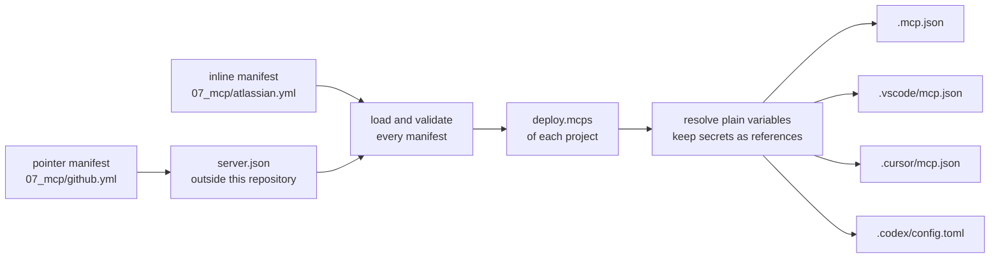

# MCP Servers

An MCP server gives an AI coding assistant extra tools, such as reading Jira issues or GitHub pull requests, over the Model Context Protocol (MCP).
Each YAML file here is an MCP server manifest: it declares one MCP server once, and a deploy writes it into the MCP config file of every supported tool in each project that selects it.
The engine never reads a variable marked secret and never writes its value: each tool gets a reference by name.
A plain variable is written as its value, read from `env_vars` of the config files only.
For a pointer server, which variables are secret comes from its `server.json`, so the engine refuses a `server.json` it cannot render safely; see [What a deploy lets a tool start](#what-a-deploy-lets-a-tool-start).

The schema is `ai-tools-engine/engine/src/main/kotlin/cz/cleanship/aitools/engine/models/McpServerManifest.kt`.
When this page and the model disagree, the model wins.



## Servers in this folder

| File | Server | Form |
| --- | --- | --- |
| `atlassian.yml` | Jira and Confluence through the local `jira-confluence-mcp-server` checkout | inline stdio server |
| `github.yml` | GitHub through the `server.json` of the `github-mcp-server` checkout | pointer to the remote endpoint |

Both carry the tag `ai-tools`, which the `mcps` filter of `09_deployments/ai-tools/project.yml` selects.

Every run needs two checkouts outside this repository, `./deploy.sh --dry-run` included:

- `atlassian.yml` starts `${PROJECTS_FOLDER}/jira-confluence-mcp-server/.venv/bin/jira-mcp-server`. The engine does not check that this file exists; a missing one only shows when a tool starts the server.
- `github.yml` reads the `server.json` of `${PROJECTS_FOLDER}/github-mcp-server`, a checkout of `github/github-mcp-server`. With the default `config.yml` that is `~/Documents/Projects/github-mcp-server`. Every run reads that file, so a machine without the checkout fails every run until you check it out or remove `github.yml`.

`github.yml` selects the remote Streamable HTTP endpoint `https://api.githubcopilot.com/mcp/` rather than the OCI package.
The remote needs one secret, the whole `Authorization` header, which every tool fills from its environment.
The package passes its token inside a `docker run -e` argument, which Codex cannot fill from the environment, so the engine refuses to render it.
Before starting a tool, export the header value, including the scheme:

```bash
export GITHUB_AUTHORIZATION="Bearer <your GitHub token>"
```

## An inline server

An inline server declares how a tool starts or reaches it, and the variables it needs.
This is a shortened `07_mcp/atlassian.yml`:

```yaml
id: atlassian
description: Jira and Confluence through the local jira-confluence-mcp-server.
transport:
  type: stdio
  command: ${PROJECTS_FOLDER}/jira-confluence-mcp-server/.venv/bin/jira-mcp-server
  # args: [--verbose]          # optional
  # env: { LOG_LEVEL: info }   # optional fixed values
variables:                     # optional
  - name: JIRA_PAT
    description: Jira personal access token.
    secret: true               # required: true or false, there is no default
    required: false            # optional, default true
  - name: JIRA_BASE_URL
    description: Base URL of Jira.
    secret: false
    required: false
metadata:
  version: 1.0.0
  tags: [ai-tools]
```

A remote server uses `type: http` with a `url` and optional `headers`:

```yaml
id: example
description: An example remote server.
transport:
  type: http
  url: https://mcp.example.com/mcp
  headers:
    Authorization: Bearer ${EXAMPLE_TOKEN}
variables:
  - name: EXAMPLE_TOKEN
    description: API token.
    secret: true
metadata:
  version: 1.0.0
  tags: [ai-tools]
```

- `transport.type` is `stdio` or `http`. Any other type, SSE included, fails the run.
- A stdio transport has `command` and the optional `args` and `env`. An http transport has `url` and the optional `headers`.
- `description` is required for an inline server and must not be blank.
- Each variable has `name`, `description`, and `secret`, which are all required, and `required`, which defaults to `true`. A `name` is an environment variable name: letters, digits, and underscores, not starting with a digit.
- `${NAME}` in `args`, `env`, `url`, and `headers` must name a variable the manifest declares under `variables`. Any other `${` fails loading, naming the file: an undeclared name, and tool syntax such as `${NAME:-default}`, `${env:NAME}`, `${input:id}` or a nested reference, which every tool would expand from its own environment.
- `command` is a path, resolved like the `source` of a pointer: `${NAME}` in it is a variable of the run, from `env_vars` of `config.yml` or `config.local.yml` or from the environment of the run, such as `${PROJECTS_FOLDER}`. It may not reference a declared variable.
- A `command` that is `~` or starts with `~/` is expanded against the home directory of the user running the engine, whatever `--user-home` the run uses. A relative command without `~` is kept as written, for the tool to look up. `url` is never expanded.
- A name under `env` must be an environment variable name, and a name under `headers` an HTTP header name.
- A stdio server receives every declared variable in its environment under the variable's own name. Do not also set that name under `env`.
- An http server receives only the variables its `url` and `headers` reference. A declared variable that neither references fails the run.
- Every `.yml` and `.yaml` file under `07_mcp/`, at any depth, is loaded as an MCP server manifest. Keep other YAML files out of this folder.

## A pointer server

```yaml
# 07_mcp/github.yml
id: github
source: ${PROJECTS_FOLDER}/github-mcp-server
select:
  remote: https://api.githubcopilot.com/mcp/
metadata:
  version: 1.0.0
  tags: [ai-tools]
```

A pointer server takes its description, transport, and variables from a `server.json` in the [MCP Registry format](https://static.modelcontextprotocol.io/schemas/2025-12-11/server.schema.json).

- `source` names that file, or the folder holding it. It resolves like the `source` of a pointer skill: `${NAME}` is substituted with a variable of the run, a leading `~/` is the home directory of the user running the engine, whatever `--user-home` the run uses, and any other relative path resolves against the folder holding the manifest.
- The `$schema` of the file must be `https://static.modelcontextprotocol.io/schemas/2025-12-11/server.schema.json`. A file of another version, or one without `$schema`, fails the run.
- `select` picks one way to run the server: `package: <identifier>` or `remote: <url>`, never both. Leave `select` out only when the file declares exactly one package or remote.
- A pointer must not declare `description`, `transport`, or `variables`.
- A remote must be `streamable-http`. Its url must be a scheme, `://` and a host, with no backslash, and must not carry a user or password, and must start with `https://` when it sends a secret header; otherwise loading fails naming the manifest. No message repeats a url: a remote is named by its position in the file, such as `remote 1`.
- A package must be a stdio package from `npm` (started with `npx -y`), `pypi` (`uvx`), or `oci` (`docker run -i --rm`, with `-e NAME` for each environment variable).
- A `runtimeHint` other than the runner of the registry type, `npx`, `uvx` or `docker`, fails loading.
- Runtime arguments are accepted only for an `oci` package, and only as `-e NAME`, which forwards one environment variable into the container and declares it as a variable. Any other runtime argument fails loading, naming the file and the argument.
- The identifier and the version of a package must follow the grammar of its registry, or loading fails naming the file and the field, without repeating the text. npm: a package name as `validate-npm-package-name` defines it, and a SemVer 2.0.0 version, a single-comparator range such as `^1.2.0` or `1.x`, or a dist-tag. An `npm:` alias, a git or URL spec, and a name or version ending in `.tgz`, `.tar` or `.tar.gz`, which npm reads as a local file, are refused, so only specs npm resolves from its registry are accepted. pypi: a PEP 508 project name and a PEP 440 version. oci: an image reference as `distribution/reference` defines it, and a tag or a digest. None of these grammars admits text that starts with `-` or holds whitespace, so no text of the file reaches a position where `npx`, `uvx` or `docker` reads its own options.
- An environment variable of a package, set or forwarded, fails loading when its name, compared without regard to case, is one of these, because it configures the runner, the loader or the connection of the process a tool starts: `DOCKER_*`, `NPM_*` (so `npm_config_*` too), `NODE_*`, `UV_*`, `PIP_*`, `PYTHON*`, `LD_*`, `DYLD_*`, `GIT_*`, `SSL_*`, `*_PROXY`, `PATH`, `HOME`, `TMPDIR`, `TMP`, `TEMP`, `SHELL`, `BASH_ENV`, `ENV`, `REQUESTS_CA_BUNDLE`, `CURL_CA_BUNDLE`, `XDG_*`, `CONTAINER_*`, `CONTAINERS_*`, `GCONV_PATH`, `HOSTALIASES`, `LOCALDOMAIN`, `RES_OPTIONS`.
- A header of a remote fails loading when its name is a hop-by-hop header or overrides the host, the client address, the method, or authentication other than `Authorization`: `Host`, `Connection`, `Keep-Alive`, `Proxy-*`, `TE`, `Trailer`, `Transfer-Encoding`, `Upgrade`, `Content-Length`, `Cookie`, `Forwarded`, `X-Forwarded-*`, `X-Real-IP`, `X-HTTP-Method-Override`, `X-Method-Override`, `X-Original-URL`, `X-Rewrite-URL`.
- The identifier and version grammar and the environment variable and header denylists apply to what a `server.json` contributes; the url rules apply to every server. An inline manifest is exempt from the denylists: it is written by the owner of this repository, chooses its whole `command` anyway, and is reviewed like code.
- Every run, `--dry-run` included, logs for each pointer server the file it was read from, the name of every variable it passes to the server and every environment variable it sets, never a value. A `server.json` may still ask for any other variable of your environment, such as `AWS_SECRET_ACCESS_KEY`, by name; read that line before you deploy.

How the variables of a `server.json` are named:

| In `server.json` | Variable |
| --- | --- |
| an environment variable of a package without a `value`, or whose `value` is one `{placeholder}` | the name of the environment variable, such as `EXAMPLE_TOKEN` |
| a `{placeholder}` in a url, header, argument, or environment value, defined under `variables` | the manifest id and the placeholder in upper case, such as `GITHUB_TOKEN` |
| a header without a `value` | the manifest id and the header name in upper case, such as `GITHUB_AUTHORIZATION` |
| a positional argument without a `value` | the manifest id and its `valueHint` in upper case |

- A positional argument with neither `value` nor `valueHint`, and a named argument without a `value`, fail loading, naming the file and the argument; rendering them would shift the command line.
- A `{placeholder}` that `variables` does not define is kept as written.
- Text of the file is data. Text holding `${`, in any form, fails loading, naming the file and the field, because every tool would expand it as a reference to its own environment.
- In a generated name, every character other than a letter, digit, or underscore becomes `_`.
- A variable is secret when its own input or any input around it is marked `isSecret`, so a header marked secret makes the `{token}` inside its value secret too. One variable derived both as secret and as not secret fails loading.
- `isRequired` becomes `required`. `server.json` defaults it to `false`, so an input without it is an optional variable.
- The same secret rules as for an inline server then apply: a secret inside an argument or combined with other text in an environment value or header fails loading.

## Secret and plain variables

A secret variable (`secret: true`) is never read by the engine.
Each tool gets a reference to it and reads the value from its own environment when it starts or connects to the server:

| Tool | MCP config file | A secret variable is written as |
| --- | --- | --- |
| Claude Code | `.mcp.json` | `${NAME}`, or `${NAME:-}` when `required: false` |
| GitHub Copilot (VS Code) | `.vscode/mcp.json` | `${env:NAME}` |
| Cursor | `.cursor/mcp.json` | `${env:NAME}` |
| Codex | `.codex/config.toml` | its name in `env_vars` (stdio), `bearer_token_env_var` (`Authorization: Bearer ${NAME}`), or `env_http_headers` (a header whose whole value is `${NAME}`) |

Because Codex has no `${NAME}` expansion, a secret is accepted only where all four tools can pass it by name:

- in a stdio server, only through its environment, never in `command`, `args`, or `env`;
- in an http server, only as a whole header value, `${NAME}`, or as `Authorization: Bearer ${NAME}`, never in `url`.

### Where a secret value comes from

The value of a secret must be in the environment of the tool process when the tool starts: the shell you start `claude` or `codex` from, or the session that starts VS Code or Cursor.

- Export it, for example in your shell profile or with `export JIRA_PAT=...` before you start the tool.
- `env_vars` of `config.yml` or `config.local.yml` is not enough. The engine reads `env_vars` only while it deploys, and it never reads a secret, so a secret declared there never reaches a tool.
- A deploy does not need the secret. Every run, `--dry-run` included, warns once about each secret variable of a selected server that the environment of the run does not set, naming the variable and never its value, and does not fail on it.
- If a secret is unset when the tool starts, Claude Code passes an optional one as an empty value and leaves a required one as the literal text `${NAME}`. Do not rely on a server's own `.env` file for a declared variable: a server that reads that file only for variables not already set may never use it.

### Plain variables

A plain variable (`secret: false`) is resolved when the deploy runs, from `env_vars` of `config.local.yml` and `config.yml` only, and written into the MCP config file as its value.
The environment of the run is never read for it, so a value your shell happens to export, such as a proxy with credentials or `JIRA_VERIFY_SSL=false` from a debugging session, never lands in a file.

- A required plain variable that `env_vars` does not declare fails the MCP config files of every project that selects the server, naming the server and the variable.
- An optional one that `env_vars` does not declare is left out, and so is an `env` entry or header that references it.
- An optional one used in `args` or `url` cannot be left out, so it fails the MCP config files of every project that selects the server.
- A value in `env_vars` that holds `${` fails the same way, naming the variable, because a tool would expand it. No message ever repeats a value.
- Such a failure does not stop the run: every other artifact is still written, and the run exits non-zero at the end.
- Put machine-specific plain values into `env_vars` of `config.local.yml`, which is gitignored.

## Where the servers land

A project selects servers with a `deploy.mcps` filter of the same shape as `skills`:

```yaml
deploy:
  mcps:
    filter:
      - type: tags
        tags: [ai-tools]
```

- MCP servers are opt-in. A project without an `mcps` block gets none of them, unlike every other kind, because the entries land in files other repositories commit and a tool starts the processes they name.
- An `mcps` block present with an empty filter (`mcps: {}`) selects every MCP server manifest of the run, like the other blocks.
- A project that selects no server, with no block or with a filter that matches nothing, never reads or writes any MCP config file. Removing a project's `mcps` block therefore leaves the entries an earlier deploy wrote; remove them by hand.

| Tool | MCP config file in the project | Server entry |
| --- | --- | --- |
| Claude Code | `.mcp.json` | `mcpServers.<id>`, with `type` |
| GitHub Copilot | `.vscode/mcp.json` | `servers.<id>`, with `type` |
| Cursor | `.cursor/mcp.json` | `mcpServers.<id>`, `type` on stdio servers only |
| Codex | `.codex/config.toml` | `[mcp_servers.<id>]` and its sub-tables |
| Windsurf | none | the run warns that the servers are not deployed for it |
| Antigravity | none | the run warns that the servers are not deployed for it |

The entry name is the manifest id, so Claude Code names a tool of the server `mcp__<id>__<tool>`.

For the http example above, a deploy writes this entry into `.mcp.json`:

```json
{
  "mcpServers": {
    "example": {
      "type": "http",
      "url": "https://mcp.example.com/mcp",
      "headers": {
        "Authorization": "Bearer ${EXAMPLE_TOKEN}"
      }
    }
  }
}
```

and this table into `.codex/config.toml`:

```toml
[mcp_servers.example]
url = "https://mcp.example.com/mcp"
bearer_token_env_var = "EXAMPLE_TOKEN"
```

### What the engine owns in an MCP config file

In a project that selects at least one server, the engine owns the entries named after any MCP server manifest of the run:

- it writes each selected server into the entry of its id;
- it removes the entry of a server the run knows but the project does not select, even one you wrote by hand under that name, so do not name your own entries like a manifest of `07_mcp/`;
- it keeps every other entry, and every other key of the file.

An owned entry is rendered in full on every deploy. A setting you add to it by hand, such as `startup_timeout_sec` or a `[mcp_servers.<id>.tools.<tool>]` table in Codex, is removed; settings of that kind belong in the manifest once the engine supports them.

Every edit is checked before it is written, and the file is left untouched, failing that project and tool, when a check does not hold:

- The existing file must parse: strict JSON for the JSON files, TOML 1.0 for `.codex/config.toml`. A JSON file with comments or trailing commas, as VS Code and Cursor allow, is refused rather than rewritten without them, on every deploy until you remove them. A JSON object with a duplicate key is refused too.
- In `.codex/config.toml`, an owned server must be defined as its own `[mcp_servers.<id>]` table. An owned server written as an inline table, with dotted keys, or as an array of tables is refused rather than defined twice.
- The edited file is parsed again: every entry and key the engine does not own must be unchanged, and the owned entries must be exactly the selected servers.
- The file must not change between the read and the write, as it would when a tool writes it during the deploy.

A JSON file is written again as a whole, so its layout is normalized. In `.codex/config.toml`, only the tables of owned servers are cut out and written again; every other line, comment and blank line included, is kept byte for byte, and so are its line endings and a missing final newline.
A rewritten file keeps its permission bits, set on the temporary file before any content is written.
The file is written only inside the project directory, once links are resolved: a symbolic link at the path is written through only when its real target lies inside the project, and the directory holding the file, such as a linked `.codex`, `.vscode` or `.cursor`, must lie inside it too. A link leading outside the project, nowhere, or in a loop fails that project and tool, naming the file and where it leads. Anything at the path that is not a regular file, such as a directory or a FIFO, fails the same way without being opened.
No failure message quotes the content of a file or the value of a variable; it names the file, the line or offset, the server and the variable.
`replace: true` never deletes an MCP config file: Codex and Cursor replace only the directories they generate inside `.codex` and `.cursor`.

### Keep the files out of version control

The four MCP config files are gitignored in this repository.
They hold plain values resolved on one machine, such as base URLs and the absolute path of the Jira server, which differ between machines.
The engine does not edit the `.gitignore` of another project: in every project that selects servers, add `.mcp.json`, `.vscode/mcp.json`, `.cursor/mcp.json`, and `.codex/config.toml` to its `.gitignore` yourself, or review each file before you commit it.

### What a deploy lets a tool start

An MCP entry makes a tool start a process or send requests to a server, often without asking:

- Claude Code asks once per server in an interactive session and remembers the answer by server name, so a changed command under an approved name is not asked about again. `claude -p` and the Agent SDK start the servers of `.mcp.json` without asking.
- VS Code starts the servers of `.vscode/mcp.json` without a prompt in a trusted workspace. It also reads `.mcp.json`, so a Copilot user gets the Claude Code entries too.
- Cursor documents no prompt before it starts the servers of `.cursor/mcp.json`; a tool call asks for approval.
- Codex reads the `.codex/config.toml` of a project only when the project is trusted in Codex, and then starts its servers without a further prompt. In a project you have not trusted, Codex ignores the file.

A pointer server trusts its `server.json` within the rules above. `select` pins the package name or remote url, and the grammar checks keep the version from naming another package or a local file, but the version itself, the package arguments, the headers, and the names of the variables it forwards follow the checkout under `${PROJECTS_FOLDER}`: after a `git pull` there, the next deploy writes what the new file says. The registry the runner installs from is the one configured for your runner, not one the file can choose. Review changes to that checkout, and the forwarded names the run logs, before you deploy.

## Not supported yet

These are planned and listed in [PLANNED_FEATURES.md](../PLANNED_FEATURES.md#mcps):

- MCP servers in the user scope: a `user.yml` has no `mcps` block, so nothing is written to `~/.claude.json` or `~/.codex/config.toml`.
- Attaching a server to a single agent.
- Windsurf. Antigravity stays unsupported too.
- Allow and deny lists of the tools of a server.
- A secrets manager as the source of secret values. Today the only source is the environment of the tool.

## Troubleshooting

**`MCP server '<id>' needs the variable '<NAME>' ...`**: a required plain variable is not declared under `env_vars:`. Declare it in `config.local.yml`, mark it `required: false`, or mark it `secret: true` to pass it from the environment of the tool. Exporting it in the shell of the deploy does not help: plain variables are never read from there. The MCP config files of the projects selecting that server are not written, everything else is, and the run exits non-zero.

**`MCP server '<id>' references the secret variable '<NAME>' in ...`**: a secret is used where a tool would need its value in the file. Pass it through the environment of a stdio server, or use it as a whole header value or a bearer token. The message has two origins:

- From loading, when the message starts with `Failed to load <file>:`. The manifest breaks the rules above, and the whole run stops before anything is written.
- Resolving refuses the same thing again as a safeguard, with a message ending in `where it would have to be written as a value.`. Loading rejects every such manifest first, so you only meet that second message after an engine fault; report it.

**`... declares the schema '...', but this engine reads only '...'`**: the `server.json` is of another registry schema version. Point `source` at a file of the 2025-12-11 schema.

**`'select' names the package '...', which '...' does not declare`**: the identifier or url in `select` does not match the file. The message lists what the file declares.

**`... is not valid JSON at offset <n>, so the engine leaves it untouched`** / **`... is not valid TOML at line <n>, column <m>`**: an existing MCP config file cannot be parsed, or holds comments or trailing commas. Fix or remove it, and deploy again. The other artifacts of the run are still written, and the run exits non-zero.

**`MCP server '<id>' references '<NAME>' in ..., which it does not declare`** / **`... holds a '${' ... that is not a reference in the form '${NAME}'`**: declare the variable under `variables`, or remove the tool syntax. The message names the field, never its text.

**`'...server.json': ... holds '${' in ...`**, **`... declares the runtime argument ...`**, **`... names the runtime ...`**, **`... derives the variable ... twice`**: the `server.json` of a pointer asks for something the engine does not render. Select another package or remote, or leave the server out.

**`... defines the MCP server '<id>', which a manifest of this run owns, other than as a table`**: rewrite that definition in `.codex/config.toml` as a `[mcp_servers.<id>]` table, or remove it.

**`... declares the key '<key>' twice in one object`** / **`... changed while the engine merged it`** / **`... would lose or change content the engine does not own`**: the file is left untouched. Remove the duplicate key, deploy again once the tool writing the file is idle, or report the file layout.

**`<tool> has no MCP support in this engine`**: a project selects servers and the run configures Windsurf or Antigravity. The servers are deployed for every other tool.

**A server does not start in Codex**: check that the project is trusted in Codex, and that every secret variable is exported in the shell that starts Codex.

**A project got no MCP config file**: MCP servers are opt-in; add an `mcps` block to its `project.yml`.
