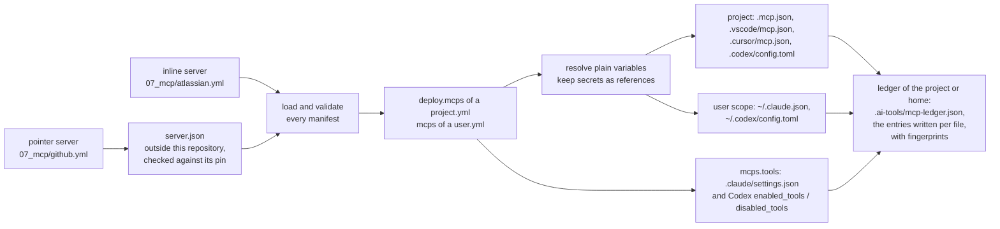

# MCP Servers

An MCP server gives an AI coding assistant extra tools, such as reading Jira issues or GitHub pull requests, over the Model Context Protocol (MCP).
Each YAML file here is an MCP server manifest: it declares one MCP server once, and a deploy writes it into the MCP config file of every supported tool in each project that selects it.
A user deployment can select servers too, for the MCP config files of Claude Code and Codex in the home directory; see [The user scope](#the-user-scope).
An agent can name the servers it uses, and a deployment can allow and deny single tools of a server; see [Attaching servers to an agent](#attaching-servers-to-an-agent) and [Allowing and denying tools](#allowing-and-denying-tools).
The engine never uses the value of a variable marked secret: each tool gets a reference by name.
A plain variable is written as its value, read from `env_vars` of the config files only.
For a pointer server, which variables are secret comes from its `server.json`, so the engine refuses a `server.json` it cannot render safely; see [What a deploy lets a tool start](#what-a-deploy-lets-a-tool-start).

The schema is `ai-tools-engine/engine/src/main/kotlin/cz/cleanship/aitools/engine/models/McpServerManifest.kt`.
When this page and the model disagree, the model wins.



The ledger is read at the start of the next deploy, which removes the entries it records that the deployment no longer selects; see [The ledger](#the-ledger).

## Servers in this folder

| File | Server | Form |
| --- | --- | --- |
| `atlassian.yml` | Jira and Confluence through the local `jira-confluence-mcp-server` checkout | inline stdio server |
| `github.yml` | GitHub through the `server.json` of the `github-mcp-server` checkout | pointer to the remote endpoint, [pinned](#pinning-a-pointer-server) |

Both carry the tag `ai-tools`, which the `mcps` filter of `09_deployments/ai-tools/project.yml` selects.

Every run needs two checkouts outside this repository, `./deploy.sh --dry-run` included:

- `atlassian.yml` starts `${PROJECTS_FOLDER}/jira-confluence-mcp-server/.venv/bin/jira-mcp-server`. The engine does not check that this file exists; a missing one only shows when a tool starts the server.
- `github.yml` reads the `server.json` of `${PROJECTS_FOLDER}/github-mcp-server`, a checkout of `github/github-mcp-server`. With the default `config.yml` that is `~/Documents/Projects/github-mcp-server`. Every run reads that file, so a machine without the checkout fails every run until you check it out or remove `github.yml`.
- `github.yml` pins the hash of that `server.json`. A checkout whose `server.json` holds other bytes fails every run until you review the change and update the pin; see [Pinning a pointer server](#pinning-a-pointer-server).

`github.yml` selects the remote Streamable HTTP endpoint `https://api.githubcopilot.com/mcp/` rather than the OCI package.
The remote takes one secret: the whole `Authorization` header.
Its `server.json` does not mark the header required, so the secret is optional.
Every tool fills it from its environment, and Claude Code sends an empty header when it is unset.
The package passes its token as `-e GITHUB_PERSONAL_ACCESS_TOKEN={token}`, a runtime argument other than `-e NAME`, so loading refuses it.
Its identifier also holds `${VERSION}`, which the oci grammar refuses, so allowing the argument alone would not make the package usable.
Codex could not fill that argument from the environment either.
Before starting a tool, export the header value, including the scheme:

```bash
export GITHUB_AUTHORIZATION="Bearer <your GitHub token>"
```

## Adding a server

1. Create `07_mcp/<id>.yml`, as an [inline server](#an-inline-server) or a [pointer server](#a-pointer-server).
2. Tag it `ai-tools` to deploy it into this repository, or select it in the `deploy.mcps` block of another project or the `mcps` block of a `user.yml`; see [Where the servers land](#where-the-servers-land).
3. For a pointer server, review its `server.json` and add the `pin` that the first dry run prints; see [Pinning a pointer server](#pinning-a-pointer-server).
4. Run `./deploy.sh --dry-run` from the repository root. It loads and checks the manifest, names each MCP config file it would write, and warns about every secret the environment does not set.

The full step list is in [QUICKREF.md](../QUICKREF.md#add-an-mcp-server).

## An inline server

An inline server declares how a tool starts or reaches it, and the variables it needs.
This is a shortened `07_mcp/atlassian.yml`:

```yaml
id: atlassian
description: Jira and Confluence through the local jira-confluence-mcp-server.
transport:
  type: stdio
  command: ${PROJECTS_FOLDER}/jira-confluence-mcp-server/.venv/bin/jira-mcp-server
  # args: [--verbose]          # optional
  # env: { LOG_LEVEL: info }   # optional fixed values
variables:                     # optional
  - name: JIRA_PAT
    description: Jira personal access token.
    secret: true               # required: true or false, there is no default
    required: false            # optional, default true
  - name: JIRA_BASE_URL
    description: Base URL of Jira.
    secret: false
    required: false
metadata:
  version: 1.0.0
  tags: [ai-tools]
```

A remote server uses `type: http` with a `url` and optional `headers`:

```yaml
id: example
description: An example remote server.
transport:
  type: http
  url: https://mcp.example.com/mcp
  headers:
    Authorization: Bearer ${EXAMPLE_TOKEN}
variables:
  - name: EXAMPLE_TOKEN
    description: API token.
    secret: true
metadata:
  version: 1.0.0
  tags: [ai-tools]
```

- `transport.type` is `stdio` or `http`. Any other type, SSE included, fails the run.
- A stdio transport has `command` and the optional `args` and `env`. An http transport has `url` and the optional `headers`.
- `description` is required for an inline server and must not be blank.
- Each variable has the required fields `name`, `description`, and `secret`.
- The optional field `required` defaults to `true`.
- A `name` is an environment variable name: letters, digits, and underscores, not starting with a digit.
- `${NAME}` in `args`, `env`, `url`, and `headers` must name a variable the manifest declares under `variables`.
- Any other `${` fails loading, naming the file: an undeclared name, and tool syntax such as `${NAME:-default}`, `${env:NAME}`, `${input:id}` or a nested reference. Every tool would expand such text from its own environment.
- `command` is a path. `${NAME}` in it is a variable of the run, from `env_vars` of `config.yml` or `config.local.yml` or from the environment of the run, such as `${PROJECTS_FOLDER}`. It may not reference a declared variable.
- A `command` that is `~` or starts with `~/` is expanded against the home directory of the user running the engine, whatever `--user-home` the run uses. A relative command without `~` is kept as written, for the tool to look up. `url` is never expanded.
- A name under `env` must be an environment variable name, and a name under `headers` an HTTP header name.
- A stdio server receives every declared variable in its environment under the variable's own name. Do not also set that name under `env`.
- An http server receives only the variables its `url` and `headers` reference. A declared variable that neither references fails the run.
- Every `.yml` and `.yaml` file under a directory of `locations.mcps` (`07_mcp/` by default), at any depth, is loaded as an MCP server manifest. Keep other YAML files out of those directories.

### URL rules

These rules apply to the `url` of every http server, inline or pointer.
No message repeats a url.

| Rule | Example that fails |
| --- | --- |
| The url starts with `http://` or `https://`, in any letter case, followed by a host. | `mcp.example.com/mcp`, `ftp://mcp.example.com/mcp` |
| The host starts right after `//`: no path, query, fragment, port, user or space in its place. | `https://?x`, `https://:443/mcp`, `https://#mcp.example.com` |
| A url that writes its scheme also writes its host, rather than taking it from a variable. | `https://${HOST}/mcp` |
| The url holds no backslash, which some tools read as a slash. | `https://mcp.example.com\mcp` |
| The url carries no user or password. | `https://user:pw@mcp.example.com/mcp` |
| When the server sends a secret header, the url starts with `https://` as written in the manifest, never with plain http or a variable. | `${BASE}/mcp` with a secret header |

When a rule is checked:

- A url that starts with written text is checked when loading, on the text before its first variable. That text must hold the scheme and at least the start of the host, so `https://mcp.${DOMAIN}/mcp` passes and `https://${HOST}/mcp` does not.
- A url whose written start is exactly `http://` or `https://`, followed by a variable, fails loading with its own message: write the host, or start the url with the variable.
- A url that starts with a variable, such as `${BASE}/mcp`, is checked once its plain variables are resolved from `env_vars`.
- Every url is checked again once its variables are resolved.
- A failure when loading names the manifest and stops the whole run before anything is written.
- A failure once the variables are resolved names the server and the variables the url uses, never the value. It fails the MCP config files of every deployment that selects the server. The rest of the run is still written, and the run exits non-zero.

## A pointer server

```yaml
# 07_mcp/github.yml
id: github
source: ${PROJECTS_FOLDER}/github-mcp-server
select:
  remote: https://api.githubcopilot.com/mcp/
pin: sha256:38d2395945342d544b57055e46d5faaae01f51cb4304bbd5182ec60489c33372
metadata:
  version: 1.1.0
  tags: [ai-tools]
```

A pointer server takes its description, transport, and variables from a `server.json` in the [MCP Registry format](https://static.modelcontextprotocol.io/schemas/2025-12-11/server.schema.json).

- `source` names that file, or the folder holding it. It resolves like the `source` of a pointer skill:
  - `${NAME}` is substituted with a variable of the run.
  - `~` or a leading `~/` is the home directory of the user running the engine, whatever `--user-home` the run uses.
  - Any other relative path resolves against the folder holding the manifest.
- The `$schema` of the file must be `https://static.modelcontextprotocol.io/schemas/2025-12-11/server.schema.json`. A file of another version, or one without `$schema`, fails the run.
- `select` picks one way to run the server: `package: <identifier>` or `remote: <url>`, never both. Leave `select` out only when the file declares exactly one package or remote.
- `pin` is optional. It is the hash of the bytes of the `server.json`; see [Pinning a pointer server](#pinning-a-pointer-server).
- A pointer server must not declare `description`, `transport`, or `variables`.
- A remote must be `streamable-http`.
- The url of a remote follows the [URL rules](#url-rules).
- No message repeats the url of a remote. A remote is named by its position in the file, such as `remote 1`.
- A package must be a stdio package from `npm` (started with `npx -y`), `pypi` (`uvx`), or `oci` (`docker run -i --rm`, with `-e NAME` for each environment variable).
- A `runtimeHint` other than the runner of the registry type, `npx`, `uvx` or `docker`, fails loading.
- Runtime arguments are accepted only for an `oci` package, and only as `-e NAME`, which forwards one environment variable into the container and declares it as a variable. Any other runtime argument fails loading, naming the file and the argument.
- The identifier and the version of a package must follow the grammar of its registry. Otherwise loading fails naming the file and the field, without repeating the text.
  - npm: the identifier follows the rules `validate-npm-package-name` sets for new packages: lower case, URL-safe characters, at most 214 characters, optionally scoped. The version is a SemVer 2.0.0 version, a single-comparator range such as `^1.2.0` or `1.x`, or a dist-tag. An `npm:` alias and a git or URL spec are refused. A name or version ending in `.tgz`, `.tar` or `.tar.gz` is refused too, because npm reads it as a local file. Only specs npm resolves from its registry are accepted.
  - pypi: the identifier is a PEP 508 project name, and the version a PEP 440 version.
  - oci: the identifier is an image reference as `distribution/reference` defines it, optionally with a tag or a digest, and the version is a tag or a digest. An identifier that carries a tag or a digest is used as written, and the version is then ignored.
- No identifier or version the engine accepts starts with `-` or holds whitespace. So no identifier or version reaches a position where `npx`, `uvx` or `docker` reads its own options. Package arguments come after the identifier. They are checked for `${`, but not against a grammar.
- A `server.json` fails loading when it sets, forwards or derives an environment variable whose name is on the [environment variable denylist](#environment-variable-denylist), compared without regard to case.
- A derived name is one the engine builds from the manifest id and a key of the file, such as `GIT_SSH_COMMAND` from the id `git` and the `valueHint` `ssh_command`; see [how the variables are named](#how-the-variables-of-a-serverjson-are-named).
- A header of a remote fails loading when its name is a hop-by-hop header or overrides the host, the client address, the method, or authentication other than `Authorization`: `Host`, `Connection`, `Keep-Alive`, `Proxy-*`, `TE`, `Trailer`, `Transfer-Encoding`, `Upgrade`, `Content-Length`, `Cookie`, `Forwarded`, `X-Forwarded-*`, `X-Real-IP`, `X-HTTP-Method-Override`, `X-Method-Override`, `X-Original-URL`, `X-Rewrite-URL`.
- The grammar checks and the two denylists apply to what a `server.json` contributes. The [URL rules](#url-rules) apply to every server.
- An inline server is exempt from the denylists. It is written by the owner of this repository, chooses its whole `command` anyway, and is reviewed like code.
- Every run, `--dry-run` included, logs for each pointer server the file it was read from, the name of every variable it passes to the server and every environment variable it sets, never a value. A `server.json` may still ask for any other variable of your environment, such as `AWS_SECRET_ACCESS_KEY`, by name; read that line before you deploy.

### Environment variable denylist

Each of these names configures the runner, the loader or the connection of the process a tool starts:

| Names | What they configure |
| --- | --- |
| `DOCKER_*`, `CONTAINER_*`, `CONTAINERS_*` | docker and podman |
| `NPM_*` (so `npm_config_*` too), `NODE_*` | npm and Node.js |
| `UV_*`, `PIP_*`, `PYTHON*` | uv, pip and Python |
| `LD_*`, `DYLD_*`, `GCONV_PATH` | the dynamic loader and glibc |
| `HOSTALIASES`, `LOCALDOMAIN`, `RES_OPTIONS` | name resolution of glibc |
| `GIT_*` | git |
| `SSL_*`, `REQUESTS_CA_BUNDLE`, `CURL_CA_BUNDLE`, `*_PROXY` | TLS and proxies |
| `PATH`, `HOME`, `TMPDIR`, `TMP`, `TEMP`, `SHELL`, `BASH_ENV`, `ENV`, `XDG_*` | the paths, shell and configuration directories a process runs with |

### How the variables of a `server.json` are named

| In `server.json` | Variable |
| --- | --- |
| an environment variable of a package without a `value`, or whose `value` is one `{placeholder}` defined under its `variables` | the name of the environment variable, such as `EXAMPLE_TOKEN` |
| a `{placeholder}` in a url, header, argument, or environment value, defined under `variables` | the manifest id and the placeholder in upper case, such as `GITHUB_TOKEN` |
| a header without a `value` | the manifest id and the header name in upper case, such as `GITHUB_AUTHORIZATION` |
| a positional argument without a `value` | the manifest id and its `valueHint` in upper case |

- A positional argument with neither `value` nor `valueHint`, and a named argument without a `value`, fail loading, naming the file, and the argument when it has a name. Rendering them would shift the command line.
- A `{placeholder}` that `variables` does not define is kept as written.
- Text the engine writes from the file is data. A url, a header value, a package argument, or an environment value that holds `${`, in any form, fails loading, naming the file and the field, because every tool would expand it as a reference to its own environment.
- An identifier or version holding `${` fails the grammar check instead.
- Fields the engine does not render, such as the top-level `version`, are not read.
- In a generated name, every character other than an ASCII letter, digit or underscore becomes `_`, and a name that would start with a digit gets a leading `_`.
- A variable is secret when its own input or any input around it is marked `isSecret`, so a header marked secret makes the `{token}` inside its value secret too. One variable derived both as secret and as not secret fails loading.
- `isRequired` becomes `required`. `server.json` defaults it to `false`, so an input without it is an optional variable.
- The same secret rules as for an inline server then apply: a secret inside an argument or combined with other text in an environment value or header fails loading.

### Pinning a pointer server

A pin makes a changed `server.json` fail the run until you have reviewed the change.
Without a pin, a `git pull` in the checkout changes what every tool starts on the next deploy.

- The key is `pin`, on a pointer server only.
- Its value is `sha256:` followed by the 64 lowercase hexadecimal digits of the SHA-256 hash of the bytes of the `server.json`.
- The hash covers that one file, not the rest of the checkout.
- Every run, `--dry-run` included, reads the file once and compares the hash of exactly the bytes it then decodes.

To add a pin:

1. Review the `server.json` the manifest points at.
2. Run `./deploy.sh --dry-run`. For every pointer server without a pin, it logs one warning that names the file and prints the value to add:

   ```
   MCP server 'github' reads '/home/<you>/Documents/Projects/github-mcp-server/server.json' without a pin, so any change to that file changes what every tool starts. Review the file, then add 'pin: sha256:38d2395945342d544b57055e46d5faaae01f51cb4304bbd5182ec60489c33372' to the manifest to refuse any other content.
   ```

3. Copy `pin: sha256:<hash>` from the warning into the manifest. `sha256sum server.json` prints the same 64 digits, without the `sha256:` prefix.

When the file no longer matches, loading fails and the whole run stops before anything is written, `--dry-run` included.
The message names the manifest, the `server.json`, the actual hash, and the pinned one.
A mismatch means the checkout now holds a different `server.json` than the one you reviewed, for example after a `git pull`.
Review what changed, for example with `git -C <checkout> diff <old commit> -- server.json`, then set `pin` to the new hash from the message.
A hash is not a secret, so the messages print it.

A `pin` on an inline server, or a value of another form, fails loading naming the manifest; see [Troubleshooting](#troubleshooting).

## Secret and plain variables

A secret variable (`secret: true`) is never written, logged or resolved by the engine. The engine only checks whether the environment of the run sets it, to warn when it does not.
Each tool gets a reference to it and reads the value from its own environment when it starts or connects to the server:

| Tool | MCP config file | A secret variable is written as |
| --- | --- | --- |
| Claude Code | `.mcp.json` | `${NAME}`, or `${NAME:-}` when `required: false` |
| GitHub Copilot (VS Code) | `.vscode/mcp.json` | `${env:NAME}` |
| Cursor | `.cursor/mcp.json` | `${env:NAME}` |
| Codex | `.codex/config.toml` | its name in `env_vars` (stdio), `bearer_token_env_var` (`Authorization: Bearer ${NAME}`), or `env_http_headers` (a header whose whole value is `${NAME}`) |

Because Codex has no `${NAME}` expansion, a secret is accepted only where all four tools can pass it by name:

- in a stdio server, only through its environment, never in `command`, `args`, or `env`;
- in an http server, only as a whole header value, `${NAME}`, or as `Authorization: Bearer ${NAME}`, never in `url`.

### Where a secret value comes from

The value of a secret must be in the environment of the tool process when the tool starts: the shell you start `claude` or `codex` from, or the session that starts VS Code or Cursor.

- Export it, for example in your shell profile or with `export JIRA_PAT=...` before you start the tool.
- `env_vars` of `config.yml` or `config.local.yml` is not enough. The engine reads `env_vars` only while it deploys, and it never uses the value of a secret, so a secret declared there never reaches a tool.
- A deploy does not need the secret. Every run, `--dry-run` included, warns once about each secret variable of a selected server that the environment of the run does not set, naming the variable and never its value, and does not fail on it.
- If a secret is unset when the tool starts, Claude Code passes an optional one as an empty value and leaves a required one as the literal text `${NAME}`. Do not rely on a server's own `.env` file for a declared variable: a server that reads that file only for variables not already set may never use it.

### Plain variables

A plain variable (`secret: false`) is resolved when the deploy runs, from `env_vars` of `config.local.yml` and `config.yml` only, and written into the MCP config file as its value.
The environment of the run is never read for it, so a value your shell happens to export, such as a proxy with credentials or `JIRA_VERIFY_SSL=false` from a debugging session, never lands in a file.

- A required plain variable that `env_vars` does not declare fails the MCP config files of every deployment that selects the server, naming the server and the variable.
- An optional one that `env_vars` does not declare is left out, and so is an `env` entry or header that references it.
- An optional one used in `args` or `url` cannot be left out, so it fails the MCP config files of every deployment that selects the server.
- A value in `env_vars` that holds `${` fails the same way, naming the variable, because a tool would expand it. No message ever repeats a value.
- Such a failure does not stop the run: every other artifact is still written, and the run exits non-zero at the end.
- Put machine-specific plain values into `env_vars` of `config.local.yml`, which is gitignored.

## Where the servers land

A project selects servers with a `deploy.mcps` filter of the same shape as `skills`:

```yaml
deploy:
  mcps:
    filter:
      - type: tags
        tags: [ai-tools]
```

- MCP servers are opt-in. A project without an `mcps` block gets none of them, unlike every other kind, because the entries land in files other repositories commit and a tool starts the processes they name.
- An `mcps` block present with an empty filter (`mcps: {}`) selects every MCP server manifest of the run, like the other blocks.
- The block may also hold `tools`, which allows and denies single tools of a selected server; see [Allowing and denying tools](#allowing-and-denying-tools).
- A project that selects no server, with no block or with a filter that matches nothing, writes no server entry. It still reads its [ledger](#the-ledger), and removes the entries the ledger records from the files it names. Without a ledger, such a project reads and writes no MCP config file.
- A user deployment selects servers with an `mcps` block of the same shape at the top level of its `user.yml`; see [The user scope](#the-user-scope).

| Tool | MCP config file in the project | Server entry |
| --- | --- | --- |
| Claude Code | `.mcp.json` | `mcpServers.<id>`, with `type` |
| GitHub Copilot | `.vscode/mcp.json` | `servers.<id>`, with `type` |
| Cursor | `.cursor/mcp.json` | `mcpServers.<id>`, `type` on stdio servers only |
| Codex | `.codex/config.toml` | `[mcp_servers.<id>]` and its sub-tables |
| Windsurf | none | the run warns that the servers are not deployed for it |
| Antigravity | none | the run warns that the servers are not deployed for it |

The entry name is the manifest id, so Claude Code names a tool of the server `mcp__<id>__<tool>`.

For the http example above, a deploy writes this entry into `.mcp.json`:

```json
{
  "mcpServers": {
    "example": {
      "type": "http",
      "url": "https://mcp.example.com/mcp",
      "headers": {
        "Authorization": "Bearer ${EXAMPLE_TOKEN}"
      }
    }
  }
}
```

and this table into `.codex/config.toml`:

```toml
[mcp_servers.example]
url = "https://mcp.example.com/mcp"
bearer_token_env_var = "EXAMPLE_TOKEN"
```

### What the engine owns in an MCP config file

In a deployment that selects at least one server, the engine owns the entries named after any MCP server manifest of the run, and the entries the [ledger](#the-ledger) records for the file while they still hold what the engine wrote:

- it writes each selected server into the entry of its id;
- it removes the entry of a server the run knows but the deployment does not select, even one you wrote by hand under that name, so do not name your own entries like a manifest of `07_mcp/`;
- it removes an entry the ledger records whose manifest was deleted from `07_mcp/`, but only while the entry holds the content the ledger records for it;
- it keeps every other entry, and every other key of the file.

So while a deployment selects servers, an entry named after a manifest belongs to the engine whatever it holds: an entry you edited by hand is replaced or removed without a warning.

In a deployment that selects no server, the engine owns only the entries the ledger records for the file, each only while it holds the recorded content, and removes them.
The same fingerprint rule applies to an entry whose manifest no longer exists.
In those two cases, an entry whose content changed since, for example because you edited it by hand, is left in place with a warning, and the ledger no longer records it.

An owned entry is rendered in full on every deploy. A setting you add to it by hand, such as `startup_timeout_sec` or a `[mcp_servers.<id>.tools.<tool>]` table in Codex, is removed; settings of that kind belong in the manifest once the engine supports them.

Every edit is checked before it is written, and the file is left untouched, failing that deployment and tool, when a check does not hold:

- The existing file must be valid UTF-8, so no byte the engine does not own is replaced.
- The existing file must parse: strict JSON for the JSON files, TOML 1.0 for `.codex/config.toml`. A JSON file with comments or trailing commas, as VS Code and Cursor allow, is refused rather than rewritten without them, on every deploy until you remove them. A JSON object with a duplicate key is refused too, and so is a value no JSON reader accepts, such as an unquoted word or the number `01`.
- A JSON string must not hold a raw control character, such as a line break or a tab; JSON allows them only escaped.
- A JSON file must not nest its values deeper than 512 levels. The top object counts as level 1.
- A key the engine edits, such as `mcpServers` or `permissions.deny`, must hold an object or an array as the tool expects.
- In `.codex/config.toml`, an owned server must be defined as its own `[mcp_servers.<id>]` table. An owned server written as an inline table, with dotted keys, or as an array of tables is refused rather than defined twice.
- The edited file is parsed again: every entry and key the engine does not own must be unchanged, and the owned entries must be exactly the selected servers.
- The file must read the same just before the write as when it was merged. It does not when a tool writes it during the deploy.

The project files `.mcp.json`, `.vscode/mcp.json`, and `.cursor/mcp.json` are written again as a whole, so their layout is normalized.
`~/.claude.json` and every `settings.json` are edited in place instead: only the owned entries change, and every other byte is kept, an empty `{}` or `[]` included; see [The user scope](#the-user-scope).
A `mcpServers` object the engine added to a file that had none stays as `"mcpServers": {}` once its last entry is removed.
In `.codex/config.toml`, only the tables of owned servers are cut out and written again; every other line, comment and blank line included, is kept byte for byte, and so are its line endings and a missing final newline. Lines the engine adds use the dominant line ending of the file: CRLF when more lines end in CRLF than in LF, otherwise LF. This holds for any mix of line endings, with or without a final newline.
A rewritten file keeps its permission bits, set on the temporary file before any content is written.
A file the engine creates under the home, such as `~/.claude.json`, `~/.codex/config.toml`, `~/.claude/settings.json` or the ledger of the home, gets the mode `0600` (`rw-------`) on a POSIX file system, so only you can read it. A file created in a project gets the mode of every other generated file.
The engine moves each new file into place atomically where the file system supports it.

In a project, the file is written only inside the project directory, once links are resolved:

- A symbolic link at the path is written through only when its real target lies inside the project.
- The directory holding the file, such as a linked `.codex`, `.vscode` or `.cursor`, must lie inside the project too.
- A link at the file, or at a directory above it, that leads outside the project, nowhere, or in a loop fails that project and tool. The message names the file and where the link leads. A dry run fails the same way as a deploy.

In the user scope, a link at the file or above it may lead anywhere, as the links of a dotfile repository do, but it must lead to something.
In both scopes:

- Anything at the path that is not a regular file, such as a directory or a FIFO, fails that deployment and tool without being opened.
- Something that is not a directory above the file, such as a regular file at `.codex`, fails that deployment and tool before anything is read or written, in a dry run as in a deploy.
- A write the file system refuses, for example to a read-only MCP config file or into a read-only `.codex` directory, fails that deployment and tool too. Only a real deploy finds it, because a dry run never writes.

The same rules hold for every `settings.json` the engine edits and for the [ledger](#the-ledger).
The directory each tool writes into is checked as well, before any file of the tool is written; see [Tool directories](#tool-directories).

No failure message quotes the content of a file or the value of a variable; it names the file, the line or offset, the server and the variable, or the duplicated key.
A name the engine read from a file or a manifest, such as a key, a ledger entry or a server id, is named with every control character, line or paragraph separator, Unicode format character (such as U+202E) and lone surrogate written as `\uXXXX`, and cut to 160 characters ending in `…`, so it cannot start a line of its own or hide text in a log.
`replace: true` never deletes an MCP config file: Codex and Cursor replace only the directories they generate inside `.codex` and `.cursor`.
It does delete `.claude/settings.json`, because Claude Code replaces `.claude` as a whole; see [Allowing and denying tools](#allowing-and-denying-tools).

### Keep the files out of version control

The four MCP config files are gitignored in this repository, and so is `.ai-tools/`, the directory of the [ledger](#the-ledger).
The config files hold plain values resolved on one machine, such as base URLs and the absolute path of the Jira server, which differ between machines.
The ledger records what the engine wrote on one machine.
The engine does not edit the `.gitignore` of another project. In every project that selects servers, add `.mcp.json`, `.vscode/mcp.json`, `.cursor/mcp.json`, `.codex/config.toml`, and `.ai-tools/` to its `.gitignore` yourself, or review each file before you commit it.
`.claude/settings.json` is often committed. A deployment with `deny` restrictions changes only the permission entries it wrote there, so the diff shows exactly those entries.

### What a deploy lets a tool start

An MCP entry makes a tool start a process or send requests to a server, often without asking:

- Claude Code asks once per server in an interactive session and remembers the answer; `claude mcp reset-project-choices` resets it ([Claude Code MCP documentation](https://code.claude.com/docs/en/mcp)). `claude -p` and the Agent SDK start the servers of `.mcp.json` without asking.
- VS Code starts the servers of `.vscode/mcp.json` without a prompt in a trusted workspace. It also reads `.mcp.json`, so a Copilot user gets the Claude Code entries too.
- Cursor documents no prompt before it starts the servers of `.cursor/mcp.json`; a tool call asks for approval.
- Codex reads the `.codex/config.toml` of a project only when the project is trusted in Codex, and then starts its servers without a further prompt. In a project you have not trusted, Codex ignores the file.

A pointer server trusts its `server.json` within the rules above:

- `select` pins the package name or the remote url.
- The grammar checks keep the version from naming another package or a local file.
- The version itself, the package arguments, the headers, and the names of the variables it forwards follow the checkout under `${PROJECTS_FOLDER}`. Without a pin, the next deploy after a `git pull` there writes what the new file says. With a [pin](#pinning-a-pointer-server), a changed file fails every run until you update the pin.
- The runner installs from the registry configured for your runner, not from one the file can choose.

Review changes to that checkout, and the forwarded names the run logs, before you deploy.

## The user scope

A `user.yml` selects MCP servers with a top-level `mcps` block of the same shape as `deploy.mcps` of a project:

```yaml
# in 09_deployments/<name>/user.yml, beside rulesets, agents and the other blocks
mcps:
  filter:
    - type: whitelist
      ids: [github]
  tools:                          # optional; see "Allowing and denying tools"
    github:
      deny: [delete_repository]
```

- Selection is opt-in, as in a project: a `user.yml` without an `mcps` block selects no server.
- `09_deployments/globals/user.yml` of this repository has no `mcps` block, so a deploy writes no server into your home.
- A `user.yml` without the block still reads the [ledger](#the-ledger) of the home and removes the entries it records, unless another deployment of the run covers the file with its `mcps` block.

Paths are relative to `--user-home`, which defaults to your home directory:

| Tool | MCP config file | Server entry | Tool restrictions |
| --- | --- | --- | --- |
| Claude Code | `~/.claude.json` | top-level `mcpServers.<id>`, with `type` | `~/.claude/settings.json` |
| Codex | `~/.codex/config.toml` | `[mcp_servers.<id>]` and its sub-tables | in the server table |
| GitHub Copilot, Cursor, Windsurf, Antigravity | none | the run warns that the tool gets none of the servers, with the reason | none |

- The ledger of the user scope is `~/.ai-tools/mcp-ledger.json`.
- Secrets are written as references, exactly as in a project: `${NAME}` or `${NAME:-}` for Claude Code, by name for Codex; see [Secret and plain variables](#secret-and-plain-variables). Claude Code expands `${NAME}` in the server entries of `~/.claude.json` ([Claude Code MCP documentation](https://code.claude.com/docs/en/mcp)).
- Ownership, verification and the other rules of [What the engine owns in an MCP config file](#what-the-engine-owns-in-an-mcp-config-file) apply unchanged. So a server you added by hand under the id of a manifest, for example with `claude mcp add --scope user github ...`, is changed by the first deploy of a `user.yml` that selects servers. When the `user.yml` selects that id, the entry is replaced without a separate log line. Otherwise it is removed, which the dry run names under `removing [...]`.
- A file the engine creates under the home gets the mode `0600`.
- A link at `~/.claude`, `~/.codex`, or one of the files may lead anywhere, as the links of a dotfile repository do, but it must lead to something; see [Tool directories](#tool-directories).
- GitHub Copilot and Cursor keep their user servers in files this engine does not write: VS Code in the `mcp.json` of each user profile and of each remote, Cursor in `~/.cursor/mcp.json`. Windsurf and Antigravity are not supported in either scope; see [Not supported yet](#not-supported-yet).

### Deploy while no Claude Code session runs

`~/.claude.json` is the file Claude Code "writes for itself": it holds the sign-in session, the MCP servers, the trust state of each project, and global settings ([Claude Code settings](https://code.claude.com/docs/en/settings)).
Claude Code writes it back while it runs, for example when you approve a trust prompt ([the `.claude` directory](https://code.claude.com/docs/en/claude-directory)).
The engine therefore edits it in place:

- Only the owned entries under `mcpServers` change. Every other byte is kept: layout, escapes, large numbers, and line endings.
- A first deploy only inserts the new entries. A deploy that no longer selects them restores the bytes the file held before, except that a `mcpServers` key the engine added stays as `"mcpServers": {}`.
- Every edit is parsed again and compared with what the engine intended before it is written.
- The engine reads the file, merges, reads it again, and compares it once more right before it moves the new content into place. When the file changed in between, the engine leaves it untouched and fails that deployment and tool with `'<file>' changed while the engine merged it, so the engine leaves it untouched. Deploy again once the tool writing it is idle.`
- A write by Claude Code in the instant between that last check and the move is not detected, and one of the two writes is lost.

So deploy the user scope while no Claude Code session runs.
Claude Code keeps the five newest earlier versions of `~/.claude.json` in `~/.claude/backups/` ([the `.claude` directory](https://code.claude.com/docs/en/claude-directory)).

### Codex merges user and project entries

Codex reads `~/.codex/config.toml` and the `.codex/config.toml` of a trusted project, and merges them field by field: for an entry of the same id in both files, the project file wins each field it sets, and a field only the user file sets still applies.
This is read from the Codex source (`codex-rs/config/src/merge.rs`); the documentation only says that the closest file wins for the same key ([Codex configuration](https://developers.openai.com/codex/config-advanced)).
The engine writes complete entries in both files, so every field it renders is set in the project entry too.
A field the engine renders only in the user entry, such as `enabled_tools` from a restriction of the user deployment, still applies inside a project whose entry of that id does not set it.

### Trying it out

Point a dry run at a scratch home to see what the user scope would write:

```bash
./deploy.sh --dry-run --user-home /tmp/try
```

With an `mcps` block selecting `github`, the log holds lines such as:

```
Would write the MCP ledger {.claude.json=[github]} to /tmp/try/.ai-tools/mcp-ledger.json
Would write MCP servers [github] to /tmp/try/.claude.json
Would write the MCP ledger {.claude.json=[github], .codex/config.toml=[github]} to /tmp/try/.ai-tools/mcp-ledger.json
Would write MCP servers [github] to /tmp/try/.codex/config.toml
```

A run without `--dry-run` writes those files into `/tmp/try`, and also deploys every project for real; only the user scope goes to the scratch home.

## Attaching servers to an agent

An agent manifest names the MCP servers it uses under `mcps`:

```yaml
# 05_agents/reviewer-pull-request.yml
id: reviewer-pull-request
description: Reviews a GitHub pull request.
persona: You are a senior engineer who reviews pull requests.
prompt: Review the pull request the user names.
mcps:
  - github
metadata:
  version: 1.0.0
  tags: [development]
```

- `mcps` is optional and empty by default.
- Each entry is the id of an MCP server manifest. An id no manifest of the run declares fails loading, naming the agent manifest, and the whole run stops before anything is written.
- Every deployment that deploys the agent must select each of its servers. A deployment that does not is not exported at all: nothing of it is written, every other deployment is still exported, and the run exits non-zero naming the deployment, the agent and the server.
- The servers themselves come from the MCP config file of the deployment. The agent file only names them.

| Tool | What the agent file gets |
| --- | --- |
| Claude Code | `mcpServers: [github]` in the frontmatter of `.claude/agents/<id>.md`, or `~/.claude/agents/<id>.md` in the user scope |
| GitHub Copilot | nothing: a Copilot agent without `tools` already gets every configured server, and a `tools` list would remove its built-in tools |
| Codex | nothing: Codex agents are rendered as skills, which name no MCP server, and every server of the deployment is available to every agent |
| Cursor | nothing: Cursor agents are rendered as rules, and Cursor gives every subagent all servers it is configured with |
| Windsurf, Antigravity | nothing: their agents are rendered as rules, and the engine writes no MCP config file for them |

For GitHub Copilot, Codex, Cursor, Windsurf and Antigravity, the run logs one warning per deployment and tool, naming the agents and the reason, such as:

```
app: github_copilot attaches no MCP server to the agent(s) 'reviewer-pull-request': a Copilot agent without 'tools' already gets every configured server, and a 'tools' list would remove its built-in tools.
```

- **Claude Code.** A server named by string "shares the parent session's connection" to the server the MCP config file configures ([Claude Code subagents](https://code.claude.com/docs/en/sub-agents)). The engine writes names only. It never defines a server inside an agent file, because the documentation does not say whether Claude Code expands `${NAME}` there.
- **GitHub Copilot.** The agent file never carries `tools`. VS Code documents `tools` as "A list of tool or tool set names that are available for this custom agent" ([VS Code custom agents](https://code.visualstudio.com/docs/copilot/customization/custom-agents), read 2026-09-25), so listing only the servers of an agent would take away its built-in tools, such as editing files. Without `tools`, the agent keeps every tool, the servers of `.vscode/mcp.json` included.

## Allowing and denying tools

A deployment may allow and deny single tools of a server it selects, under `tools` of its `mcps` block. Only Codex applies `allow`; Claude Code applies only `deny`:

```yaml
deploy:
  mcps:
    filter:
      - type: whitelist
        ids: [github]
    tools:
      github:
        allow: [get_me]
        deny: [delete_repository]
```

- `tools` maps the id of a selected server to its `allow` and `deny` lists. The map, and each list, is optional and empty by default.
- A tool is named as the server exposes it, such as `get_me`: 1 to 128 of the characters `A-Z a-z 0-9 _ - .`, the characters MCP tool names are made of. There are no wildcards.
- A restriction for a server the deployment does not select, a tool name outside those characters, or a server id or tool name that holds `__`, leaves the whole deployment unexported, reported with the other failures of the run. `__` separates the server from the tool in a Claude Code permission entry `mcp__<server>__<tool>`.
- A `user.yml` uses the same `tools` key in its top-level `mcps` block.

The tools apply the lists differently:

| Tool | Where the lists land | What they do |
| --- | --- | --- |
| Codex | `enabled_tools` and `disabled_tools` in the owned `[mcp_servers.<id>]` table, before its sub-tables | Codex offers only the tools of `enabled_tools`, and hides those of `disabled_tools`, which it applies after `enabled_tools` ([Codex MCP documentation](https://developers.openai.com/codex/mcp)). |
| Claude Code | `deny` only: `permissions.deny` entries `mcp__<id>__<tool>` in `.claude/settings.json` of the project, or `~/.claude/settings.json` in the user scope | A denied tool is blocked ([Claude Code permissions](https://code.claude.com/docs/en/permissions)). Every other tool of the server stays available and asks before it runs. The `allow` list is not applied, and the run warns about it. |
| GitHub Copilot, Cursor | nothing | The run warns that the tool does not restrict the tools of the server: the engine knows no setting of their MCP config file that does. |
| Windsurf, Antigravity | nothing | They get no MCP config file at all. |

Claude Code has no setting that limits which tools a server offers. A `permissions.allow` entry would approve a call without a prompt, which grants where the restriction means to limit, so the engine never writes or changes `permissions.allow`.
For a restriction with `allow`, every deploy through Claude Code logs:

```
app: claude does not apply the 'allow' list of the MCP server(s) [github]: Claude Code has no list of the tools a server may offer; only 'deny' is rendered.
```

### What the engine owns in a `settings.json`

For the example above, a project `.claude/settings.json` that holds permissions of its own is edited like this:

```json
{
  "permissions": {
    "allow": [
      "Bash(git status)"
    ],
    "deny": [
      "mcp__playwright__browser_close",
      "mcp__github__delete_repository"
    ]
  },
  "model": "opus"
}
```

- The engine owns exactly the `permissions.deny` entries it wrote: those the [ledger](#the-ledger) records with their exact text, and only while they still hold that text. It never owns an entry by its name.
- A deny entry you wrote yourself is never taken over or removed, even when the deployment denies the same tool; the engine then does not add it a second time.
- `permissions.allow`, and every other key and byte of the file, is kept as it is.
- New entries go where the first owned entry stood, otherwise after the last entry of the list.
- A missing file is created, holding only `permissions`.
- A deployment that restricts nothing, and whose ledger records nothing for the file, never reads or writes it.
- Once a deployment drops a restriction, the next deploy removes the entries it wrote, names each one by its full text, such as `removing [mcp__github__delete_repository]`, and leaves the file otherwise as it was.
- A file left holding nothing but `permissions` with empty lists is deleted, which gives a project back the state it had before its first restriction. When a symbolic link sits at the file, as in a dotfile setup, the emptied content is written through the link instead, and the link stays.
- A replacing deploy (`replace: true`) of a project deletes `.claude` as a whole, `settings.json` included, with every entry written by hand. The engine then writes `settings.json` again holding only its own permissions. In such a project, keep no settings of your own in `.claude/settings.json`. A dry run of such a project treats `.claude/settings.json` as missing, as the deploy will find it.

## The ledger

The engine records which MCP entries it wrote, and what it wrote into each, so that a later deploy can remove the ones its deployment no longer selects; see below for when the content has to match.

| Deploy target | Ledger |
| --- | --- |
| a project | `.ai-tools/mcp-ledger.json` in the project directory |
| the user scope | `.ai-tools/mcp-ledger.json` under `--user-home`, so `~/.ai-tools/mcp-ledger.json` by default |

A ledger lists, for every MCP config file and `settings.json` of its target that the engine wrote entries into, each entry with a fingerprint of its content:

```json
{
  "version": 2,
  "files": {
    ".claude/settings.json": {
      "deny:mcp__github__delete_repository": "sha256:<64 hexadecimal digits>"
    },
    ".mcp.json": {
      "atlassian": "sha256:<64 hexadecimal digits>",
      "github": ["sha256:<64 hexadecimal digits>", "sha256:<64 hexadecimal digits>"]
    }
  }
}
```

- Each path is relative to the project directory or home, written with `/`.
- An entry of an MCP config file is named by its server id. An entry of `settings.json` is named `deny:` followed by its exact text.
- A fingerprint is `sha256:` followed by the 64 lowercase hexadecimal digits of the SHA-256 hash of the entry once parsed and written canonically. Layout, key order, escapes and comments do not change it; any change of content does. A number counts as written, so `1000`, `1e3` and `1000.0` give three fingerprints.
- The ledger holds names and fingerprints only, never a value or a command, and the log never shows a fingerprint.
- An entry usually records one fingerprint. It records a sorted list of several only while an edit of its file is pending, or when the ledger could not be written after the edit.

How a deploy uses it:

- The whole run is planned before anything is exported. Each ledger is read once, and every deployment and tool writing into that project or home uses it. Two directories that lead to the same place once links are resolved share one ledger.
- Before the engine writes a file, it records what the file will hold beside what it recorded before. After the write, it narrows the record to what the file now holds. So whichever step fails, every entry the engine changed is still recorded as its own.
- An entry the ledger records, but the deployment no longer selects, is removed from its file. In a deployment that still selects servers, an entry named after a manifest is removed whatever it holds. Otherwise the entry is removed only while it holds one of the recorded fingerprints, and an entry whose content changed since is left in place with a warning, and the ledger records it no more.
- The fingerprint rule applies to a deployment without an `mcps` block: removing the block of a project removes, on its next deploy, the entries the ledger records that still hold the recorded content, and then the ledger itself.
- The same rule applies to an entry the ledger records whose manifest was deleted from `07_mcp/`.
- The records of a tool the run does not deploy, for example after narrowing `tools`, are kept until that tool deploys again.
- Without a ledger file, a deployment that selects nothing reads and writes no MCP config file, as before the ledger existed.
- The first deploy that writes an entry creates the ledger. A ledger left with no file is deleted, together with `.ai-tools/` when that directory is then empty. When `.ai-tools/` cannot be removed, the run warns and goes on.

A ledger that records a content no entry holds removes nothing, so a ledger the engine did not write cannot make the engine remove what you wrote, beyond the entries named after a manifest that a deployment selecting servers removes anyway.
The limit of that guarantee: a fingerprint is not a secret. Anyone who can read an entry can compute its fingerprint, so a ledger planted by someone who can write into the project or the home can make the engine remove an entry whose exact content they know.
Every removal is logged by name in the dry run and the deploy, as `removing [...]`.
To check a project you did not write, run `./deploy.sh --dry-run` and compare each `removing [...]` list with the entries you expect the deployment to drop; an entry you did not expect there is one a planted ledger claims.
A ledger nobody but the user running the engine can plant is planned; see [PLANNED_FEATURES.md](../PLANNED_FEATURES.md#mcps).

### One `mcps` block per file

Within one run, each MCP config file and `settings.json` belongs to at most one deployment: the one whose `mcps` block covers it.
Files are compared by their real path, so a project reached through a link to another project directory covers the same files.

- When two deployments of the run declare an `mcps` block and write the same file, for example two projects with the same `deploy.directory`, or a project deployed into the home beside a user deployment, both fail for that file and write none of their MCP files. Their other artifacts are still written.
- A deployment without an `mcps` block never touches a file another deployment of the run covers, so it cannot remove what that deployment wrote.

### What the dry run shows

A dry run writes neither the files nor the ledger, and logs every change instead:

```
Would write MCP servers [], removing [github] to /home/<you>/Documents/Projects/app/.mcp.json
Would write the MCP ledger {.claude/settings.json=[deny:mcp__github__delete_repository]} to /home/<you>/Documents/Projects/app/.ai-tools/mcp-ledger.json
Would delete the MCP tool permissions file emptied by removing [mcp__github__delete_repository] at /home/<you>/Documents/Projects/app/.claude/settings.json
Would delete the MCP ledger at /home/<you>/Documents/Projects/app/.ai-tools/mcp-ledger.json
```

A `settings.json` that keeps other content is written instead of deleted, as `Would write MCP tool permissions [], removing [mcp__github__delete_repository] to <file>`.

The ledger line names every file and entry, never a fingerprint; an entry of `settings.json` appears as `deny:mcp__<id>__<tool>`.
Because the ledger is widened before each file and narrowed after it, its line comes before the line of a file the edit adds an entry to, and after the line of a file the edit only removes entries from.
A real deploy logs the same lines starting with `Wrote` and `Deleted`.

### A ledger the engine cannot read or write

The ledger is checked when it is read. It must hold only `version` and `files`, and `version` must be the number 2. Every path must be relative to its target without leaving it, every entry must be named like a manifest id or a permission entry, and every entry must carry a fingerprint or a non-empty list of fingerprints. A path or an entry name holding a control or format character is refused.
A ledger of version 1 records no fingerprint and is refused naming its version.
A ledger that fails a check, or cannot be read, fails every MCP export of its target and tool, reported as `MCP ledger`, and the engine leaves every MCP file of that target untouched.
Remove the ledger and deploy again. Without it, the engine no longer knows what it wrote, so remove by hand the entries of servers the deployment no longer selects.

A ledger that cannot be written leaves the file it was about to record untouched, or, when the write failed after the file was written, records both what the file held and what it holds now.
The failure is reported once for that tool, as `MCP ledger`, and the other MCP files of that tool are then left as they are. Every later tool writing into the same project or home fails as `MCP ledger` too.
Gitignore `.ai-tools/`; see [Keep the files out of version control](#keep-the-files-out-of-version-control).

## Tool directories

Before the engine writes any file of a tool for a deployment, it checks each directory that tool writes into, and the fixed subdirectories it writes its files in:

| Tool | In a project | In the user scope |
| --- | --- | --- |
| Claude Code | `.claude`, `.claude/agents`, `.claude/commands`, `.claude/skills`, `.claude/workflows` | `~/.claude`, `~/.claude/agents`, `~/.claude/commands`, `~/.claude/skills` |
| Codex | `.codex`, `.codex/skills`, `.codex/features` | `~/.codex`, `~/.codex/skills` |
| GitHub Copilot | `.github`, `.github/agents`, `.github/prompts`, `.github/instructions`, and `.vscode` when it writes `.vscode/mcp.json` | no user scope |
| Cursor | `.cursor`, `.cursor/rules`, `.cursor/commands`, `.cursor/features` | no user scope |
| Windsurf | `.windsurf`, `.windsurf/rules`, `.windsurf/workflows` | no user scope |
| Antigravity | `.agent`, `.agent/rules`, `.agent/workflows` | no user scope |

A directory fails the check when:

- it is a symbolic link that leads nowhere or in a loop;
- it is not a directory, such as a regular file named `.codex` or `.claude/agents`;
- in a project, it is a link that leads outside the project once resolved. In the user scope, a link may lead anywhere, but it must lead to something.

A directory that does not exist yet passes, because the deploy creates it.
A directory that `replace: true` deletes, such as `.claude` of a replacing project, is not checked, and neither is any directory below it, because the replace removes whatever stands there before anything is written.

When a directory fails, nothing of that tool is written for that deployment: no agent, no prompt, no MCP config file.
The failure is named `tool directory '<directory>'`, such as `tool directory '.claude/agents'`, every other tool and deployment is still exported, and the run exits non-zero.
A dry run checks the same directories and fails the same way.

A dry run still passes where a deploy fails in one case, because it never writes: a write the file system refuses, such as into a read-only directory, to a read-only file, or where a directory stands at the path of a file, such as a directory at `.claude/agents/<id>.md`.
A real deploy reports it:

- For an MCP config file, a `settings.json` or the ledger, the message is [`'<file>' cannot be written (<exception>), so the engine leaves it untouched.`](#troubleshooting), and only that file fails.
- For any other file, the message is [`cannot be written ... no further <tool> files`](#troubleshooting). It ends the files of that tool for that deployment, in a project and in the user scope alike.
- Every other tool and deployment is still exported, and the run exits non-zero.

## Not supported yet

These are planned and listed in [PLANNED_FEATURES.md](../PLANNED_FEATURES.md#mcps):

- Windsurf, in either scope. The installed Windsurf reads user servers only from `~/.codeium/windsurf/mcp_config.json`, while the documentation of Devin Desktop, as Windsurf is now named, names other paths. The engine writes none of them.
- Antigravity, in either scope, because it expands no environment variable in its MCP config file, so a secret could reach a server only by being written into the file.
- The user scope of GitHub Copilot and Cursor.
- Attaching a server to an agent in GitHub Copilot, Codex, Cursor, Windsurf and Antigravity.
- Allow and deny lists in GitHub Copilot and Cursor, and an `allow` list in Claude Code, which has no setting for it.
- A ledger that nobody but the user running the engine can plant; see [The ledger](#the-ledger).
- A secrets manager as the source of secret values. Today the only source is the environment of the tool.

## Troubleshooting

**`MCP server '<id>' needs the variable '<NAME>' ...`**: a required plain variable is not declared under `env_vars:`. Declare it in `config.local.yml`, mark it `required: false`, or mark it `secret: true` to pass it from the environment of the tool. Exporting it in the shell of the deploy does not help: plain variables are never read from there. The MCP config files of the deployments selecting that server are not written, everything else is, and the run exits non-zero.

**`MCP server '<id>' uses the optional variable '<NAME>' in ..., which 'env_vars:' of config.yml and config.local.yml do not declare, and ... cannot be left out. Declare it under 'env_vars:'.`**: an optional plain variable is used in `args` or `url`, where leaving it out would change the command line or the address. Declare it under `env_vars:` in `config.local.yml`. Marking it `required: true` does not help: the run then fails with the `needs the variable` message above. The MCP config files of the deployments selecting that server are not written, everything else is, and the run exits non-zero.

**`MCP server '<id>' reads the variable '<NAME>' for ..., and its value in 'env_vars:' holds '${', which a tool would expand from its own environment. Declare a value without it.`**: the value of a plain variable in `config.yml` or `config.local.yml` holds `${`. Change the value there. The MCP config files of the deployments selecting that server are not written, and the run exits non-zero.

**`MCP server '<id>' has a 'url' that does not start with 'http://' or 'https://' followed by a host.`** / **`MCP server '<id>' has a 'url' that holds a backslash, which some tools read as a slash.`** / **`MCP server '<id>' has a 'url' that carries credentials, which every tool would write into its config file and send. Pass them as a secret header instead.`** / **`MCP server '<id>' sends a secret header, so its 'url' must start with 'https://' as written, never plain http or a variable.`**: the url as written breaks a [URL rule](#url-rules). An empty host, such as `https://?x` or `https://:443/mcp`, gets the first message. Fix the manifest. The message starts with `Failed to load <file>:`, and the whole run stops before anything is written.

**`MCP server '<id>' has a 'url' that writes its scheme but takes its host from a variable. Write the host after 'http://' or 'https://', or start the url with the variable, which is then checked once resolved.`**: the url is written like `https://${HOST}/mcp`. Write the host, as in `https://mcp.example.com/${PATH_PART}`, or let the variable hold the scheme too, as in `${BASE}/mcp`. The message starts with `Failed to load <file>:`, and the whole run stops before anything is written.

**`MCP server '<id>' resolves its 'url' from '<NAME>' to one that ... Give '<NAME>' a value in 'env_vars:' that makes the url start with 'http://' or 'https://' followed by a host, without a backslash or credentials.`**: the url breaks a [URL rule](#url-rules) once its plain variables are resolved from `env_vars`. The `...` is one of `holds a backslash, which some tools read as a slash`, `does not start with 'http://' or 'https://' followed by a host`, or `carries credentials, which every tool would write into its config file and send`. When the url uses several variables, the message names them all, as in `from 'A', 'B'`, and ends `Give 'A', 'B' values in 'env_vars:' that make the url ...`. Fix the value in `config.yml` or `config.local.yml`. The message never repeats the url or a value. The MCP config files of the deployments selecting that server are not written, and the run exits non-zero.

**`MCP server '<id>' sends a secret header, but its 'url' resolves from '<NAME>' to one that is not https. Give '<NAME>' a value in 'env_vars:' that makes the url start with 'https://'.`**: the same, for a server that sends a secret header. With several variables the remedy reads `Give 'A', 'B' values in 'env_vars:' that make the url start with 'https://'.` Loading already requires `https://` as written for such a server, so this is a safeguard you should not meet.

**`MCP server '<id>' references the secret variable '<NAME>' in ...`**: a secret is used where a tool would need its value in the file. Pass it through the environment of a stdio server, or use it as a whole header value or a bearer token. The message has two origins:

- From loading, when the message starts with `Failed to load <file>:`. The manifest breaks the rules above, and the whole run stops before anything is written.
- Resolving refuses the same thing again as a safeguard, with a message ending in `where it would have to be written as a value.`. Loading rejects every such manifest first, so you only meet that second message after an engine fault; report it.

**`... declares the schema '...', but this engine reads only '...'`** / **`'...server.json' declares no '$schema'. This engine reads only server.json files of the schema '...'.`**: the `server.json` is of another registry schema version, or declares none. Point `source` at a file of the 2025-12-11 schema. The message starts with `Failed to load <file>:`, and the whole run stops before anything is written.

**`The 'source' '...' resolves to '...', which does not exist.`** / **`The 'source' '...' holds no server.json: '...' does not exist.`**: the checkout a pointer server names is missing, or holds no `server.json`, as on a machine without `${PROJECTS_FOLDER}/github-mcp-server`. Check it out there, fix `source`, or remove the manifest. The message starts with `Failed to load <file>:`, and the whole run stops before anything is written.

**`'...server.json' declares <n> ways to run the server: .... Pick one with 'select:' and 'package: <identifier>' or 'remote: <url>'.`** / **`'...server.json' declares no package and no remote, so there is no server to start or reach.`**: add `select` naming one package or remote of the file, or point `source` at a file that declares one. The message starts with `Failed to load <file>:`, and the whole run stops before anything is written.

**`'...server.json' provides no 'description', and a pointer server takes its description from there. Point 'source' at a server.json that describes the server.`**: the `server.json` of a pointer server has no `description`, or a blank one. Point `source` at a file that has one. The message starts with `Failed to load <file>:`, and the whole run stops before anything is written.

**`'select' names the package '...', which '...' does not declare`**: the identifier or url in `select` does not match the file. The message lists what the file declares.

**`... is not valid JSON at offset <n>, so the engine leaves it untouched`** / **`... is not valid TOML at line <n>, column <m>`**: an existing MCP config file cannot be parsed, or holds comments or trailing commas. Fix or remove it, and deploy again. The other artifacts of the run are still written, and the run exits non-zero.

**`MCP server '<id>' references its declared variable '<NAME>' in 'command'. The command is a path, resolved like the 'source' of a pointer: it may reference only variables of the run, from 'env_vars:' or the environment of the run.`**: `command` names a variable of `variables`. Use a variable of the run, such as `${PROJECTS_FOLDER}`, or write the path. The message starts with `Failed to load <file>:`, and the whole run stops before anything is written.

**`MCP server '<id>' references the variable '<NAME>' in 'command', which neither 'env_vars:' of config.yml or config.local.yml nor the environment of the run declares.`**: declare the variable under `env_vars:` of `config.local.yml`, export it in the environment of the run, or write the path. The same message with `'source'` is about the `source` of a pointer server. The message starts with `Failed to load <file>:`, and the whole run stops before anything is written.

**`MCP server '<id>' sets '<NAME>' under 'env' and declares it as a variable. A stdio server already receives every declared variable under its own name; remove one of them.`** / **`MCP server '<id>' declares the variable '<NAME>', which neither 'url' nor 'headers' references. An http server receives only the variables it references; reference it or remove it.`**: remove the duplicate `env` entry or the unused variable. The message starts with `Failed to load <file>:`, and the whole run stops before anything is written.

**`MCP server '<id>' references '<NAME>' in ..., which it does not declare`** / **`... holds a '${' ... that is not a reference in the form '${NAME}'`**: declare the variable under `variables`, or remove the tool syntax. The message names the field, never its text.

**`'...server.json': ... holds '${' in ...`**, **`... declares the runtime argument ...`**, **`... names the runtime ...`**, **`... derives the variable ... twice`**: the `server.json` of a pointer server asks for something the engine does not render. Select another package or remote, or leave the server out.

**`'...server.json': The remote <n> sends the header '<name>', which controls the connection or overrides authentication; the engine sends only 'Authorization' and headers of the server itself.`**: the remote sends a header on the [header denylist](#a-pointer-server). Select another remote or a package, or leave the server out. The message starts with `Failed to load <file>:`, and the whole run stops before anything is written.

**`'...server.json': The identifier of the <registry> package is not a ..., or starts with '-', so the engine refuses to put it on the command line of '<runner>'.`** / **`'...server.json': The version of the <registry> package '<identifier>' does not follow the ..., so the engine refuses to put it on the command line of '<runner>'.`**: the identifier or version breaks the grammar of its registry, or holds `${`. Select another package or a remote, or leave the server out. The message starts with `Failed to load <file>:`, and the whole run stops before anything is written.

**`'...server.json': It sets, forwards or derives the environment variable '<NAME>', which configures the runner, the loader or the connection of the process a tool starts, so the engine refuses it.`**: the name is on the [denylist](#environment-variable-denylist). When `<NAME>` starts with the manifest id in upper case, the engine derived it from the id and a key of the file. If the id is what puts the name on the list, as the id `git` does for `GIT_SSH_COMMAND`, give the manifest another id. Otherwise select another package or remote, or leave the server out.

**`'<dir>' is a symbolic link to '<target>' that cannot be followed (<exception>), so the engine writes no <tool> files of project '<id>' in this run. Repair or remove the link, and deploy again.`**: a [tool directory](#tool-directories), such as `.claude` or `.codex`, is a link that leads nowhere or in a loop. In the user scope, the message ends `... no <tool> files of user deployment '<id>' in this run. ...`. When the link cannot be read, `to '<target>'` is missing. The failure is listed as `[<id> | <TOOL> | tool directory '<dir>']`. Nothing of that tool is written for that deployment, every other tool and deployment is, and the run exits non-zero. A dry run fails the same way.

**`'<dir>' is not a directory, so the engine writes no <tool> files of project '<id>' in this run. Remove what is at that path, and deploy again.`**: a regular file or another entry that is not a directory sits where a [tool directory](#tool-directories) belongs, such as a file named `.github`. Remove or rename it. The consequences are those of the entry above.

**`'<dir>' leads to '<real>' once links are resolved, outside the project directory '<root>', so the engine writes no <tool> files of project '<id>' in this run. The engine writes only inside the project: replace the link with a directory, and deploy again.`**: a [tool directory](#tool-directories) of a project, such as a `.codex` linked into a dotfile repository, leads outside the project. Replace the link with a directory. In the user scope, such a link is followed. The consequences are those of the entries above.

**`'<file>' is reached through the symbolic link '<link>', which leads to '<target>' and cannot be followed (<exception>), so the engine leaves it untouched.`**: an MCP config file, a `settings.json` or the ledger, or a directory between it and its tool directory, such as `.ai-tools`, is a link that leads nowhere or in a loop. A broken tool directory, such as `.codex`, is reported by the tool directory check above instead. When the link itself cannot be read, the message says `is reached through a symbolic link that cannot be followed` instead. Repair or remove the link, and deploy again. That deployment fails for that tool, in a dry run as in a deploy, and the rest of the run is still written.

**`'<file>' lies in '<directory>' once links are resolved, outside the project directory '<project>'. ...`** / **`'<file>' is a symbolic link to '<target>', which lies outside the project directory '<project>'. ...`**: in a project, the file, or the directory holding it, such as `.ai-tools`, leads outside the project. The engine writes only inside the project. Replace the link with a file or directory inside the project, or remove it.

**`'<file>' lies below '<path>', which is not a directory, so the engine leaves it untouched. Remove what is at that path, and deploy again.`**: something other than a directory, such as a regular file named `.ai-tools`, sits where the directory of an MCP config file, a `settings.json` or the ledger belongs. Remove or rename it. That deployment fails for that tool, and the rest of the run is still written.

**`'<file>' cannot be written (<exception>), so the engine leaves it untouched.`**: a real deploy could not write an MCP config file, a `settings.json` or the ledger, for example because the file or its directory is read-only. A dry run never writes, so it does not report this. Make the path writable, and deploy again.

**`[<id> | <TOOL> | <manifest>] '<path>' cannot be written (<class>[: <reason>]), so the engine writes no further <tool> files of project '<id>' in this run. Repair or remove what is at that path, and deploy again.`**: a real deploy could not write a file of that tool for that deployment. For a user deployment, the message reads `... no further <tool> files of user deployment '<id>' in this run. ...`.

- Cause: a write the file system refuses, such as into a read-only `.claude/agents`, or a directory standing at the path of a file, such as `.claude/agents/<id>.md`. A broken tool directory, or a broken subdirectory such as a regular file at `.claude/agents`, is reported by the [tool directory](#tool-directories) check before anything is written.
- Message variants: `<reason>` is the reason the operating system gave, such as `No such file or directory`, `Not a directory` or `Permission denied`, when it is known. A failure that did not come from writing a file reads `'<path>' cannot be accessed (<class>[: <reason>])`, or `A file cannot be accessed (<class>[: <reason>])` when no path is known.
- What is still written: the files of that tool written before the failure stay in place. Every other tool and deployment is still deployed, in a project and in the user scope alike. The line is listed under `Export failed for N manifest(s)`, `<manifest>` is the export that hit it, such as `agent 'basic'`, and the run exits non-zero.
- Dry run: a dry run writes nothing, so it does not report this.

**`'<file>' would not be valid TOML after the edit at line <n>, column <m>, so the engine leaves it untouched. Fix the file or remove it, and deploy again.`**: the edited `.codex/config.toml` did not parse, so it was not written. This is a safeguard: a valid file of any line-ending mix is edited without it. Report the file layout.

**`'<file>' is not a regular file, so the engine leaves it untouched. Remove what is at that path, and deploy again.`** / **`'<file>' cannot be read (<exception>), so the engine leaves it untouched.`**: a directory, a FIFO or another entry that is not a file sits at the path of an MCP config file, a `settings.json` or the ledger, or the file cannot be read. Remove what is there, or make the file readable. That deployment fails for that tool, in a dry run as in a deploy, and the rest of the run is still written.

**`'<file>' is not valid UTF-8, so the engine leaves it untouched rather than rewrite it with bytes of its own.`**: an MCP config file, a `settings.json` or the ledger holds bytes that are not UTF-8. Fix or remove the file, and deploy again. That deployment fails for that tool, in a dry run as in a deploy.

**`'<file>' is not valid JSON: it holds a value that is neither quoted nor a number, true, false or null, so the engine leaves it untouched rather than rewrite it. Fix the file or remove it, and deploy again.`**: a JSON file holds a value no JSON reader accepts, such as an unquoted word or the number `01`. Fix the value, and deploy again.

**`'<file>' is not valid JSON at offset <n>: a string holds a control character that JSON allows only escaped, so the engine leaves it untouched rather than rewrite it. Fix the file or remove it, and deploy again.`**: a string of a JSON file, a key included, holds a raw line break, tab or other character below U+0020. Write it escaped, such as `\n`, and deploy again. That deployment fails for that tool, in a dry run as in a deploy.

**`'<file>' nests its values deeper than 512 levels at offset <n>, so the engine leaves it untouched rather than read it. Fix the file or remove it, and deploy again.`**: a JSON file, such as `~/.claude.json` or the ledger, nests objects or arrays more than 512 levels deep. Fix or remove the file. That deployment fails for that tool, and the rest of the run is still written.

**`'<file>' holds a '<key>' that is not a JSON object, so the engine leaves it untouched. Fix the file or remove it, and deploy again.`** / **`... that is not a JSON array, ...`** / **`'<file>' is not a JSON object, so the engine leaves it untouched. ...`**: a key the engine edits has another shape than the tool expects, such as `permissions` that is a list, `permissions.deny` that is a string, or a file that is not a JSON object at the top. Fix the file, and deploy again.

**`... defines the MCP server '<id>', which a manifest of this run owns, other than as a table`**: rewrite that definition in `.codex/config.toml` as a `[mcp_servers.<id>]` table, or remove it.

**`'<file>' changed while the engine merged it, so the engine leaves it untouched. Deploy again once the tool writing it is idle.`**: a program wrote the file between the moment the engine read it and the moment it would have replaced it. For `~/.claude.json`, that program is usually a running Claude Code. Close every Claude Code session, and deploy the user scope again; see [Deploy while no Claude Code session runs](#deploy-while-no-claude-code-session-runs). The file is left untouched, that deployment fails for that tool, and the rest of the run is still written.

**`... declares the key '<key>' twice in one object`** / **`... would lose or change content the engine does not own`**: the file is left untouched. Remove the duplicate key, or report the file layout. A key read from the file is named escaped and cut to 160 characters.

**`'<ledger>' is not an MCP ledger the engine can read: <problem>. The engine leaves every MCP file of its target untouched rather than guess what it wrote; remove the ledger, and deploy again.`**: the [ledger](#the-ledger) was edited by hand, damaged, or written by an earlier version of the engine. `<problem>` is one of:

- `it is of version 1, which records no fingerprint of what the engine wrote, and this engine reads only version 2`
- `its version is not 2`
- `it holds '<key>' besides 'version' and 'files'`
- `its 'files' are not an object`
- `it names a path that is not relative to its target, or leaves it`
- `it records the entries of a file without a fingerprint of each`
- `it records entries that are not named like a manifest id or a permission entry`
- `it records an entry without a fingerprint of the form 'sha256:' followed by 64 lowercase hexadecimal digits`

A ledger that is not valid JSON gets the JSON messages above instead. Every MCP export of that project or home fails for every tool that has an MCP file (Claude Code, GitHub Copilot, Cursor, Codex), listed as `MCP ledger`, and the rest of the run is still written. Remove the ledger, and deploy again; then remove by hand the entries of servers the deployment no longer selects.

**`Failed to load <manifest>: MCP server '<id>' declares a 'pin' that is not 'sha256:' followed by 64 lowercase hexadecimal digits, the form a pin is written in.`**: the `pin` has another form, such as upper-case digits or a missing `sha256:`. Copy the value from the warning of an unpinned run; see [Pinning a pointer server](#pinning-a-pointer-server). The whole run stops before anything is written.

**`Failed to load <manifest>: MCP server '<id>' declares 'pin' but no 'source'. Only the server.json of a pointer server is pinned; remove 'pin'.`**: an inline server declares `pin`. Remove it. The whole run stops before anything is written.

**`Failed to load <manifest>: '<server.json>' has the hash 'sha256:<actual>', but the manifest pins 'sha256:<pinned>'. The file changed since it was pinned: review the change, then set 'pin' to the new hash.`**: the `server.json` of a pinned pointer server holds other bytes than when it was pinned, typically after a `git pull` in its checkout. Review what changed, then copy the actual hash from the message into `pin`. The whole run stops before anything is written, `--dry-run` included.

**`MCP server '<id>' reads '<server.json>' without a pin, so any change to that file changes what every tool starts. Review the file, then add 'pin: sha256:<hash>' to the manifest to refuse any other content.`**: a warning, logged once per run for each pointer server without a `pin`. The run goes on. Review the file, and add the line the warning prints.

**`Failed to load <manifest>: Agent '<id>' uses the MCP server(s) '<server>', which no MCP server manifest of the run declares. Add a manifest under 'locations.mcps', or remove the id from 'mcps'.`**: the `mcps` list of an agent names an id no manifest under `07_mcp/` declares, often a typo. Several unknown ids of one agent are listed as `'<a>', '<b>'`. When several agents name unknown ids, one failure lists them all, headed `Found <n> agent manifest(s) naming an MCP server no MCP server manifest declares:`, with one `Failed to load <file>: Agent ...` line per agent. Fix the id, add the manifest, or remove the entry. The whole run stops before anything is written.

**`Not exporting project <id>: Project '<id>' deploys the agent '<agent>', which uses the MCP server '<server>', but does not select that server under 'deploy.mcps'. Select the server, or leave the agent out.`**: a deployment deploys an agent whose `mcps` names a server the deployment does not select. For a user deployment, the line reads `Not exporting user deployment <id>: User deployment '<id>' ...` and names `'mcps'`. Select the server in the `mcps` block, or narrow the `agents` filter. Nothing of that deployment is written, every other deployment is, and the run ends with `Skipped the deployment(s) whose MCP servers do not fit what they deploy, for <n> reason(s):` followed by each message.

**`... restricts the tools of the MCP server '<server>' under 'deploy.mcps.tools', but does not select that server. Select it under 'deploy.mcps', or remove the restriction.`**: `tools` names a server the `filter` of the block does not select. In a `user.yml`, the fields are `mcps.tools` and `mcps`. Select the server, or remove its entry under `tools`. The consequences are those of the entry above.

**`... names a tool of the MCP server '<server>' under 'deploy.mcps.tools' that is not 1 to 128 of the characters A-Z a-z 0-9 _ - . that MCP tool names are made of. Correct the name.`**: an `allow` or `deny` entry holds another character, such as a space or a `*`. The message names the server, never the entry. Correct the name as the server exposes it. The consequences are those of the entries above.

**`<id>: <tool> gets none of the MCP servers [<ids>] in the user scope: <reason>.`**: a warning. A `user.yml` that selects servers also names a tool without a user-scope MCP config file in this engine: GitHub Copilot, Cursor, Windsurf or Antigravity. The reason names where that tool keeps its user servers, or why the engine does not write them. The servers are deployed for Claude Code and Codex.

**`<id>: <tool> attaches no MCP server to the agent(s) '<agent>': <reason>.`**: a warning. The deployment deploys an agent with `mcps` through GitHub Copilot, Codex, Cursor, Windsurf or Antigravity, which get no server list in the agent file; see [Attaching servers to an agent](#attaching-servers-to-an-agent). The agent is still deployed.

**`<id>: claude does not apply the 'allow' list of the MCP server(s) [<ids>]: Claude Code has no list of the tools a server may offer; only 'deny' is rendered.`**: a warning. The deployment allows tools of a server and deploys through Claude Code, which gets only the `deny` list; see [Allowing and denying tools](#allowing-and-denying-tools). Codex still gets `enabled_tools`.

**`... restricts the tools of the MCP server '<server>' under 'deploy.mcps.tools', whose id holds '__', which separates the server from the tool in a permission entry 'mcp__<server>__<tool>'. Rename the server, or remove the restriction.`** / **`... names a tool of the MCP server '<server>' under 'deploy.mcps.tools' that holds '__', which separates the server from the tool in a permission entry 'mcp__<server>__<tool>'. Remove the tool from the restriction.`**: a restriction names a server id or a tool with `__`, so its permission entry could not be told apart from that of another server. In a `user.yml`, the fields are `mcps.tools` and `mcps`. The deployment is not exported, as for the other misfits above.

**`Not writing the MCP entries of '<file>': the deployments [<d1>, <d2>] each declare an 'mcps' block covering it. Keep the 'mcps' block in only one of them.`** / **`'<file>' is covered by the 'mcps' block of more than one deployment of this run: <d1>, <d2>. None of them may write it; keep the 'mcps' block in only one of them, and deploy again.`**: two deployments of the run, such as two projects with the same `deploy.directory`, or two user deployments naming the same tool, declare an `mcps` block and write the same file; see [One `mcps` block per file](#one-mcps-block-per-file). The first line is logged once per file, the second is the failure of each deployment, and with two files it reads `'<f1>' and '<f2>' are covered ... None of them may write them; ...`. Neither deployment writes its MCP files for that tool; its other artifacts are written. Keep the `mcps` block in one of them.

**`'<file>' holds the entry '<entry>' with other content than the MCP ledger records for it: it changed since the engine wrote it, or the ledger is not one the engine wrote. The engine leaves the entry in place and records it no more.`**: a warning. The entry was edited by hand since the engine wrote it, or the ledger records a content the entry never held. The engine no longer treats the entry as its own; remove it by hand if you do not want it.

**`Kept the directory '<dir>' of the deleted MCP ledger, which could not be removed (<exception>). Remove it by hand once it is empty.`**: a warning. The ledger was deleted, but its empty `.ai-tools` directory could not be. Remove it by hand.

**`<id>: <tool> does not restrict the tools of the MCP server(s) [<ids>]: <reason>.`**: a warning. The deployment declares `tools` restrictions and deploys through GitHub Copilot or Cursor, which get the servers without the restrictions; see [Allowing and denying tools](#allowing-and-denying-tools).

**`<tool> has no MCP support in this engine`**: a project selects servers and the run configures Windsurf or Antigravity. The servers are deployed for every other tool.

**A deploy removed a server entry the deployment no longer selects**: that is the [ledger](#the-ledger) at work, also for a deployment without an `mcps` block. An entry is removed only while it holds what the ledger records, or, in a deployment that selects servers, when it is named after a manifest. The dry run shows each removal as `Would write MCP servers [...], removing [<ids>] to <file>`, and each removed deny entry by its full text. To keep an entry of your own, give it a name that is not the id of an MCP server manifest.

**A server does not start in Codex**: check that the project is trusted in Codex, and that every secret variable is exported in the shell that starts Codex.

**A project got no MCP config file**: MCP servers are opt-in; add an `mcps` block to its `project.yml`.
